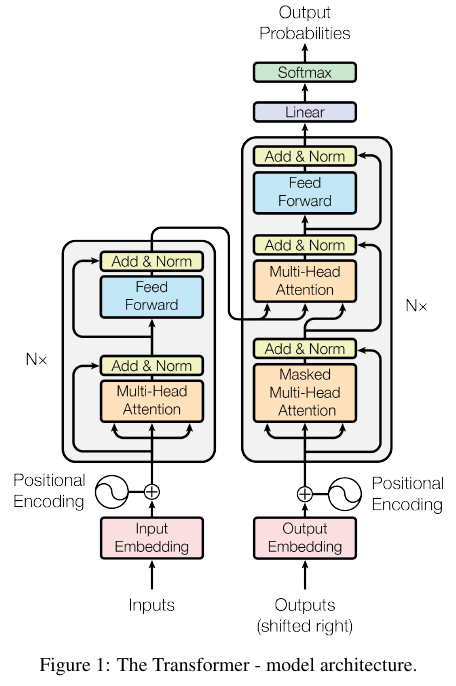

# 図1の左側（エンコーダ部分）についての詳細説明



## 1. Input Embedding (入力埋め込み)
- **説明**: エンコーダの最初のステップでは、入力シーケンス（通常は単語やサブワードのシーケンス）が**入力埋め込み**層を通じて、固定次元の連続ベクトルに変換されます。このベクトルは、各トークンに対して学習された埋め込みベクトルで表されます。

- **数式**: 
  ```math
  X_{\text{embed}} = W_{\text{embed}} \cdot X_{\text{input}}
  ```
  ここで、$W_{\text{embed}}$ は埋め込み行列で、$X_{\text{input}}$ は入力トークンです。

## 2. Positional Encoding (位置エンコーディング)
- **説明**: Transformerにはリカレント構造がないため、入力シーケンス内のトークンの順序情報を保持する必要があります。そのため、位置エンコーディングを使用して、トークンの相対的位置をモデルに伝達します。位置エンコーディングは、サイン波とコサイン波に基づいて生成され、埋め込みベクトルに加算されます。

- **数式**:
  ```math
  X_{\text{input}}^{\text{pos}} = X_{\text{embed}} + PE_{\text{pos}}
  ```
  ここで、$PE_{\text{pos}}$ は位置エンコーディングです。

## 3. Multi-Head Attention (マルチヘッド・アテンション)
- **説明**: **Self-Attention Mechanism**の一種である**マルチヘッド・アテンション**は、各トークンがシーケンス全体の他のトークンに対してどの程度「注意」を向けるべきかを計算します。このメカニズムは、複数の異なる注意ヘッドを並列に実行し、それぞれが異なるサブスペースでのAttentionを計算します。

- **数式**:
  各ヘッドの計算は以下の通りです:
  ```math
  \text{head}_i = \text{Attention}(QW_i^Q, KW_i^K, VW_i^V)
  ```
  マルチヘッド・アテンションの出力は、全てのヘッドの出力を結合し、最終的な線形変換を適用して得られます。
  ```math
  \text{MultiHead}(Q, K, V) = \text{Concat}(\text{head}_1, \dots, \text{head}_h)W^O
  ```

## 4. Add & Norm (加算と正規化)
- **説明**: 各マルチヘッド・アテンションの出力は、元の入力に対して残差接続（Residual Connection）を介して加算され、その後レイヤー正規化（Layer Normalization）が適用されます。このプロセスにより、勾配消失や勾配爆発を防ぎつつ、学習が安定化されます。

- **数式**:
  ```math
  X_{\text{out}} = \text{LayerNorm}(X_{\text{input}}^{\text{pos}} + \text{MultiHead}(Q, K, V))
  ```

## 5. Feed Forward (フィードフォワード)
- **説明**: 正規化された出力は次に、ポイントワイズ・フィードフォワードネットワーク（Feed Forward Network）に送られます。このネットワークは、各位置の入力に対して2つの線形変換とReLU活性化関数を適用します。

- **数式**:
  ```math
  \text{FFN}(X) = \max(0, XW_1 + b_1)W_2 + b_2
  ```
  
  $$ \text{FFN}(X) = \max(0, XW_1 + b_1)W_2 + b_2 $$
  

  ここで、$W_1$ と $W_2$ は重み行列、$b_1$ と $b_2$ はバイアス項です。

## 6. 再度の Add & Norm
- **説明**: フィードフォワードネットワークの出力も、再度残差接続を通じて元の入力と加算され、その後レイヤー正規化が適用されます。このステップにより、各トークンの特徴が次の層に渡される前に安定化されます。

- **数式**:
  ```math
  X_{\text{out-final}} = \text{LayerNorm}(X_{\text{out}} + \text{FFN}(X_{\text{out}}))
  ```

## 7. Encoder Stack (エンコーダスタック)
- **説明**: 上記のプロセス（マルチヘッド・アテンション、加算と正規化、フィードフォワード、再度の加算と正規化）は、エンコーダスタック内でN回（通常は6回）繰り返されます。この処理により、モデルは入力シーケンスの特徴を強力に表現することができ、次のデコーダへの入力として渡されます。

- **数式**: 
  この繰り返しプロセスは、数式的には上記の各プロセスをN回適用することで表現されます。

---


# 図1の右側（デコーダ部分）についての詳細説明


## 1. Outputs (Shifted Right) (右シフトされた出力)
- **説明**: デコーダの入力として使用される出力シーケンスは、通常、前の時間ステップで生成されたトークンです。しかし、Transformerでは、自己回帰型のプロセスを確保するために、これらの出力トークンは1つ右にシフトされます。これにより、モデルは現在のステップで予測するトークンが、過去のステップで予測されたトークンのみを参照するようになります。

## 2. Output Embedding (出力埋め込み)
- **説明**: シフトされた出力シーケンスは、**出力埋め込み**層を通じて、固定次元の連続ベクトルに変換されます。これにより、各トークンが数値的に処理可能なベクトル表現にマッピングされます。

- **数式**: 
  ```math
  Y_{\text{embed}} = W_{\text{embed}} \cdot Y_{\text{input}}
  ```
  ここで、$W_{\text{embed}}$ は出力埋め込み行列で、$Y_{\text{input}}$ はシフトされた出力トークンです。

## 3. Positional Encoding (位置エンコーディング)
- **説明**: デコーダでも、トークンの順序情報を保持するために、位置エンコーディングが使用されます。これにより、モデルはシーケンス内のトークンの相対的な位置を認識できるようになります。位置エンコーディングは、サイン波とコサイン波に基づいて生成され、出力埋め込みに加算されます。

- **数式**:
  ```math
  Y_{\text{input}}^{\text{pos}} = Y_{\text{embed}} + PE_{\text{pos}}
  ```
  ここで、$PE_{\text{pos}}$ は位置エンコーディングです。

## 4. Masked Multi-Head Attention (マスク付きマルチヘッド・アテンション)
- **説明**: デコーダの最初のサブレイヤーは、**マスク付きマルチヘッド・アテンション**です。ここでは、未来の情報に対する注意を防ぐため、未来の位置に対応するトークンへの注意スコアがマスクされます。これにより、デコーダは過去および現在のトークンにのみ注意を向け、次のトークンを予測します。

- **数式**:
  ```math
  \text{MaskedAttention}(Q, K, V) = \text{softmax}\left(\frac{QK^\top}{\sqrt{d_k}} + M\right)V
  ```
  ここで、$M$ はマスク行列で、未来の位置に対するスコアを無効化するために使用されます。

## 5. Add & Norm (加算と正規化)
- **説明**: マスク付きマルチヘッド・アテンションの出力は、残差接続を通じて元の入力に加算され、その後レイヤー正規化が適用されます。この操作により、勾配消失を防ぎつつ、学習が安定化します。

- **数式**:
  ```math
  Y_{\text{out1}} = \text{LayerNorm}(Y_{\text{input}}^{\text{pos}} + \text{MaskedAttention}(Q, K, V))
  ```

## 6. Encoder-Decoder Attention (エンコーダ-デコーダ・アテンション)
- **説明**: 次のサブレイヤーでは、**エンコーダ-デコーダ・アテンション**が適用されます。ここでは、デコーダの出力をクエリとして使用し、エンコーダの出力をキーおよびバリューとして使用します。これにより、デコーダはエンコーダの出力に注意を向け、入力シーケンスの情報を考慮しながら次のトークンを生成します。

- **数式**:
  ```math
  \text{Attention}_{\text{Enc-Dec}}(Q, K_{\text{enc}}, V_{\text{enc}}) = \text{softmax}\left(\frac{QK_{\text{enc}}^\top}{\sqrt{d_k}}\right)V_{\text{enc}}
  ```
  ここで、$K_{\text{enc}}$ と $V_{\text{enc}}$ はエンコーダからの出力です。

## 7. Add & Norm (加算と正規化)
- **説明**: エンコーダ-デコーダ・アテンションの出力も、再度残差接続を通じて元の入力と加算され、レイヤー正規化が適用されます。これにより、アテンション操作が安定し、次の処理ステップに渡されます。

- **数式**:
  ```math
  Y_{\text{out2}} = \text{LayerNorm}(Y_{\text{out1}} + \text{Attention}_{\text{Enc-Dec}}(Q, K_{\text{enc}}, V_{\text{enc}}))
  ```

## 8. Feed Forward (フィードフォワード)
- **説明**: 正規化された出力は、**フィードフォワードネットワーク**に送られます。このネットワークは、各トークン位置に対して2つの全結合層を適用し、ReLU活性化関数を用いて非線形性を導入します。

- **数式**:
  ```math
  \text{FFN}(Y) = \max(0, YW_1 + b_1)W_2 + b_2
  ```
  ここで、$W_1$ と $W_2$ は重み行列、$b_1$ と $b_2$ はバイアス項です。

## 9. 再度の Add & Norm
- **説明**: フィードフォワードネットワークの出力は、再度残差接続を通して元の入力と加算され、レイヤー正規化が適用されます。これにより、最終的なデコーダ出力が安定化され、次のトークン予測に使用される準備が整います。

- **数式**:
  ```math
  Y_{\text{out-final}} = \text{LayerNorm}(Y_{\text{out2}} + \text{FFN}(Y_{\text{out2}}))
  ```

## 10. Decoder Stack (デコーダスタック)
- **説明**: 以上のプロセス（マスク付きマルチヘッド・アテンション、エンコーダ-デコーダ・アテンション、フィードフォワードネットワーク）は、**デコーダスタック**内でN回（通常は6回）繰り返されます。この処理により、モデルは出力シーケンスの各トークンに対する強力な特徴表現を生成し、次に予測されるトークンを効果的に生成します。

- **数式**: 
  この繰り返しプロセスは、数式的には上記の各プロセスをN回適用することで表現されます。

## 11. Linear & Softmax (線形変換とソフトマックス)
- **説明**: デコーダスタックの最終出力は、**線形変換**と**ソフトマックス関数**を通じて、次のトークンの確率分布に変換されます。この確率分布から、最も可能性の高いトークンが選ばれ、最終的な出力シーケンスが生成されます。

- **数式**:
  ```math
  P_{\text{output}} = \text{softmax}(Y_{\text{out-final}}W_{\text{out}} + b_{\text{out}})
  ```
  ここで、$W_{\text{out}}$ は線形変換の重み行列、$b_{\text{out}}$ はバイアス項です。

