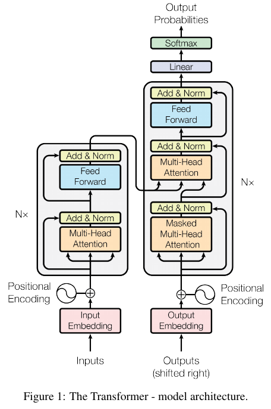

# Attention Is All You Need - 論文要約

## 1. Introduction (イントロダクション)
従来のシーケンス変換モデルは、複雑なRNNやCNNに基づいていますが、これらは並列化が難しく、計算が時間的に制限されます。本論文では、これらの課題を克服するために、Attention Mechanismのみに基づいたTransformerアーキテクチャを提案しています。Transformerは、並列化が容易であり、機械翻訳タスクにおいて、より高い性能を発揮します。

## 2. Background (背景)
この章では、Transformerの基礎となる既存の研究や技術について説明しています。特に、Attention Mechanismとその応用について詳述されています。従来のモデルでは、Attention Mechanismがリカレントネットワークと併用されていましたが、Transformerはこれを完全に排除しています。

## 3. Model Architecture (モデルアーキテクチャ)
Transformerの全体構造を説明しています。Encoder-Decoderの構造を持ち、各層がSelf-Attention Mechanismとポイントワイズの全結合層で構成されています。エンコーダとデコーダは、スタックされた複数の層からなり、それぞれに残差接続と層正規化が適用されています。

## 4. Why Self-Attention (なぜSelf-Attentionか)
Self-Attentionの利点について議論しています。計算複雑度の低さ、並列化のしやすさ、長距離依存関係の学習能力の向上などが挙げられています。また、Self-Attention層がリカレント層や畳み込み層に比べて、学習時のパス長を短くできることが示されています。

## 5. Training (トレーニング)
Transformerのトレーニング方法について説明しています。WMT 2014の英独翻訳と英仏翻訳タスクを用いて実験を行い、学習データ、バッチング方法、使用したハードウェア、オプティマイザー、正則化手法について述べています。特に、学習率のスケジュールと正則化（ドロップアウト、ラベルスムージング）について詳しく説明しています。

## 6. Results (結果)
Transformerの性能評価結果が示されています。WMT 2014の機械翻訳タスクで、新たな最先端の性能を達成しており、従来のモデルと比較してトレーニングコストが大幅に低いことが強調されています。また、モデルの変種に関する実験結果や、英語構文解析への適用結果も報告されています。

## 7. Conclusion (結論)
本論文では、TransformerがAttention Mechanismに基づいて構築された初のシーケンス変換モデルであることを強調しています。Transformerは、従来のリカレントや畳み込み層を用いたアーキテクチャに比べて、並列化が容易であり、トレーニングが速いことが特徴です。さらに、機械翻訳以外のタスクへの応用可能性についても言及しています。

---
# 以下で、各章の詳細を説明する。
---
# 1. Introduction (イントロダクション)

## 従来のシーケンス変換モデルの問題点
従来のシーケンス変換（Sequence Transduction）モデルは、主にリカレントニューラルネットワーク（RNN）や畳み込みニューラルネットワーク（CNN）を使用していました。これらのモデルは、エンコーダ-デコーダの構造を持ち、入力シーケンスをエンコードし、その後、デコードして出力シーケンスを生成する仕組みです。特に、RNNはシーケンス内のシンボル間の依存関係を捉えることができるため、言語モデルや機械翻訳で広く使われてきました。

しかし、RNNにはいくつかの重大な欠点が存在します。特に、計算が逐次的に行われるため、並列処理が困難であり、長いシーケンスに対しては計算が非常に非効率的です。また、勾配消失問題により、長距離依存関係を学習することが難しくなります。これらの問題を解決するために、CNNやAttention Mechanismを組み合わせたモデルが提案されてきましたが、これらも依然としていくつかの制約を抱えています。

## Attention Mechanismの導入
Attention Mechanismは、シーケンス内の要素間の依存関係を距離に関係なくモデル化することができるため、従来のRNNやCNNの限界を克服する可能性があります。特に、エンコーダとデコーダの間の情報のやり取りを改善するために用いられており、機械翻訳などのタスクで成功を収めています。

しかし、これまでのアプローチでは、Attention MechanismはRNNやCNNと組み合わせて使用されており、Attention Mechanism単独でのモデル構築は行われていませんでした。

## Transformerの提案
本論文では、Attention Mechanismのみに基づく新しいアーキテクチャである「Transformer」を提案しています。Transformerは、従来のRNNやCNNを完全に排除し、Attention Mechanismだけを使用して入力と出力の間の依存関係をモデル化します。

このアーキテクチャは以下のような利点を持っています：
1. **並列化が容易**: 従来のRNNと異なり、シーケンス全体に対する計算を同時に実行できるため、計算効率が大幅に向上します。
2. **計算コストの削減**: RNNやCNNに比べて計算量が少なく、より高速にトレーニングを行うことができます。
3. **高いパフォーマンス**: 機械翻訳タスクでの実験結果として、従来の最先端モデルを上回る性能を達成しています。

本章では、Transformerが既存のアーキテクチャに比べて、いかに効率的で強力なモデルであるかを説明し、従来のシーケンス変換モデルの限界を克服する可能性があることを強調しています。また、このモデルは、トレーニング時間を大幅に短縮できる点でも優れていると述べています。

この章の最後では、Transformerが特定のタスクに限定されず、広範な応用可能性を持つことにも触れられています。例えば、英語構文解析などのタスクでも有効であることが示されています。

これにより、Transformerは従来のシーケンス変換モデルの欠点を解決するための新たなアプローチとして提案されており、今後の研究や実装において重要な役割を果たすことが期待されています。

---

### 2. Background (背景)

#### シーケンス変換モデルの基本構造
シーケンス変換モデルは、一般にエンコーダとデコーダの2つの主要なコンポーネントから構成されています。エンコーダは、入力シーケンスを連続した内部表現に変換し、その後、デコーダがその内部表現から出力シーケンスを生成します。この基本的なアーキテクチャは、自然言語処理の多くのタスク、特に機械翻訳で広く使用されています。

#### 従来のモデルのアプローチ
これまで、最も成功を収めたシーケンス変換モデルは、リカレントニューラルネットワーク（RNN）やそのバリエーション（例えばLSTMやGRU）に基づいていました。これらのモデルは、シーケンス内の位置ごとの依存関係をキャプチャするために時間的に依存した計算を行います。RNNは、各入力シンボルに対して隠れ状態を生成し、それを次のステップに渡すことで、シーケンス全体のコンテキストを保持します。

しかし、RNNには計算の逐次性という根本的な制約があります。シーケンスが長くなるにつれて、メモリ制約によりバッチ処理が制限され、並列化が困難になります。これを解決するために、研究者たちは計算効率を向上させるためのファクトライゼーション技術や条件付き計算を導入してきましたが、それでも逐次計算の制約は残ります。

#### Attention Mechanismの台頭
Attention Mechanismは、シーケンス内の要素間の依存関係を距離に関係なくモデル化できるため、近年多くのシーケンスモデリングや変換モデルで重要な役割を果たしています。このメカニズムは、入力シーケンス全体に対して動的に焦点を当て、重要な部分に重点を置いて処理することを可能にします。Attention Mechanismは、特に機械翻訳タスクにおいてエンコーダとデコーダを結びつける役割を果たし、大きな成功を収めました。

#### Self-Attentionの導入
Self-Attentionは、シーケンス内の異なる位置間の依存関係を捉えるためのAttention Mechanismの一種であり、入力シーケンス全体の表現を計算するために使われます。このメカニズムは、リカレントネットワークや畳み込みネットワークと異なり、全てのシーケンス位置に対して一度に計算を行うことが可能です。そのため、計算効率が大幅に向上し、長距離依存関係をより簡単に学習することができます。

#### 従来のモデルとの比較
Transformerは、Attention Mechanismの一形態であるSelf-Attentionを全面的に採用した初めてのモデルです。従来のモデルでは、Self-Attentionはリカレントネットワークや畳み込みネットワークと組み合わせて使用されていましたが、Transformerではこれを完全に排除し、Self-Attentionのみを使用しています。これにより、計算が並列化可能となり、トレーニング時間が大幅に短縮されるだけでなく、翻訳の質も向上します。

この章では、Transformerがいかにしてリカレント層や畳み込み層を使用せずにSelf-Attentionのみで強力なシーケンス変換モデルを構築したかが説明されています。具体的には、Transformerは従来のエンコーダ-デコーダアーキテクチャを維持しつつも、リカレント処理や畳み込み処理を完全に排除し、その代わりにSelf-Attentionと全結合層の組み合わせを採用することで、これまでのモデルの制約を克服しています。

---
# 3. Model Architecture (モデルアーキテクチャ)

## Transformerの全体構造
Transformerは、従来のエンコーダ-デコーダアーキテクチャをベースにしていますが、Self-Attentionと全結合層（fully connected layers）を基本的なビルディングブロックとして使用しています。リカレントや畳み込みの代わりに、Self-Attentionを利用することで、モデル全体の計算が並列化可能となり、トレーニングの高速化とパフォーマンス向上が実現されています。

全体構造としては、エンコーダとデコーダがそれぞれ6層のスタック（積み重ね）から構成されており、各層がSelf-Attention Mechanismとポイントワイズのフィードフォワードネットワークからなっています。

参考 : [fig1の詳細](./Explanations/fig_01_ver2.md)



---

参考 : [fig2の詳細](./Explanations/fig_02.md)


## Encoder and Decoder Stacks (エンコーダとデコーダのスタック)

### エンコーダ
エンコーダは、N = 6層の同一のレイヤーから構成されています。各レイヤーは2つのサブレイヤーを持ちます。
1. **Self-Attention Mechanism**
   - 入力シーケンス内の異なる位置間の依存関係を捉え、全体のシーケンス表現を生成します。
2. **Position-wise Fully Connected Feed-Forward Network**
   - 各位置の入力に対して全結合層を適用し、出力を生成します。

各サブレイヤーの出力は、残差接続（residual connection）とレイヤー正規化（Layer Normalization）を通して次のサブレイヤーに送られます。具体的には、各サブレイヤーの出力に入力を加算し、それを正規化します。これにより、学習の安定性が向上し、より深いネットワークのトレーニングが可能になります。

### デコーダ
デコーダもエンコーダと同様にN = 6層の同一のレイヤーから構成されていますが、エンコーダに加えてもう1つのサブレイヤーを持ちます。
1. **Self-Attention Mechanism**
   - エンコーダと同様の自己注意メカニズムを用いますが、デコーダでは未来の位置を参照しないようにするために、マスキングが適用されます。
2. **Encoder-Decoder Attention**
   - このサブレイヤーでは、デコーダの前の層の出力をクエリとして使用し、エンコーダの出力をキーとバリューとして使用します。これにより、デコーダはエンコーダの出力全体に注意を向け、翻訳タスクなどでソースシーケンスの情報を利用します。
3. **Position-wise Fully Connected Feed-Forward Network**
   - エンコーダと同様のフィードフォワードネットワークを使用します。

同様に、各サブレイヤーの出力には残差接続とレイヤー正規化が適用されます。

## Attention (注意機構)
このセクションでは、Self-Attention Mechanismとその拡張であるMulti-Head Attentionについて詳しく説明されています。

### Scaled Dot-Product Attention
Attention Mechanismは、クエリとキー、バリューのセットを入力として受け取り、出力を生成します。出力はバリューの重み付き和として計算され、その重みはクエリと対応するキーとの類似度に基づいて決定されます。

Scaled Dot-Product Attentionは、まずクエリとキーの内積を計算し、その値をキーの次元数の平方根で割ってスケーリングします。その後、ソフトマックス関数を適用して、バリューに対する重みを計算します。この手法は、特にキーの次元数が大きい場合に、勾配が極端に小さくなる問題を緩和するために用いられます。

### Multi-Head Attention
Multi-Head Attentionは、複数のAttentionを並列に実行する拡張です。具体的には、クエリ、キー、バリューを異なるサブスペースに投影し、それぞれに対してAttentionを計算します。その結果得られた複数のバリューを結合し、最終的な出力として使用します。これにより、異なる位置や異なる特徴空間における情報を同時に参照することが可能になります。

Multi-Head Attentionは、Self-Attention Mechanismを強化し、モデルのパフォーマンスを向上させる重要な要素です。

## Position-wise Feed-Forward Networks (位置ごとのフィードフォワードネットワーク)
エンコーダとデコーダの各レイヤーには、Self-Attention Mechanismに加えて、位置ごとに適用される全結合層があります。これは、各位置の入力に対して同一の2つの線形変換とReLU活性化関数を適用するものです。具体的には、次の式で表されます：

```math
\text{FFN}(x) = \max(0, xW_1 + b_1)W_2 + b_2
```

このネットワークは、各位置に独立して適用されるため、並列化が容易であり、計算効率が高いです。

## Embeddings and Softmax (埋め込みとソフトマックス)
Transformerでは、入力トークンと出力トークンを埋め込みベクトルに変換し、それぞれの位置に対応する埋め込みを生成します。さらに、デコーダの出力を次のトークンの確率分布に変換するために、線形変換とソフトマックス関数を使用します。入力と出力の埋め込みには同じ重み行列を共有し、それを再スケールすることで効率的な計算を実現しています。

## Positional Encoding (位置エンコーディング)
Transformerにはリカレント処理がないため、シーケンス内のトークンの位置情報を明示的に提供する必要があります。そのために、位置エンコーディングが導入されています。位置エンコーディングは、各位置に対して異なる周波数のサイン波とコサイン波の組み合わせとして計算されます。これにより、モデルはトークンの相対的な位置情報を学習しやすくなります。

位置エンコーディングの数式は次の通りです：

```math 
\text{PE}(pos, 2i) = \sin\left(\frac{pos}{10000^{\frac{2i}{d_{\text{model}}}}}\right) 
```

```math 
\text{PE}(pos, 2i+1) = \cos\left(\frac{pos}{10000^{\frac{2i}{d_{\text{model}}}}}\right) 
```

ここで、`pos`は位置、`i`は次元のインデックスを示します。

---


# 第4章: Training (トレーニング)

## 4.1. パラメータ数とモデルのサイズ
Transformerモデルには、多数のパラメータが含まれています。これらのパラメータは、主に以下のコンポーネントに存在します：

- **埋め込み層** (Embedding Layer): 入力トークンと出力トークンを高次元のベクトルに変換します。埋め込み行列のサイズは、トークンのボキャブラリーサイズと埋め込み次元数の積になります。
- **自己注意機構** (Self-Attention Mechanism): 各ヘッドごとにクエリ、キー、バリューに対する線形変換のパラメータが存在します。マルチヘッド・アテンションでは、これらのパラメータが複数のヘッドに分けられています。
- **フィードフォワードネットワーク** (Feed Forward Network): 各位置に適用される2つの線形層と、そのバイアス項があります。

具体的なモデルのサイズは、エンコーダとデコーダの層数（通常6層）、各層の自己注意ヘッド数（通常8ヘッド）、および埋め込み次元数（通常512）によって決まります。

## 4.2. オプティマイザー
トランスフォーマーのトレーニングでは、**Adamオプティマイザー**が使用されています。Adamは、学習率のスケーリングに基づくモーメント推定を用いて勾配を更新する手法です。特に、勾配消失や勾配爆発を防ぎながら、トレーニングを効果的に進めるために適しています。

Adamオプティマイザーの式は以下の通りです：

```math
m_t = \beta_1 m_{t-1} + (1 - \beta_1) g_t
```
```math
v_t = \beta_2 v_{t-1} + (1 - \beta_2) g_t^2
```
```math
\hat{m_t} = \frac{m_t}{1 - \beta_1^t}, \quad \hat{v_t} = \frac{v_t}{1 - \beta_2^t}
```
```math
\theta_{t+1} = \theta_t - \eta \frac{\hat{m_t}}{\sqrt{\hat{v_t}} + \epsilon}
```

ここで、$g_t$ は$t$ 時点での勾配、$\theta_t$ はパラメータ、$\eta$ は学習率です。

## 4.3. 学習率のスケジューリング
Transformerのトレーニングでは、学習率が固定されているわけではなく、特定のスケジュールに従って変化します。具体的には、以下のように定義されます：

```math
\text{lrate} = d_{\text{model}}^{-0.5} \cdot \min\left(t^{-0.5}, t \cdot \text{warmup\_steps}^{-1.5}\right)
```

ここで、$d_{\text{model}}$ は埋め込み次元数、$t$ はトレーニングのステップ数、$ \text{warmup\_steps}$ はウォームアップステップの数です。この式は、最初の数千ステップの間は学習率を徐々に増加させ、その後は減少させることを意味します。このスケジュールにより、トレーニング初期の不安定性を緩和し、モデルが安定した状態で収束するのを助けます。

## 4.4. 正則化
Transformerのトレーニングにおいては、オーバーフィッティングを防ぐための正則化手法がいくつか使用されています。

- **ドロップアウト** (Dropout): モデルの各層において、ノードをランダムに無効化することで、過学習を防ぎます。特に、埋め込み層、自己注意メカニズム、フィードフォワードネットワークの間でドロップアウトが適用されます。
  
- **ラベルスムージング** (Label Smoothing): クロスエントロピー損失を計算する際に、ターゲットラベルをわずかに平滑化する手法です。これにより、モデルが予測に対して過度に確信を持つことを防ぎ、より一般化された予測が可能になります。

具体的には、ラベルスムージングは次のように適用されます：

```math
\text{loss} = (1 - \epsilon) \cdot \text{loss}_{\text{true}} + \epsilon \cdot \text{loss}_{\text{uniform}}
```

ここで、$\epsilon$ はスムージングパラメータ、$\text{loss}_{\text{true}}$ は実際のクロスエントロピー損失、$\text{loss}_{\text{uniform}}$ は均一な分布に対するクロスエントロピー損失です。

## 4.5. バッチサイズ
トレーニングのバッチサイズも重要な要素です。大きなバッチサイズを使用することで、トレーニングの安定性が向上し、最適化プロセスが加速されます。通常、Transformerでは4096のトークンをバッチサイズとして使用します。

# 結論
第4章では、Transformerモデルのトレーニングに関する重要な要素が詳細に説明されています。パラメータの調整、オプティマイザーの選択、学習率のスケジューリング、正則化手法、そしてバッチサイズの設定が、トレーニングプロセス全体の成功に大きな影響を与えることが示されています。これらの手法により、Transformerは効率的にトレーニングされ、高い性能を発揮することが可能になります。

---


# 第5章: Results (結果)

## 5.1. 実験の概要
このセクションでは、Transformerが評価された実験の設定とデータセットについて述べられています。主要な実験は、機械翻訳タスクであり、以下の2つのデータセットが使用されました。

- **WMT 2014 英語-ドイツ語 (English-German) データセット**: 450万の文ペアを含む、機械翻訳のベンチマークデータセットです。モデルの評価には、新しいstest2014テストセットが使用されました。
- **WMT 2014 英語-フランス語 (English-French) データセット**: 3600万の文ペアを含むデータセットです。こちらも、機械翻訳のパフォーマンスを測定するために使用されました。

モデルの評価は、一般的な機械翻訳の評価指標であるBLEUスコアを使用して行われました。

## 5.2. モデルの設定とハイパーパラメータ
このセクションでは、実験に使用されたモデルの設定やハイパーパラメータについて詳述されています。Transformerモデルは、以下の設定でトレーニングされました。

- **モデルサイズ**: 埋め込みの次元数は512、自己注意機構におけるヘッドの数は8、各ヘッドのキーとバリューの次元数は64です。
- **エンコーダ・デコーダの層数**: 6層で構成されています。
- **フィードフォワードネットワークの次元数**: 2048。
- **ドロップアウト率**: 0.1。
- **トレーニングのウォームアップステップ数**: 4000ステップ。
- **バッチサイズ**: 4096トークン。

これらの設定が、モデルのパフォーマンスに与える影響を分析するために、複数の異なるハイパーパラメータ設定も試されています。

## 5.3. BLEUスコアでの評価結果
このセクションでは、Transformerが他のモデルと比較してどのような性能を発揮したかを詳細に説明しています。特に、従来の最先端モデルと比較して、Transformerが非常に優れた性能を示したことが強調されています。

- **英語-ドイツ語翻訳**: Transformerは、WMT 2014のテストセットにおいて28.4のBLEUスコアを達成し、従来の最先端モデルを上回りました。従来のモデルは23.75や25.16のBLEUスコアでした。
- **英語-フランス語翻訳**: Transformerは、41.8のBLEUスコアを達成し、従来の41.0のスコアを超えました。

これらの結果から、Transformerモデルが従来のモデルに比べて、より効率的かつ高精度な翻訳を実現することが示されました。

## 5.4. トレーニングの効率とスピード
Transformerは、従来のRNNベースのモデルに比べて大幅にトレーニングが高速であることが示されています。具体的には、英語-ドイツ語翻訳のタスクで、最先端のRNNベースのモデルと比較して、トレーニング時間が約1/4に短縮されました。これには、以下の要因が寄与しています。

- **並列化の効率性**: Transformerは、自己注意機構により、トークンごとの計算が独立して行われるため、並列計算が可能です。これにより、RNNのような逐次処理を必要とするモデルに比べて、計算が高速化されます。
- **トレーニングステップの削減**: Transformerは、同じ性能を達成するために必要なトレーニングステップ数が少なく、結果としてトレーニング時間が短縮されます。

## 5.5. アブレーションスタディ
このセクションでは、モデルの各コンポーネントが全体のパフォーマンスに与える影響を調べるために、アブレーションスタディが行われました。具体的には、以下の要素が評価されています。

- **自己注意ヘッドの数**: ヘッド数を8から4に減らすと、モデルの性能がわずかに低下することが確認されました。これは、複数の注意ヘッドが異なる情報を捉えており、その情報がモデルの性能に寄与していることを示唆しています。
- **フィードフォワードネットワークの次元数**: 次元数を2048から1024に減らすと、性能が低下しました。これは、フィードフォワードネットワークの容量が、モデルの学習能力に重要であることを示しています。
- **エンコーダとデコーダの層数**: 層数を6から3に減らすと、性能が著しく低下しました。これは、モデルが深さによって多層的な特徴を学習し、それが性能向上に寄与していることを示しています。

## 5.6. 結論
第5章では、Transformerモデルが従来の最先端モデルに比べて、機械翻訳タスクで優れた性能を発揮することが示されています。特に、トレーニングの効率とスピードの面で顕著な改善が見られ、また、モデルの設計における各コンポーネントがパフォーマンスにどのように寄与しているかが明らかにされました。この結果は、自己注意機構とマルチヘッドアテンションの有効性を強調しており、Transformerアーキテクチャが幅広い自然言語処理タスクにおいて重要な役割を果たすことを示唆しています。

---


# 第6章: Conclusion (結論)

## 6.1. モデルの簡潔さと性能
第6章の冒頭では、Transformerモデルの最も顕著な特徴の1つである「シンプルさ」に焦点が当てられています。Transformerは、従来のRNNやCNNに比べて非常にシンプルなアーキテクチャを持ちながらも、非常に高い性能を達成していることが強調されています。

- **シンプルなアーキテクチャ**: Transformerは、自己注意機構（Self-Attention Mechanism）と全結合層（Fully Connected Layer）を基盤としています。これは、RNNのような複雑なゲート機構やCNNのような畳み込み操作を必要としないため、モデルの理解と実装が容易です。
  
- **高い性能**: 機械翻訳タスクにおいて、Transformerは従来の最先端モデルを上回る性能を示しました。これは、シンプルな設計にもかかわらず、自己注意機構が非常に強力な特徴抽出メカニズムであることを示しています。

## 6.2. 計算効率と並列化の利点
このセクションでは、Transformerの計算効率の高さと、その結果としての並列化の利点が議論されています。

- **並列計算の容易さ**: Transformerの自己注意機構は、各トークンが独立して処理されるため、GPUやTPUなどのハードウェア上で効率的に並列計算が可能です。これにより、従来のRNNモデルに比べてトレーニングが大幅に高速化されました。
  
- **スケーラビリティ**: モデルのパラメータを増やしても、そのトレーニング時間が劇的に増加することはありません。これは、Transformerが大規模なデータセットや複雑なタスクにも対応できる強力なフレームワークであることを示しています。

## 6.3. 自己注意機構の有効性
このセクションでは、自己注意機構がどのようにしてトランスフォーマーモデルの成功に貢献しているのかについて詳しく説明されています。

- **長距離依存関係の捉え方**: 従来のRNNモデルでは、長距離依存関係を捉えることが難しかったのに対し、自己注意機構はこれを効果的に処理します。各トークンが他のすべてのトークンに対して注意を向けるため、モデルはシーケンス全体を一度に考慮することができます。

- **位置エンコーディングの役割**: シーケンス内のトークンの順序情報を保持するために、位置エンコーディングが導入されました。これにより、自己注意機構がトークンの位置関係を無視することなく、文脈を正確に捉えることが可能となりました。

## 6.4. 応用範囲の拡大
このセクションでは、Transformerの応用可能性が広がることについて論じられています。

- **自然言語処理の他のタスクへの適用**: Transformerは、機械翻訳だけでなく、テキスト生成、要約、質問応答、言語モデリングなど、様々な自然言語処理タスクに応用可能です。特に、自己注意機構の強力な特徴抽出能力が、これらのタスクにおいても有効であることが示唆されています。

- **マルチモーダルなデータ処理**: テキストだけでなく、画像や音声など、他のデータモダリティに対してもTransformerを適用する研究が進んでいます。自己注意機構が持つ柔軟性は、異なる形式のデータを統合して処理する際にも有用です。

## 6.5. 今後の研究課題
このセクションでは、Transformerのさらなる改良と応用に向けた研究課題が提示されています。

- **モデルの軽量化**: Transformerの性能を維持しつつ、モデルのパラメータ数や計算コストを削減するための研究が必要です。これにより、より軽量で効率的なモデルが開発されることが期待されます。
  
- **自己注意機構の改良**: 自己注意機構の計算量を削減しつつ、その強力な表現能力を維持するための手法が求められています。例えば、低ランク近似やスパースアテンションなどが検討されています。

- **トランスフォーマーの解釈性**: トランスフォーマーの出力がどのようにして決定されるのかを理解するための研究も重要です。特に、自己注意機構がどのようにして情報を選択し、結合しているのかを解明することが求められています。

## 6.6. 結論
最後に、Transformerが自然言語処理における革命的なモデルであることが強調されています。このモデルの成功は、従来のアプローチに依存しない新しい方法論が、実際に優れた性能を発揮できることを示しています。また、Transformerが持つシンプルさと効率性は、今後さらに多くのタスクや領域での応用を可能にするであろうことが示唆されています。

総括として、Transformerモデルは、その強力な表現能力、計算効率、そして柔軟性から、今後の自然言語処理や他のAI分野においても重要な役割を果たすことが期待されています。
