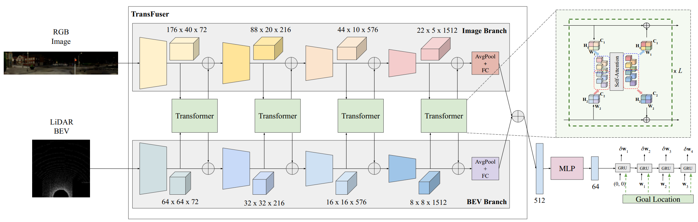
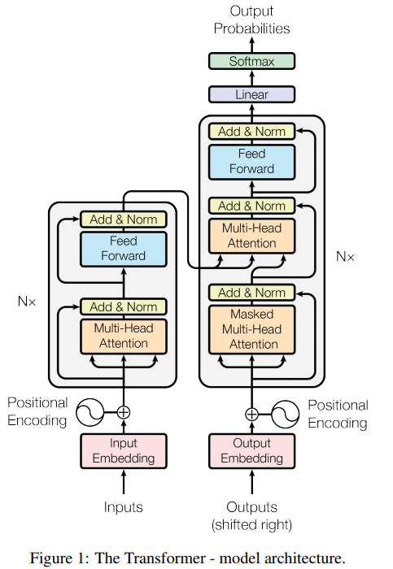
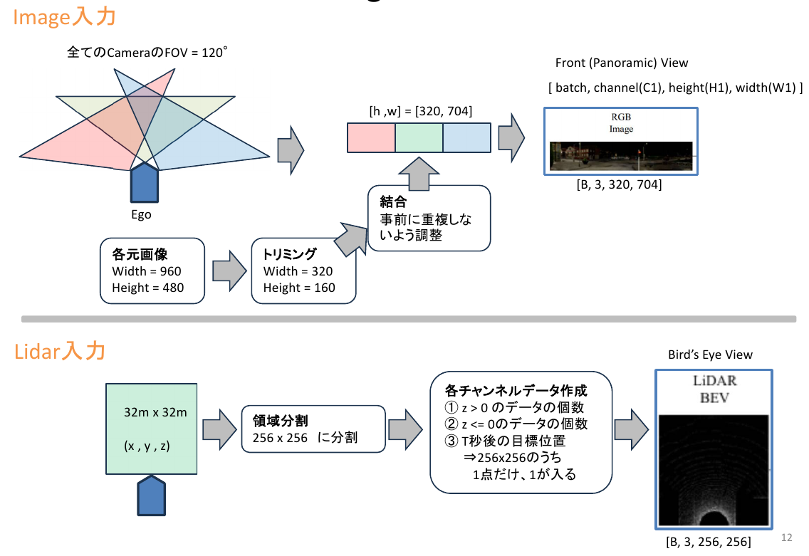
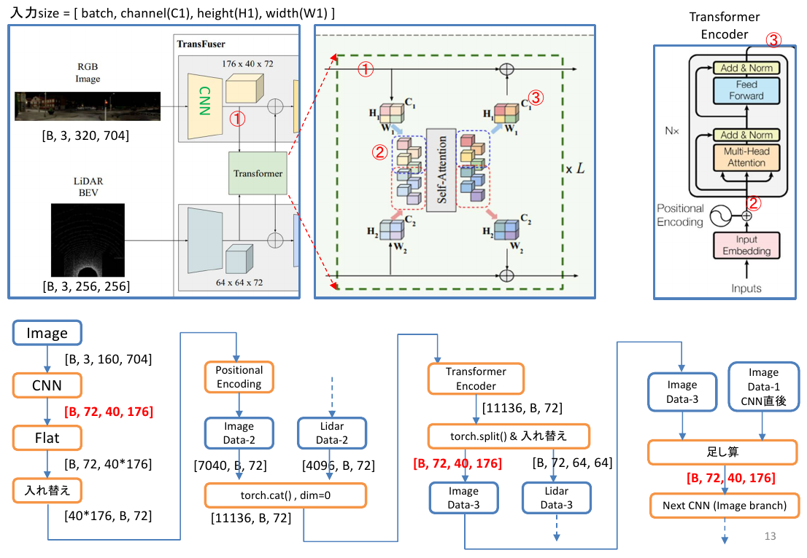
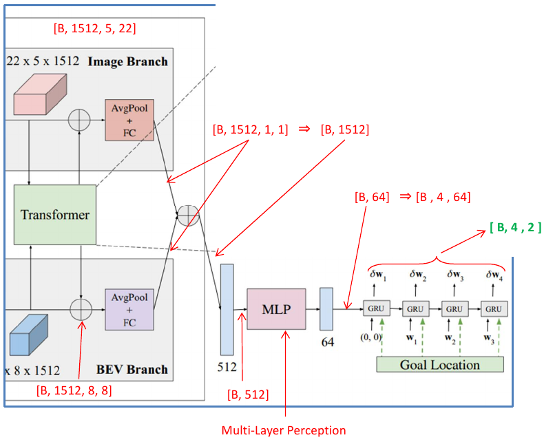
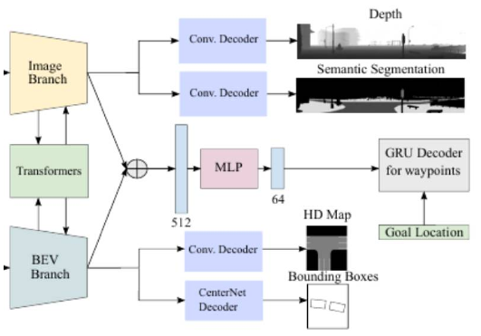

# Transfuser 論文のまとめ

---

## 1. この論文でやっていること

### 入力データ

1. 画像 RGB
2. Lidarの点群データ(xyz)
3. CARLAからもらうグローバルプランニング（経路の点群xyz）の中から、数秒先の1点

### 出力データ

1. ローカルプランニング（自車座標系における、4点の時系列座標xyz）

---

## 2. Transfuserの章ごとの要約

### 1. はじめに

この章では、LiDARセンサーが自動運転車に正確な3D情報を提供することの重要性と課題について述べています。特に、既存のセンサーフュージョン手法に基づく模倣学習が複雑な運転シナリオでの性能に限界があることを指摘し、新しいアプローチであるTransFuserを提案しています。このアプローチは、画像とLiDARの表現を自己注意機構を用いて統合し、複数の解像度でのセンサーフュージョンを実現します。

### 2. 関連研究

ここでは、マルチモーダル自動運転とセンサーフュージョンに関する既存の研究を概観しています。RGB画像に深度やセマンティクスを加えることで運転性能が向上することが示されていますが、既存の手法には高いインフラクション率やルート完遂率の低さが課題として残っています。これを踏まえ、TransFuserは注意機構を用いて複数の段階で異なるモダリティの情報を統合する新しいアプローチを提案します。

### 3. TransFuser

この章では、提案されたTransFuserアーキテクチャの詳細が説明されています。TransFuserは、複数のセンサーモダリティ（画像とLiDAR）の情報を統合するマルチモーダルフュージョントランスフォーマーと、自動回帰ウェイポイント予測ネットワークの二つの主要コンポーネントから成り立っています。問題設定として、都市環境でのポイント・ツー・ポイントナビゲーションが取り上げられています。

### 4. 実験

この章では、実験の設定、TransFuserの運転性能といくつかのベースラインとの比較、注意マップの可視化、アブレーションスタディが紹介されています。実験結果として、TransFuserは既存の手法に比べて大幅に優れた運転スコアを達成し、特に衝突の平均回数を48%削減することが確認されました。

### 5. 結論

最終章では、提案されたTransFuserの有効性と、今後の研究の方向性について述べています。TransFuserは、複雑な運転シナリオにおいても高い性能を示し、既存の手法を大きく上回る結果を達成しました。将来的には、さらに多くのセンサーや環境変数を統合することで、より安全で効率的な自動運転システムの開発が期待されます。

---

## 3. 論文が克服した課題と手段

### 課題

1. **センサーフュージョンの限界**:  
従来のセンサーフュージョン手法は、複雑な都市環境での自動運転において、情報を効果的に統合するのが難しいとされています。特に、局所的な情報に依存するため、動的なエージェント（他の車両や歩行者）との相互作用を正確に捉えることが難しいという問題があります。

2. **模倣学習の性能不足**:  
従来の模倣学習モデルは、単一のモダリティ（例えば、カメラのみ、またはLiDARのみ）に依存しており、複数のセンサーから得られる情報を統合する能力が不足しているため、運転性能が制約されていました。

3. **グローバルコンテキストの欠如**:  
従来の手法では、シーン全体のグローバルコンテキストを捉えることが困難であり、特に交差点や複数レーンが交差する状況では、その欠如が顕著でした。

### 克服手段

1. **Transformerベースのフュージョン**:  
この研究では、自己注意機構を用いるTransformerアーキテクチャを採用し、複数の解像度で画像とLiDARデータを融合します。これにより、各センサーから得られる情報を効果的に統合し、シーン全体のグローバルコンテキストを捉えることができます。

2. **マルチモーダルデータの統合**:  
提案されたTransFuserモデルは、画像とLiDARの両方のデータを使用し、それぞれのモダリティからの特徴を融合します。これにより、各モダリティの強みを活かしつつ、欠点を補完し合うことが可能となります。

3. **補助タスクの導入**:  
模倣学習のトレーニングにおいて、深度予測、セマンティックセグメンテーション、HDマップ予測、および車両検出といった補助タスクを導入することで、モデルの解釈性と頑健性を向上させています。これにより、運転シーンの詳細な理解が促進され、運転性能が向上します。

4. **実験的な検証**:  
提案されたモデルは、CARLAシミュレーターを用いた厳しい評価基準で実験的に検証されており、その結果、従来の最先端手法よりも優れた運転スコアと低いインフラクション率を達成しています。

---

## 4. 論文が抱える課題

1. **複雑な交通シナリオでの車両衝突**  
TransFuserは複雑な都市環境での運転性能を大幅に向上させましたが、特に高密度の交通シナリオにおいて車両衝突が依然として多く発生します。特に無保護左折や車線変更の際に、多くの衝突が発生することが観察されています。

2. **運転環境の多様性への対応**  
評価は主にCARLAシミュレーターを用いて行われていますが、シミュレーションと実際の運転環境との間にはギャップが存在します。実際の運転環境での多様な条件や予期しない状況への対応能力についてはさらなる検証が必要です。

3. **モデルの複雑さと計算コスト**  
Transformerベースのアーキテクチャは高い計算コストを伴います。特に複数の解像度でのセンサーフュージョンを行うため、実行時の計算リソースと時間が大幅に増加する可能性があります。このため、リアルタイムの運転シナリオにおいて、効率性の向上が求められます。

4. **他のセンサーとの統合**  
現在のモデルは主にカメラとLiDARデータを統合していますが、他のセンサー（例えば、レーダー、GPS、IMUなど）との統合についてはさらなる研究が必要です。これらのセンサーを統合することで、より包括的な運転環境の理解が可能となると期待されます。

5. **学習データの多様性**  
模倣学習に使用されるデータセットの多様性が不十分である可能性があります。特に、異なる都市、気象条件、交通ルールなど、多様な運転シナリオに対応するためには、より広範なデータセットが必要です。

6. **安全性の向上**  
現在の安全性チェック（例：クリーピング中のLiDARヒット）は基本的なものであり、より高度な安全性メカニズムの導入が求められます。例えば、より精密なリスク評価や予測モデリングの統合などが考えられます。

---

## 5. Transfuserの入力

### 1. Imageの入力詳細

- **カメラの構成**:  
3台のカメラが使用され、それぞれ前方、左60度、右60度をカバーします。

- **解像度**:  
各カメラの元の解像度は960×480ピクセルです。画像の歪みを取り除くために、960×480ピクセルの画像を320×160ピクセルにクロップします。

- **視野**:  
3つのカメラを組み合わせることで、合計132度の視野をカバーします。

- **合成画像の解像度**:  
クロップされた3つの画像を横に並べて合成し、最終的な入力画像の解像度は320×704ピクセルになります。

- **最終的なImageの入力**:  
解像度: 320×704ピクセル  
視野: 132度

### 2. LiDAR入力の詳細

- **範囲**:  
LiDARデータは、車両の前方32メートル、左右16メートルの範囲をカバーします。 この範囲は32m×32mの領域を構成します。

- **解像度**:  
この32m×32mの領域は、0.125m×0.125mのグリッドに分割され、256×256ピクセルの解像度になります。

- **高度ヒストグラム**:  
LiDARポイントクラウドのデータを2つのビン（bin）に分けて、高度ヒストグラムを作成します。1つ目のビンは地面上のポイント、2つ目のビンは地面以下のポイントを表します。

- **目標位置**:  
目標位置の情報を同じ256×256ピクセルのBEV（Bird's Eye View）空間でラスタライズし、高度ヒストグラムに追加します。

- **最終的なLiDAR入力**:  
以下の3つのチャンネルからなる256×256ピクセルの疑似画像として表現されます。  
範囲: 前方32メートル、左右16メートル（32m×32mの領域）  
解像度: 256×256ピクセル  
チャンネル数: 3チャンネル（地面上ビン、地面以下ビン、目標位置）

---

## 6. Transfuserの出力

### 1. 時系列のウェイポイント

モデルは、将来の複数の時点におけるウェイポイントを予測します。例えば、次の4つの時間ステップにおけるウェイポイント（w1, w2, w3, w4）を出力します。

**補足**: ウェイポイントとは、各ウェイポイントは、車両の現在の位置を基準とした相対座標（x, y）で表されます。

---

## 7. Transfuserのブロック図

---

## 8. Transfuser：Image branchのデータの流れ

- **データフローの詳細**:
  - 入力サイズ [batch, channel(C1), height(H1), width(W1)]  
    例: [B, 3, 320, 704], [B, 3, 256, 256]
  - 各チャンネルデータ作成  
    1. z > 0 のデータの個数  
    2. z <= 0のデータの個数  
    3. T秒後の目標位置  
      - 256x256のうち1点だけ1が入る

---

## 9. 補助タスクの役割

### 補助タスクの効果

補助タスクを使用することで、TransFuserのモデルはより解釈可能でロバストなものになります。実験結果では、補助タスクをすべて削除した場合、ルート完了率(RC)が92.28から78.17に大幅に低下することが示されています。これにより、補助タスクがモデルのパフォーマンスに与える影響の大きさが確認されています。補助タスクは、視覚的およびセンサーデータの統合を強化し、複雑な運転シナリオにおけるモデルの適応能力を向上させるために不可欠です。

### 補助タスクの詳細

1. **深度予測 (Depth Prediction)**:  
2D画像から深度を推定するタスクです。深度情報は、自動運転車が物体との距離を正確に把握し、安全な運転経路を計画するために重要です。深度予測はL1損失を使用して監督されます。

2. **セマンティックセグメンテーション (Semantic Segmentation)**:  
画像内のピクセルごとに意味を分類するタスクです。例えば、道路、車両、歩行者などのクラスに分類します。セマンティックセグメンテーションはクロスエントロピー損失を使用して監督され、7つのセマンティッククラス（未分類、車両、道路、赤信号、歩行者、レーンマーク、歩道）を考慮します。

3. **HDマップ予測 (HD Map Prediction)**:  
鳥瞰図(BEV)から道路やレーンマークの予測を行うタスクです。これにより、走行可能なエリアと非走行エリアを明確に区別できます。このタスクはクロスエントロピー損失を使用して監督されます。

4. **車両検出 (Vehicle Detection)**:  
鳥瞰図(BEV)から車両の位置を検出するタスクです。車両のバウンディングボックスを予測するために、CenterNetデコーダを使用します。このタスクでは、位置マップ、オリエンテーションマップ、および回帰マップを予測し、それぞれのマップは異なる損失（フォーカル損失、クロスエントロピー損失、L1損失）で監督されます。

---

## 10. 学習データの作り方：概要

- **シミュレーターの使用**:  
CARLAシミュレーター（バージョン0.9.10）を使用し、8つの公開されている町からデータを収集しました。

- **ルートの設定**:  
学習データは、2500の交差点を通るルート（平均距離100m）と、1000の曲がりくねった高速道路ルート（平均距離400m）を含むトレーニングルートを設定して収集しました。

- **エキスパートポリシー**:  
シミュレーターから得られる特権情報を使用して運転するように設計されたルールベースのアルゴリズムをエキスパートポリシーとして使用し、トレーニングデータを生成しました。このエキスパートポリシーは、経路計画のためのA*アルゴリズムと2つのPIDコントローラ（横方向および縦方向制御用）で構成されており、それぞれの制御タスクは独立して処理されます。

- **データ収集頻度**:  
2FPS（毎秒2フレーム）でデータを保存し、合計で228000フレームのトレーニングデータセットを作成しました。

---

### 衝突回避のための経路

衝突回避のための経路は、シミュレーション環境でエキスパートポリシーを使用して生成されます。このエキスパートポリシーは、CARLAシミュレーターから得られる特権情報を使用し、以下の方法で衝突回避経路を取得しています。

1. **予測と回避**:  
自動運転車が衝突を避けるためには、他の車両の動きを予測する必要があります。エキスパートポリシーは、キネマティックバイシクルモデルを使用して、他の車両の未来の位置、方向、速度を予測します。これにより、衝突が予測される場合には、車両が停止するか、経路を変更することができます。

2. **優先情報の使用**:  
エキスパートポリシーは、CARLAシミュレーターから提供される詳細な情報を使用して運転を行います。例えば、信号の状態や他の車両の位置などの情報を使用し、これに基づいて安全な経路を計画します。

3. **手動で設計されたアルゴリズム**:  
エキスパートポリシーは、手動で設計されたルールベースのアルゴリズムに基づいています。例えば、交差点での左折時に、他の車両が通過するのを待つなど、具体的な行動ルールを設定します。

4. **センサーフュージョンと安全ヒューリスティック**:  
車両の前方にある小さな矩形エリア内に他の物体が存在する場合、クリーピング（前進動作）を停止する安全ヒューリスティックを実装しています。これにより、通常の運転中でも安全性を高めることができます。

これらの手法を組み合わせることで、TransFuserは他の車両の動きを考慮しながら安全な経路を計画し、衝突回避を実現しています。

---

## 10. 学習データの作り方：エキスパートポリシー（続き）

### エキスパートポリシーの設計

エキスパートポリシーに関する情報は、「Learning by Cheating」論文に基づいています。このエキスパートポリシーは、シンプルな手作りルールに基づいており、強化学習（RL）を用いることも可能ですが、計算負荷が高く、解釈しにくいとされています。

具体的には、以下のように設計されています：

1. **A*プランナー**:  
道路上のウェイポイントを計画します。

2. **PIDコントローラ**:  
横方向と縦方向の制御をそれぞれ独立して行います。横方向制御は、A*プランナーが生成した経路に沿って車の角度を最小化するように設計されています。縦方向制御は、目標速度を設定し、交差点内では速度を低下させるなどの調整を行います。

3. **予測モデル**:  
他の交通参加者の将来の位置を予測し、衝突の可能性がある場合は車両を停止させる仕組みが組み込まれています。

エキスパートポリシーは、シミュレーション環境内で特権情報を使用して運転するように設計されており、トレーニングデータの生成に使用されます。シミュレーターから提供される詳細な情報を活用することで、安全な経路計画が可能となります。

---

## 11. 学習データの作り方: 補助タスク・アノテーション

### 1. セマンティックセグメンテーション（Semantic Segmentation）

- **アノテーション内容**:  
各ピクセルに対してセマンティックラベルを付与します。ラベルは、道路、車両、歩行者、建物、標識などのクラスに対応します。

- **作業手順**:
  - 画像収集: 実車に搭載されたカメラで連続的に画像を取得します。
  - アノテーションツールの選定: Supervisely、Labelbox、VGG Image Annotator (VIA) などのセマンティックセグメンテーションツールを使用します。
  - アノテーション: 各フレームの画像をツールにロードし、ピクセル単位で手動または半自動的にラベルを付けます。
  - 検証: アノテーション結果を複数のアノテーターが確認し、一貫性と正確性をチェックします。

- **変数の詳細**:  
変数名：`segmentation_target`  
データタイプ：整数型（ピクセルごとのクラスラベル）  
形状：[batch_size, height, width]

### 2. 深度予測（Depth Prediction）

- **アノテーション内容**:  
各ピクセルに対して深度（距離）情報を付与します。

- **作業手順**:
  - センサーデータ収集: 実車に搭載されたLiDARセンサーやステレオカメラを使用して、シーンの深度データを取得します。
  - データ処理ツールの選定: LiDARデータの処理にはPCL（Point Cloud Library）やOpen3D、ステレオカメラの処理にはOpenCVなどを使用します。
  - 深度マップの生成: LiDARの点群データを使用して、各ピクセルの深度情報を計算します。ステレオカメラの場合、視差マップを計算し、これを深度情報に変換します。
  - 検証: 深度マップの正確性を確認し、必要に応じて手動で修正します。

- **変数の詳細**:  
変数名：`depth_target`  
データタイプ：浮動小数点型（各ピクセルの深度値）  
形状：[batch_size, 1, height, width]

### 3. HDマップ予測（HD Map Prediction）

- **アノテーション内容**:  
道路、レーンマーク、標識などのHDマップ情報を付与します。

- **作業手順**:
  - センサーデータ収集: 実車に搭載された高精度GPS、LiDAR、カメラを使用してデータを収集します。
  - マッピングツールの選定: HERE HD Live Map、TomTom HD Map、Google Earth Proなどの自動マッピングツールを使用します。
  - HDマップの生成: 収集したデータを使用して、道路やレーンマークのマップを生成します。自動マッピングツールを使用し、手動で不足部分やエラーを修正します。
  - 検証: マップの正確性を確認し、必要に応じて再アノテーションします。

- **変数の詳細**:  
変数名：`hd_map_target`  
データタイプ：整数型（ピクセルごとのクラスラベル、例：道路、レーンマーク、その他）  
形状：[batch_size, height, width]

### 4. 車両検出（Vehicle Detection）

- **アノテーション内容**:  
各画像に対して車両のバウンディングボックス（位置とサイズ）を付与します。

- **作業手順**:
  - 画像収集: 実車に搭載されたカメラで連続的に画像を取得します。
  - アノテーションツールの選定: LabelImg、Labelbox、RectLabelなどのバウンディングボックスアノテーションツールを使用します。
  - アノテーション: 各フレームの画像をツールにロードし、車両の周囲にバウンディングボックスを手動で描画します。バウンディングボックスには、車両の位置、幅、高さの情報を含めます。
  - 検証: アノテーション結果を複数のアノテーターが確認し、一貫性と正確性をチェックします。

- **変数の詳細**:  
変数名：`vehicle_detection_target`  
データタイプ：浮動小数点型（バイナリマップ、各ピクセルが車両か否かを示す）  
形状：[batch_size, 1, height, width]

---

## 11. 学習データの作り方 : 補助タスク・実車実験

### 1. セマンティックセグメンテーション（Semantic Segmentation）

実車を用いた実験で補助タスクのグラウンドトゥルースを取得するには、以下のような手法が考えられます。これらの手法は、実世界のデータを収集し、必要なアノテーションを生成するためのものです。

1. **手動アノテーション**:  
専門のアノテーターが画像を見て、各ピクセルにラベルを付けます。

2. **半自動アノテーションツール**:  
自動アノテーションツールを使用し、人間のアノテーターがその結果を確認し、修正します。ツールとしては、Supervisely、Labelbox、VGG Image Annotator (VIA) などがあります。

3. **既存のデータセット**:  
公開されているデータセットを利用する。例えば、Cityscapes、Mapillary Vistas、COCO などのデータセットには、街中で撮影された画像とそのセマンティックラベルが含まれています。

---

## 11. 学習データの作り方 : 補助タスク・実車実験（続き）

### 2. 深度予測（Depth Prediction）

深度情報を取得するためには、以下の方法が考えられます：

1. **LiDARセンサー**:  
車にLiDARセンサーを搭載し、シーンの深度情報を直接取得します。

2. **ステレオカメラ**:  
2つのカメラを用いてステレオ画像を取得し、視差マップを計算して深度情報を生成します。StereoSGBMやOpenCVのステレオマッチング機能を利用します。

3. **既存のデータセット**:  
KITTIデータセットなど、実車によるLiDARとカメラのデータが含まれているデータセットを利用する。

---

## 11. 学習データの作り方 : 補助タスク・実車実験（続き）

### 3. HDマップ予測（HD Map Prediction）

HDマップの生成には、以下の方法が考えられます：

1. **手動アノテーション**:  
専門のアノテーターが、道路、レーンマーク、標識などを手動でアノテートする。

2. **自動マッピングツール**:  
高精度なGPSとLiDARデータを使用して、自動でHDマップを生成するツールを利用する。例えば、HERE HD Live Map、TomTom HD Mapなどがあります。

### 4. 車両検出（Vehicle Detection）

車両検出のグラウンドトゥルースを取得するには、以下の方法が考えられます：

1. **手動アノテーション**:  
カメラから取得した画像に対して、車両のバウンディングボックスを手動でアノテートする。

2. **既存のデータセット**:  
公開されているデータセットを利用する。例えば、KITTI、COCO、Pascal VOC などには、車両のバウンディングボックスが含まれています。

---

## 11. 学習データの作り方 : 補助タスク・アノテーション

### 1. セマンティックセグメンテーション（Semantic Segmentation）

アノテーション内容：

各ピクセルに対してセマンティックラベルを付与します。ラベルは、道路、車両、歩行者、建物、標識などのクラスに対応します。

作業手順：

1. **画像収集**:  
実車に搭載されたカメラで連続的に画像を取得します。

2. **アノテーションツールの選定**:  
Supervisely、Labelbox、VGG Image Annotator (VIA) などのセマンティックセグメンテーションツールを使用します。

3. **アノテーション**:  
各フレームの画像をツールにロードし、ピクセル単位で手動または半自動的にラベルを付けます。

4. **検証**:  
アノテーション結果を複数のアノテーターが確認し、一貫性と正確性をチェックします。

変数の詳細：

- **変数名**：`segmentation_target`
- **データタイプ**：整数型（ピクセルごとのクラスラベル）
- **形状**：[batch_size, height, width]

---

## 11. 学習データの作り方 : 補助タスク・アノテーション（続き）

### 2. 深度予測（Depth Prediction）

アノテーション内容：

各ピクセルに対して深度（距離）情報を付与します。

作業手順：

1. **センサーデータ収集**:  
実車に搭載されたLiDARセンサーやステレオカメラを使用して、シーンの深度データを取得します。

2. **データ処理ツールの選定**:  
LiDARデータの処理にはPCL（Point Cloud Library）やOpen3D、ステレオカメラの処理にはOpenCVなどを使用します。

3. **深度マップの生成**:  
LiDARの点群データを使用して、各ピクセルの深度情報を計算します。ステレオカメラの場合、視差マップを計算し、これを深度情報に変換します。

4. **検証**:  
深度マップの正確性を確認し、必要に応じて手動で修正します。

変数の詳細：

- **変数名**：`depth_target`
- **データタイプ**：浮動小数点型（各ピクセルの深度値）
- **形状**：[batch_size, 1, height, width]

---

## 11. 学習データの作り方 : 補助タスク・アノテーション（続き）

### 3. HDマップ予測（HD Map Prediction）

アノテーション内容：

道路、レーンマーク、標識などのHDマップ情報を付与します。

作業手順：

1. **センサーデータ収集**:  
実車に搭載された高精度GPS、LiDAR、カメラを使用してデータを収集します。

2. **マッピングツールの選定**:  
HERE HD Live Map、TomTom HD Map、Google Earth Proなどの自動マッピングツールを使用します。

3. **HDマップの生成**:  
収集したデータを使用して、道路やレーンマークのマップを生成します。自動マッピングツールを使用し、手動で不足部分やエラーを修正します。

4. **検証**:  
マップの正確性を確認し、必要に応じて再アノテーションします。

変数の詳細：

- **変数名**：`hd_map_target`
- **データタイプ**：整数型（ピクセルごとのクラスラベル、例：道路、レーンマーク、その他）
- **形状**：[batch_size, height, width]

---

## 11. 学習データの作り方 : 補助タスク・アノテーション（続き）

### 4. 車両検出（Vehicle Detection）

アノテーション内容：

各画像に対して車両のバウンディングボックス（位置とサイズ）を付与します。

作業手順：

1. **画像収集**:  
実車に搭載されたカメラで連続的に画像を取得します。

2. **アノテーションツールの選定**:  
LabelImg、Labelbox、RectLabelなどのバウンディングボックスアノテーションツールを使用します。

3. **アノテーション**:  
各フレームの画像をツールにロードし、車両の周囲にバウンディングボックスを手動で描画します。バウンディングボックスには、車両の位置、幅、高さの情報を含めます。

4. **検証**:  
アノテーション結果を複数のアノテーターが確認し、一貫性と正確性をチェックします。

変数の詳細：

- **変数名**：`vehicle_detection_target`
- **データタイプ**：浮動小数点型（バイナリマップ、各ピクセルが車両か否かを示す）
- **形状**：[batch_size, 1, height, width]

---

