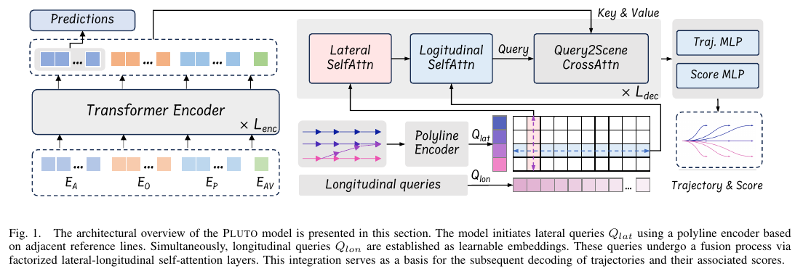

# 数式の解説

 - 静的物標 = 障害物 or obstacle
 - 動的物標 = エージェント or agent

## PLUTOのアーキテクチャ


## 3.1 Problem Formulation（問題定式化）

### 数式 1-1: 自動運転計画の基本定式化

```math
(T_0, \pi_0), P_{1:NA} = f(A, O, M, C | \phi)
```

- **目的**: 自動運転車（AV）のための 計画軌道 ( $T_0$ , $\pi_0$ ) と  周囲の動的エージェントの予測 $P_{1:NA}$ を生成します。
  - 自動運転計画の基本定式化とは、自動運転車が安全かつ効率的に目的地まで移動するための最適な軌道を決定するための数学的な枠組みを指します。
  - この定式化は、車両の動きや環境の情報を考慮し、適切な運転行動を選択するための基礎を提供します。
- **変数**:
  - $N_A$: 動的エージェントの数
  - $N_S$: 静的障害物の数
  - $A$: エージェントの特徴。( = $A_{0:N_A}$ , $A_0$ = AV )
  - $O$: 静的障害物。( = $O_{1:N_S}$ )
  - $M$: 高精度マップ情報。
  - $C$: 交通信号の状態などのコンテキスト。
  - $\phi$: モデルのパラメータ。
  - $f$: PLUTOのニューラルネットワーク。

- **具体的な内容(論文にはない情報の補足)**:
  1. **目的関数の例**:
     - 自動運転計画では、車両が安全に目的地まで到達するために、いくつかの目標を最適化する必要があります。これらの目標は通常、以下のような目的関数で表されます：
     - ここで、$\tau$ は車両の軌道を表し、$J_{\text{safety}}(\tau)$ は安全性のコスト、$J_{\text{comfort}}(\tau)$ は快適性のコスト、$J_{\text{efficiency}}(\tau)$ は効率性のコストをそれぞれ表します。この目的関数を最小化することが、最適な運転計画を見つけることになります。
   ```math
   \text{Minimize } J(\tau) = J_{\text{safety}}(\tau) + J_{\text{comfort}}(\tau) + J_{\text{efficiency}}(\tau)
   ```
     

  2. **制約条件の例**:
     - 運転計画の際には、物理的な制約や環境からの制約が考慮されます。これらの制約は、車両の動きが道路の規則や物理的な限界に適合するように設定されます。例えば下式：
     - これらの制約を満たしながら、最適な運転計画が行われます。

    ```math
    \begin{align}
    \text{Subject to: }
    = 
    \begin{cases}
    \text{車両の動力学的制約（例えば、加速度や速度の限界）}\\
    \text{環境の制約（例えば、レーンの境界や障害物の位置）}
    \end{cases}
    \end{align}
    ```

  3. **シーン理解と予測**:
     - 自動運転計画では、シーン全体を理解し、他のエージェント（他の車両や歩行者など）の動きを予測する必要があります。これにより、将来の状況を予測し、それに基づいた運転計画を立てることが可能になります。
     - ここで、$\hat{\tau}_i$ は他のエージェントの予測軌道、$\pi_i$ はその信頼度を示します。


  4. **最適軌道の選択方法の例**:
     - 上記の目的関数と制約条件を考慮し、複数の候補軌道から最適な軌道を選択します。最適軌道は、安全性、快適性、効率性のバランスを取りながら選ばれます。
     - ここで、$\tau^*$ は選ばれた最適な軌道を示します。
   ```math
   \tau^* = \arg\min_\tau J(\tau)
   ```
   
- **重要性**:
  - 自動運転計画の基本定式化は、モデルが適切な運転行動を選択し、安全かつ効率的な運転を実現するための理論的基盤を提供します。
  - これにより、モデルは複雑な運転状況に適応し、最良の運転計画を立てることができます。

---
### 数式 1-2: 最適軌道の選択

```math
(\tau^*, \pi^*) = \arg\max_{(\tau, \pi) \in (T_0, \pi_0)} S(\tau, \pi, P_{1:N_A}, O, M, C)
```

- **目的**: シーンの文脈を考慮して、最も適切な軌道と信頼度スコア ($\tau^*$, $\pi^*$) を選択します。
- **変数**:
  - $\tau$ : 複数の計画軌道（Trajectories）
    - モデルは複数の候補軌道を生成します。これらの候補軌道が $\tau$ で表されます。

  - $\pi$ : 各軌道に対する信頼度スコア（Scores）
    - 各候補軌道 $\tau$ に対して、どれだけその軌道が適切であるかを示す信頼度スコアが $\pi$ で表されます。

  - $\tau^*$ : 最適な計画軌道（Optimal Trajectory）
    - モデルが複数の候補軌道 $\tau$ の中から選択した最適な軌道が $\tau^*$ です。

  - $\pi^*$ : 最適な軌道に対する信頼度スコア（Optimal Score）
    - 最適な軌道 $\tau^*$ に対する信頼度スコアが $\pi^*$ です。
  - $S$: スコアリングモジュール
    - $S$は、各軌道 $\tau$ とその信頼度スコア $\pi$ を評価し、シーンの文脈（例えば、他のエージェントの動き、静的障害物、交通信号などの情報）を考慮して、最も適切な軌道を選び出す役割を果たします。
    - このスコアリングモジュールは、与えられた入力情報に基づいて、軌道の安全性、効率性、その他の運転目標に適合するかどうかを判断します。

- **具体的な内容　(論文の補足メモ)**:

  1. **候補軌道の生成**:
     - モデルは、与えられたシーン情報に基づいて、複数の候補軌道（$\tau$）を生成します。これらの軌道は、例えば前方の車両を追従する、レーンを変更する、停止するなど、さまざまな運転行動に対応しています。

  2. **軌道の評価基準**:
     - 各候補軌道は、信頼度スコア（$\pi$）やシーンの文脈（他のエージェントの動き、静的障害物、地図情報など）に基づいて評価されます。これには、軌道がどれだけ安全か、効率的か、運転目標に合致しているかが含まれます。

  3. **スコアリングモジュール $S$ の役割**:
     - スコアリングモジュール $S$ は、各候補軌道にスコアを与え、そのスコアに基づいて最適な軌道 $\tau^*$ を選びます。

  4. **最適軌道と信頼度スコア**:
     - 最適軌道 $\tau^*$ は、スコアリングモジュールによって最も高いスコアを得た軌道です。同時に、その軌道に対する信頼度スコア $\pi^*$ も算出されます。このスコアは、選択された軌道がどれだけ信頼できるかを示します。

- **重要性**:
  - $S$ は、自動運転モデルが安全かつ効率的に運転計画を立てるために不可欠なプロセスです。この選択が正確であるほど、車両は安全に、目的地に迅速に到達することが可能になります。


## 3.2 Input Representation and Scene Encoding（入力表現とシーンエンコーディング）

### 3.2.1 Agent History Encoding
これの目的は、エージェント（自動車や他の移動体）の過去の観測データを処理し、効率的な特徴ベクトルに変換することです。この変換により、モデルがエージェントの動きや挙動を正確に捉え、予測や計画に活用できるようになります。

#### 数式 (a) の解説
エージェントの観測状態 $s^t_i$ は以下のように表されます：

```math
s^t_i = \left( p^t_i, \theta^t_i, v^t_i, b^t_i, \mathcal{I}^t_i \right)
```

このベクトルには、位置、進行方向、速度、寸法、および観測フレームの情報が含まれています。過去の観測データをベクトル形式に変換するために、時間ステップ $t$ と $t-1$ の間の差分を以下のように計算します：

```math
\hat{s}^t_i = \left( p^t_i - p^{t-1}_i, \theta^t_i - \theta^{t-1}_i, v^t_i - v^{t-1}_i, b^t_i, \mathcal{I}^t_i \right)
```

この操作により、エージェントの特徴ベクトル $F_A$ が次のような次元を持ちます：

```math
F_A \in \mathbb{R}^{N_A \times (T_H - 1) \times 8}
```

#### 変数の説明
- **$p^t_i$**: エージェントの位置座標。これはエージェントの位置を示す2次元のベクトルです。
- **$\theta^t_i$**: エージェントの進行方向の角度。通常、地面座標系に対するエージェントの向きを表します。
- **$v^t_i$**: エージェントの速度ベクトル。エージェントがどの方向にどれだけ速く動いているかを示します。
- **$b^t_i$**: エージェントの検出境界ボックスの寸法。長さと幅で構成され、エージェントの物理的なサイズを示します。
- **$\mathcal{I}^t_i$**: 観測フレームのバイナリインジケーター。このフレームが観測されたかどうかを示すフラグです。

最終的に、Feature Pyramid Network (FPN) を使用してこれらの履歴特徴を抽出および圧縮し、次の次元を持つエージェント埋め込み $E_A$ を生成します：

```math
E_A \in \mathbb{R}^{N_A \times D}
```

ここで、$D$ は隠れ層の次元を表しています。


### 3.2.2 Static Obstacle Encoding
この目的は、自動運転車が走行中に回避すべき静的障害物（例えば、交通コーンやバリアなど）をエンコードすることです。これにより、安全なナビゲーションが確保されます。静的障害物は、運転計画において非常に重要であり、無視されるべきではありません。

#### 数式 (b) の解説
各静的障害物は、以下のように表されます：

```math
o_i = \left( p_i, \theta_i, b_i \right)
```

ここで、$o_i$ は静的障害物の位置や寸法に関連する情報を含むベクトルです。このベクトルは、以下の方法でエンコードされます：

```math
F_O \in \mathbb{R}^{N_S \times 5}
```

- 5は静的障害物の特徴ベクトルの次元（x, y, yaw, height, width）

その後、2層の多層パーセプトロン (MLP) を使用して、静的物体の特徴をエンコードし、埋め込み $E_O$ を生成します。この埋め込みの次元は次のようになります：

```math
E_O \in \mathbb{R}^{N_S \times D}
```

#### 変数の説明
- **$p_i$**: 静的障害物の位置。これは障害物の場所を示す2次元のベクトルです。
- **$\theta_i$**: 静的障害物の進行方向の角度。通常、障害物の向きや方向を示します。
- **$b_i$**: 静的障害物の寸法。これは障害物のサイズ（長さと幅）を示します。
- **$F_O$**: 静的物体の特徴ベクトル。これには、各静的障害物の位置、方向、寸法が含まれます。
- **$E_O$**: MLP によってエンコードされた静的障害物の埋め込み。この埋め込みは、後続の処理に使用されます。


### 3.2.3 AV's State Encoding
この目的は、自動運転車（AV）の現在の状態を効率的にエンコードすることです。過去の研究から得られた知見に基づき、模倣学習では履歴データからショートカットを学習しやすく、それが性能を悪化させる可能性があるため、このアプローチでは自動運転車の「現在の状態」のみを入力特徴として使用します。

#### 数式 (c) の解説
現在の自動運転車の状態は、次のような要素で構成されます：

- 位置
- 進行方向の角度
- 速度
- 加速度
- ステアリング角度

これらの情報を基に、注意機構に基づく状態ドロップアウトエンコーダ（[State Dropout Encoder, SDE](./State_Dropout_Encoder.md)）を使用して状態特徴をエンコードします。このエンコードにより、外挿された運動学的状態に基づく軌道生成を避けることができます。最終的に、エンコードされた自動運転車の埋め込みベクトル $E_{AV}$ が次の次元を持つ形で生成されます：

```math
E_{AV} \in \mathbb{R}^{1 \times D}
```

- **位置**: 自動運転車の現在位置を示す2次元ベクトル。
- **進行方向の角度**: 自動運転車の進行方向を示す角度。通常、地面座標系に対する向きを表します。
- **速度**: 自動運転車の移動速度を示すベクトル。これは、車両がどれくらいの速さで進んでいるかを表します。
- **加速度**: 自動運転車の加速度を示すベクトル。これは、車両の速度がどのように変化しているかを示します。
- **ステアリング角度**: 自動運転車のステアリングホイールの角度。これは、車両がどの方向に向かおうとしているかを示します。

これらの状態情報は、エンコードされることで、埋め込みベクトル $E_{AV}$ となり、次の処理ステップで使用されます。この埋め込みは、自動運転車の現在の状態を効率的に表現し、予測や計画において重要な役割を果たします。


---
---
---


### 数式 a: Agent History Encoding(エージェント履歴の差分表現)

```math
\hat{s}^t_i = (p^t_i - p^{t-1}_i, \theta^t_i - \theta^{t-1}_i, v^t_i - v^{t-1}_i, b^t_i, I^t_i)
```

- **目的**: エージェントの履歴情報を差分として表現し、時系列情報を抽出します。
- **変数**:
  - $p^t_i$, $\theta^t_i$, $v^t_i$: エージェントの位置、方向、速度。
  - $b^t_i$: バウンディングボックスの寸法。
  - $I^t_i$: 状態のバイナリ指標。
    - 「状態のバイナリ指標」とは、エージェントの観測状態が有効かどうかを示すために使用される2値（バイナリ）変数のことです。このバイナリ指標は、エージェントが観測可能かどうか、またはそのデータが信頼できるかどうかを判定するために利用されます。
    - 具体的な役割　(論文の補足メモ):
      1. 観測の有効性のチェック:
          - バイナリ指標は、各エージェントの状態（位置、速度、方向など）が観測可能かどうかを表します。例えば、エージェントがセンサーの範囲外に出てしまった場合や、データが欠損している場合、バイナリ指標は「無効」（通常は0）としてマークされます。
      2. データの信頼性の判断:
          - バイナリ指標を使用して、モデルはどのデータが信頼できるかを判断します。信頼できるデータのみを使用して、エージェントの将来の動きや状態を予測することができます。これにより、ノイズの多いデータや誤った観測に基づいた判断を避けることができます。
      3. 学習時の影響を軽減:
          - このバイナリ指標は、学習アルゴリズムが無効なデータを誤って学習するのを防ぎます。これにより、モデルが健全で正確な予測を行うために必要なデータのみを学習することができます。


- **説明**:
  - エージェント履歴の差分 $\hat{s}_i$ は、自動運転モデルにおいて、エージェント（車両や歩行者など）の過去の動きや状態の変化を捉えるために使われます。この差分は、エージェントがどのように動いてきたか、例えば速度や方向の変化など、時系列的な情報を把握する目的で使用されます。

- **具体的な目的**:

  1. **動きのパターンの学習**:
     - 差分情報を使うことで、モデルはエージェントの動きのパターン（例えば、加速している、減速している、方向を変えているなど）を学習します。これにより、現在のエージェントの動きを理解し、将来の動きを予測する能力が向上します。

  2. **タイムステップごとの変化の捉え方**:
     - エージェントの位置や速度、方向の変化をタイムステップごとに分析することで、モデルはエージェントが将来的にどのような動きをするかを予測する際に重要な情報を得ます。

  3. **リアクションの予測**:
     - 他のエージェントや障害物に対するエージェントのリアクションを予測する際にも、過去の動きの履歴が役立ちます。例えば、急な減速や方向転換がある場合、そのエージェントが直面している状況を理解し、適切な対策を講じるための材料となります。

- **重要性**:
  - この差分情報は、単なる静的な状態（現在の位置や速度など）に基づく判断ではなく、時間的な変化を考慮したより精緻な予測を可能にします。これにより、より安全で効率的な運転計画が可能となります。

---
### 数式 4: エージェント特徴ベクトル

```math
F_A \in \mathbb{R}^{N_A \times (T_H-1) \times 8}
```

- **目的**: エージェントの特徴(ベクトル形式）。
  - $F_A$ とは、各エージェント（他の車両や歩行者など）に関する重要な情報をまとめたベクトル表現です。
  - この特徴ベクトルは、エージェントの過去の動きや状態、位置、速度、方向などの情報をエンコードし、モデルがそれらのエージェントの将来の動きを予測するために利用されます。
- **変数**:
  - $N_A$: エージェントの数。
  - $T_H$: 履歴時間ステップの数。

- **具体的な内容**:
  1. **エージェントの履歴情報の集約**:
     - $F_A$ は、エージェントの過去の位置、速度、方向などの履歴データから計算されます。これにより、エージェントがどのように動いてきたかを把握することができます。

  2. **時系列データのエンコード**:
     - この特徴ベクトルには、エージェントの時系列的な変化（例えば、時間ごとの位置の変化や速度の変化）が含まれており、エージェントがどのような動きのパターンを持っているかを捉えます。

  3. **モデルへの入力として使用**:
     - $F_A$ は、モデルの入力として使用され、他のエージェントや障害物との相互作用を考慮しながら、エージェントの将来の行動を予測するための基礎データとなります。

  4. **次元構造**:
     - $F_A$ は通常、$N_A \times (T_H - 1) \times 8$ の形状を持ち、$N_A$ はエージェントの数、$T_H$ は履歴の時間ステップ数、$8$ は各時点での特徴の数（位置、速度、方向など）を表します。

- **重要性**:
  - エージェント特徴ベクトル $F_A$ は、自動運転車が周囲のエージェントの動きを正確に予測し、安全に運転計画を立てるために不可欠な要素です。これにより、エージェントの複雑な動きや相互作用を考慮した高度な予測が可能となります。

---
### 数式 5: シーンエンコーディングの統合テンソル

```math
E_0 = \text{concat}(E_{AV}, E_A, E_O, E_P) + PE + E_{attr}
```

- **目的**: AV、エージェント、静的障害物、マップ情報を統合し、シーンの全体像をエンコードします。
  - この数式は、シーン全体を一つのテンソルにまとめることで、複雑な相互作用をキャプチャする方法を示しています。
  - シーンエンコーディングの統合テンソルは、自動運転モデルにおいて、車両（自動運転車）、周囲のエージェント（他の車両や歩行者など）、静的障害物、地図情報など、複数の入力情報を統合するためのテンソル（多次元配列）です。

- **変数**:
  - $E_{AV}$, $E_A$, $E_O$, $E_P$: それぞれAV、エージェント、障害物、マップのエンコーディング。
  - $PE$: Positional Encodingを使った位置情報。
  - $E_{attr}$: 意味属性のエンコーディング。

- **具体的な内容**:
  1. **異なる情報の統合**:
     - 統合テンソルは、以下のような異なる種類の情報をまとめます：
       - **自動運転車の状態**（位置、速度、方向など）
       - **周囲のエージェントの状態**（他の車両や歩行者の動き）
       - **静的障害物**（建物や交通標識など）
       - **高精度マップ情報**（レーン、道路境界など）

  2. **テンソルの構造**:
     - この統合テンソルは、各情報源からのエンコーディングベクトル（特徴ベクトル）を連結して構成されます。具体的には、次のような形で構成されます：
     - ここで、$E_{AV}$ は自動運転車のエンコーディング、$E_A$ は周囲のエージェントのエンコーディング、$E_O$ は静的障害物のエンコーディング、$E_P$ はマップ情報のエンコーディングを表し、これらを結合して統合テンソル $E_0$ を形成します。
     - さらに、位置エンコーディング（$PE$）や意味属性エンコーディング（$E_{attr}$）が加えられます。

  3. **トランスフォーマーエンコーダへの入力**:
     - この統合テンソル $E_0$ は、トランスフォーマーエンコーダに入力され、シーン全体の複雑な相互作用をモデルが学習できるようになります。
     - エンコーダは、このテンソルを用いて、シーン全体を理解し、将来の予測や計画を立てるための基礎を構築します。

- **重要性**:
  - シーンエンコーディングの統合テンソルは、複数の情報源を統合し、それらの相互作用を効果的にモデル化するために不可欠です。これにより、モデルはシーン全体を一つの視点で捉え、より正確で安全な運転計画を立てることが可能になります。

---
## 3.3 Multi-modal Planning Trajectory Decoding（マルチモーダル計画軌道デコーディング）

### 数式 6: 初期クエリの投影

```math
Q_0 = \text{Projection}(\text{concat}(Q_{lat}, Q_{lon}))
```

- **目的**: 横方向と縦方向のクエリを結合し、初期クエリセットを生成します。
  - この数式は、横方向と縦方向の運転行動を統合する方法を示しています。
  - 初期クエリの投影の式は、自動運転モデルにおいて、横方向と縦方向の運転行動に基づいたクエリを生成し、それらを結合して初期のクエリセットを作成するプロセスを表しています。
  - このプロセスは、運転計画のデコーディングの基盤となる重要なステップです。
- **変数**:
  - $Q_{lat}$, $Q_{lon}$: 横方向と縦方向のクエリ。
- **具体的な内容**:

  0. **クエリとは**:
     - クエリは、具体的には「どの情報に注意を向けるべきかをモデルに尋ねるためのデータのセット」です。
     - トランスフォーマーアーキテクチャでは、セルフアテンションメカニズムにおいて、クエリ（Query）、キー（Key）、バリュー（Value）の3つの要素が用いられます。クエリは、モデルがどの情報に注意を向けるべきかを決定するためのデータです。
     - クエリは、他の要素との関連性（スコア）を計算するためにキーと比較され、その結果をバリューに適用することで、モデルが必要とする情報を抽出します。

  1. **クエリの種類**:
     - **横方向クエリ（Lateral Queries, $Q_{lat}$）**: 
       - これは、道路上での車両の横方向（左右の位置やレーン変更）の動きを捉えるために使用されます。例えば、車両がレーンを変更するか、直進するかといった横方向の決定をサポートします。
     - **縦方向クエリ（Longitudinal Queries, $Q_{lon}$）**: 
       - これは、車両の縦方向（前後の動き、加速・減速）の動きを捉えるために使用されます。例えば、車両が加速するか減速するかといった縦方向の決定をサポートします。

  2. **クエリの投影**:
     - 横方向と縦方向のクエリはそれぞれ独立に生成されますが、これらを結合して初期クエリセット $Q_0$ を生成する必要があります。この結合されたクエリセットは、運転行動を全体的に捉えるための基盤となります。
     - 関数「Projection()」は通常、単純な線形層や多層パーセプトロン（MLP）を指し、結合されたクエリを適切な次元に投影します。
     - 「concat」は、横方向クエリ $Q_{lat}$ と縦方向クエリ $Q_{lon}$ を結合する操作を示します。

  3. **初期クエリセット $Q_0$**:
     - この初期クエリセット $Q_0$ は、後続のトランスフォーマーデコーダで使用され、シーン全体のエンコーディング情報とクロスアテンションを行うための基礎として機能します。
     - $Q_0$ は、運転計画の軌道をデコードし、車両の次の動きを予測するために非常に重要な役割を果たします。

- **重要性**:
  - 初期クエリの投影は、運転計画のデコーディングプロセスにおいて、横方向と縦方向の動きを統合し、シーン全体の文脈に基づいた最適な運転行動を決定するための基盤を形成します。このプロセスが正確であるほど、車両はより安全で効率的な運転を実現することができます。

---
### 数式 7: 軌道デコーディングのセルフアテンション

```math
Q'_{i-1} = \text{SelfAttn}(Q_{i-1}, \text{dim} = 0)
```

```math
\hat{Q}_{i-1} = \text{SelfAttn}(Q'_{i-1}, \text{dim} = 1)
```

```math
Q_i = \text{CrossAttn}(\hat{Q}_{i-1}, E_{enc}, E_{enc})
```

- **目的**: 横方向セルフアテンション、縦方向セルフアテンション、シーン情報とのクロスアテンションを通じて軌道をデコードします。
  - 軌道デコーディングのセルフアテンションの式は、自動運転モデルにおいて、運転計画のデコーディングプロセスで重要な役割を果たします。
  - セルフアテンションメカニズム（Self-Attention）は、入力クエリ内での各要素間の関連性を学習し、それを基に重要な特徴を強調するために使用されます。
  - 軌道デコーディングにおいて、横方向と縦方向のセルフアテンションが適用され、複数の運転軌道候補が適切にデコードされます。
- **変数**:
  - $\text{SelfAttn}(X, \text{dim} = i)$: $X$ の $i$ 次元でのセルフアテンション。
  - $\text{CrossAttn}(Q, K, V)$: クロスアテンション操作。

- **具体的な内容**:
  1. **横方向セルフアテンション（Lateral Self-Attention）**:
     - 横方向の運転行動（例えば、レーン変更や左右への動き）に関する情報を処理するために、横方向クエリに対してセルフアテンションが適用されます。これにより、横方向の動きにおける重要な情報が強調されます。

     - 数式で表すと次のようになります：
     - ここで、$Q_{i-1}$ は前のステップのクエリで、$Q'_{i-1}$ はセルフアテンションを適用した後のクエリです。`dim=0` は横方向（Lateral）次元でセルフアテンションが適用されることを示します。
   ```math
   Q'_{i-1} = \text{SelfAttn}(Q_{i-1}, \text{dim} = 0)
   ```

  2. **縦方向セルフアテンション（Longitudinal Self-Attention）**:
     - 縦方向の運転行動（例えば、加速や減速）に関する情報を処理するために、縦方向クエリに対してセルフアテンションが適用されます。これにより、縦方向の動きにおける重要な情報が強調されます。

     - 数式で表すと次のようになります：
     - ここで、$Q'_{i-1}$ は横方向セルフアテンションを適用した後のクエリで、$\hat{Q}_{i-1}$ は縦方向セルフアテンションを適用した後のクエリです。
     - `dim=1` は縦方向（Longitudinal）次元でセルフアテンションが適用されることを示します。
   ```math
   \hat{Q}_{i-1} = \text{SelfAttn}(Q'_{i-1}, \text{dim} = 1)
   ```
     

  3. **シーンエンコーディングとのクロスアテンション（Cross-Attention with Scene Encoding）**:
     - 最後に、セルフアテンションを適用したクエリセットは、シーン全体のエンコーディング情報とクロスアテンションを行います。これにより、運転軌道の最終的なデコードが行われ、運転行動がシーンの文脈に適合するようになります。

     - 数式で表すと次のようになります：
     - ここで、$\hat{Q}_{i-1}$ は縦方向セルフアテンションを適用した後のクエリで、$E_{enc}$ はシーンエンコーディングです。
     - この操作により、シーン全体の文脈を考慮した運転軌道が生成されます。
   ```math
   Q_i = \text{CrossAttn}(\hat{Q}_{i-1}, E_{enc}, E_{enc})
   ```
     

- **重要性**:
  - 軌道デコーディングのセルフアテンションは、複数の運転軌道候補を生成し、それらがシーン全体の文脈にどのように適合するかを評価するための基盤を提供します。横方向と縦方向のセルフアテンションを適用することで、運転軌道がより詳細に評価され、より安全で効率的な運転計画が可能となります。

---
### 数式 8: 軌道とスコアの生成

```math
T_0 = \text{MLP}(Q_{dec}), \quad \pi_0 = \text{MLP}(Q_{dec})
```

- **目的**: デコーダの出力からAVの将来の軌道とそのスコアを決定します。
  - 軌道とスコアの生成の式は、自動運転モデルが最終的に候補軌道（trajectory）とそれに対応する信頼度スコアを生成するプロセスを表します。
  - このプロセスでは、セルフアテンションやクロスアテンションを経て得られたクエリから、具体的な運転軌道とその評価スコアを導き出します。
- **変数**:
  - $Q_{dec}$: 軌道デコーダの出力。
- **具体的な内容**:
  1. **軌道の生成**:
     - クエリセット $Q_i$ は、トランスフォーマーデコーダによって処理された後、軌道生成用の多層パーセプトロン（MLP）に入力されます。このMLPは、クエリを最終的な軌道に変換するための関数です。

     - 数式で表すと次のようになります：
     - ここで、$T_0$ は生成された軌道（trajectory）であり、$\text{MLP}_{traj}$ は軌道生成用の多層パーセプトロンを示します。この関数は、クエリセットから2次元の位置座標（x, y）を予測します。
   ```math
   T_0 = \text{MLP}_{traj}(Q_i)
   ```
   
  2. **スコアの生成**:
     - 同様に、クエリセット $Q_i$ は、スコア生成用の多層パーセプトロン（MLP）に入力され、各軌道に対する信頼度スコアが生成されます。このスコアは、モデルがその軌道をどれだけ確信を持って選んでいるかを示します。

     - 数式で表すと次のようになります：
     - ここで、$\pi_0$ は生成されたスコアであり、$\text{MLP}_{score}$ はスコア生成用の多層パーセプトロンを示します。この関数は、クエリセットからスカラー値を予測し、その軌道がどれだけ適切であるかを評価します。
   ```math
   \pi_0 = \text{MLP}_{score}(Q_i)
   ```
   
  3. **軌道とスコアの組み合わせ**:
     - 最終的に、生成された軌道 $T_0$ とスコア $\pi_0$ は組み合わされ、複数の候補軌道の中から最適な軌道とそれに対応する信頼度スコアが選択されます。このプロセスは、運転計画において非常に重要であり、モデルが安全かつ効率的に運転できる軌道を選択するための基盤となります。

- **重要性**:
  - 軌道とスコアの生成は、自動運転モデルが複数の運転候補の中から最適な運転計画を選択するための決定的なステップです。このプロセスにより、モデルは実際の運転状況に基づいて最も適切な行動を選び、車両を安全に目的地に導くことができます。
