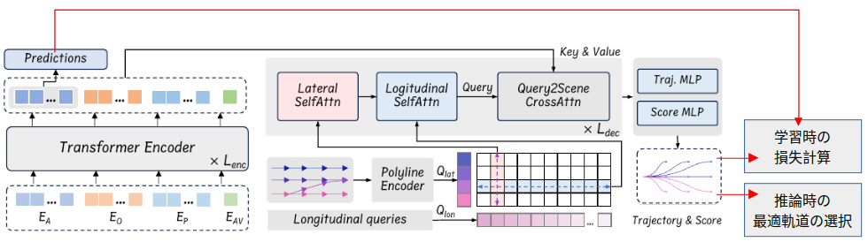

# 全数式の解説

 - 静的物標 = 障害物 or obstacle
 - 動的物標 = エージェント or agent

## PLUTOのアーキテクチャ


## 3.1 Problem Formulation( 問題定式化 )

### 数式 1-1: 自動運転計画の基本定式化(機械学習)

```math
(T_0, \pi_0), P_{1:NA} = f(A, O, M, C | \phi)
```

- **目的**: 自動運転車( AV )のための 計画軌道 ( $T_0$ , $\pi_0$ ) と  周囲の動的エージェントの予測 $P_{1:NA}$ を生成します。
  - 自動運転計画の基本定式化とは、自動運転車が安全かつ効率的に目的地まで移動するための最適な軌道を決定するための数学的な枠組みを指します。
  - この定式化は、車両の動きや環境の情報を考慮し、適切な運転行動を選択するための基礎を提供します。
- **変数**:
  - $N_A$: 動的エージェントの数
  - $N_S$: 静的障害物の数
  - $A$: エージェントの特徴。( = $A_{0:N_A}$ , $A_0$ = AV )
  - $O$: 静的障害物。( = $O_{1:N_S}$ )
  - $M$: 高精度マップ情報。
  - $C$: 交通信号の状態などのコンテキスト。
  - $\phi$: モデルのパラメータ。
  - $f$: PLUTOのニューラルネットワーク。

- **[補足](./Supplement_EQ_1_1.md)**:
  

---
### 数式 1-2: 自動運転計画の基本定式化(最適軌道の選択)

```math
(\tau^*, \pi^*) = \arg\max_{(\tau, \pi) \in (T_0, \pi_0)} S(\tau, \pi, P_{1:N_A}, O, M, C)
```

- **目的**: シーンの文脈を考慮して、最も適切な軌道と信頼度スコア ($\tau^*$, $\pi^*$) を選択します。
- **変数**:
  - $\tau$ : 複数の計画軌道( Trajectories )
    - モデルは複数の候補軌道を生成します。これらの候補軌道が $\tau$ で表されます。

  - $\pi$ : 各軌道に対する信頼度スコア( Scores )
    - 各候補軌道 $\tau$ に対して、どれだけその軌道が適切であるかを示す信頼度スコアが $\pi$ で表されます。

  - $\tau^*$ : 最適な計画軌道( Optimal Trajectory )
    - モデルが複数の候補軌道 $\tau$ の中から選択した最適な軌道が $\tau^*$ です。

  - $\pi^*$ : 最適な軌道に対する信頼度スコア( Optimal Score )
    - 最適な軌道 $\tau^*$ に対する信頼度スコアが $\pi^*$ です。
  - $S$: スコアリングモジュール
    - $S$は、各軌道 $\tau$ とその信頼度スコア $\pi$ を評価し、シーンの文脈( 例えば、他のエージェントの動き、静的障害物、交通信号などの情報 )を考慮して、最も適切な軌道を選び出す役割を果たします。
    - このスコアリングモジュールは、与えられた入力情報に基づいて、軌道の安全性、効率性、その他の運転目標に適合するかどうかを判断します。

- **[補足](./Supplement_EQ_1_2.md)**:

<br>

## 3.2 Input Representation and Scene Encoding( 入力表現とシーンエンコーディング )

### 3.2.1 Agent History Encoding
これの目的は、エージェント( 自動車や他の移動体 )の過去の観測データを処理し、効率的な特徴ベクトルに変換することです。この変換により、モデルがエージェントの動きや挙動を正確に捉え、予測や計画に活用できるようになります。

#### 数式 (a) の解説
エージェントの観測状態 $s^t_i$ は以下のように表されます：

```math
s^t_i = \left( p^t_i, \theta^t_i, v^t_i, b^t_i, \mathcal{I}^t_i \right)
```

このベクトルには、位置、進行方向、速度、寸法、および観測フレームの情報が含まれています。過去の観測データをベクトル形式に変換するために、時間ステップ $t$ と $t-1$ の間の差分を以下のように計算します：

```math
\hat{s}^t_i = \left( p^t_i - p^{t-1}_i, \theta^t_i - \theta^{t-1}_i, v^t_i - v^{t-1}_i, b^t_i, \mathcal{I}^t_i \right)
```

この操作により、エージェントの特徴ベクトル $F_A$ が次のような次元を持ちます：

```math
F_A \in \mathbb{R}^{N_A \times (T_H - 1) \times 8}
```

#### 変数の説明
- **$p^t_i$**: エージェントの位置座標。これはエージェントの位置を示す2次元のベクトルです。
- **$\theta^t_i$**: エージェントの進行方向の角度。通常、地面座標系に対するエージェントの向きを表します。
- **$v^t_i$**: エージェントの速度ベクトル。エージェントがどの方向にどれだけ速く動いているかを示します。
- **$b^t_i$**: エージェントの検出境界ボックスの寸法。長さと幅で構成され、エージェントの物理的なサイズを示します。
- **$\mathcal{I}^t_i$**: 観測フレームのバイナリインジケーター。このフレームが観測されたかどうかを示すフラグです。

最終的に、[Feature Pyramid Network (FPN)](./Feature_Pyramid_Network.md) を使用してこれらの履歴特徴を抽出および圧縮し、次の次元を持つエージェント埋め込み $E_A$ を生成します：

```math
E_A \in \mathbb{R}^{N_A \times D}
```

ここで、$D$ は隠れ層の次元を表しています。

<br>

### 3.2.2 Static Obstacle Encoding
この目的は、自動運転車が走行中に回避すべき静的障害物( 例えば、交通コーンやバリアなど )をエンコードすることです。これにより、安全なナビゲーションが確保されます。静的障害物は、運転計画において非常に重要であり、無視されるべきではありません。

#### 数式 (b) の解説
各静的障害物は、以下のように表されます：

```math
o_i = \left( p_i, \theta_i, b_i \right)
```

ここで、$o_i$ は静的障害物の位置や寸法に関連する情報を含むベクトルです。このベクトルは、以下の方法でエンコードされます：

```math
F_O \in \mathbb{R}^{N_S \times 5}
```

- 上式の"5"は、静的障害物の特徴ベクトルの次元( x, y, yaw, height, width )

その後、2層の多層パーセプトロン (MLP) を使用して、静的物体の特徴をエンコードし、埋め込み $E_O$ を生成します。この埋め込みの次元は次のようになります：

```math
E_O \in \mathbb{R}^{N_S \times D}
```

#### 変数の説明
- **$p_i$**: 静的障害物の位置。これは障害物の場所を示す2次元のベクトルです。
- **$\theta_i$**: 静的障害物の進行方向の角度。通常、障害物の向きや方向を示します。
- **$b_i$**: 静的障害物の寸法。これは障害物のサイズ( 長さと幅 )を示します。
- **$F_O$**: 静的物体の特徴ベクトル。これには、各静的障害物の位置、方向、寸法が含まれます。
- **$E_O$**: MLP によってエンコードされた静的障害物の埋め込み。この埋め込みは、後続の処理に使用されます。

<br>

### 3.2.3 AV's State Encoding
この目的は、自動運転車( AV )の現在の状態を効率的にエンコードすることです。過去の研究から得られた知見に基づき、模倣学習では履歴データからショートカットを学習しやすく、それが性能を悪化させる可能性があるため、このアプローチでは自動運転車の「現在の状態」のみを入力特徴として使用します。

#### 数式 (c) の解説
現在の自動運転車の状態は、次のような要素で構成されます：

- 位置
- 進行方向の角度
- 速度
- 加速度
- ステアリング角度

これらの情報を基に、Attention Mechanismに基づく状態ドロップアウトエンコーダ( [State Dropout Encoder, SDE](./State_Dropout_Encoder.md) )を使用して状態特徴をエンコードします。このエンコードにより、外挿された運動学的状態に基づく軌道生成を避けることができます。最終的に、エンコードされた自動運転車の埋め込みベクトル $E_{AV}$ が次の次元を持つ形で生成されます：

```math
E_{AV} \in \mathbb{R}^{1 \times D}
```

- **位置**: 自動運転車の現在位置を示す2次元ベクトル。
- **進行方向の角度**: 自動運転車の進行方向を示す角度。通常、地面座標系に対する向きを表します。
- **速度**: 自動運転車の移動速度を示すベクトル。これは、車両がどれくらいの速さで進んでいるかを表します。
- **加速度**: 自動運転車の加速度を示すベクトル。これは、車両の速度がどのように変化しているかを示します。
- **ステアリング角度**: 自動運転車のステアリングホイールの角度。これは、車両がどの方向に向かおうとしているかを示します。

これらの状態情報は、エンコードされることで、埋め込みベクトル $E_{AV}$ となり、次の処理ステップで使用されます。この埋め込みは、自動運転車の現在の状態を効率的に表現し、予測や計画において重要な役割を果たします。

<br>

### 3.2.4 Vectorized Map Encoding

この目的は、**Vectorized Map Encoding**（ベクトル化された地図のエンコーディング）について説明することです。具体的には、地図情報を扱うためにポリライン（折れ線）をどのように特徴ベクトルに変換するか、そのプロセスを詳細に述べています。このプロセスでは、地図の各ポイントの特徴を表すために、8つのチャンネルが用いられます。また、これらの特徴ベクトルをエンコードするために、[PointNet](./PointNet.md)のようなエンコーダを利用し、最終的にベクトル化された地図情報をエンコードされた特徴空間に変換する方法が示されています。

#### 数式の解説

1. **$(p_i - p_0, p_i - p_{i-1}, p_i - p_i^{left}, p_i - p_i^{right})$**:
   - 各ポリラインの$i$番目のポイントの特徴を8つのチャンネルで表現しています。
     - $p_i - p_0$: ポリラインの最初のポイント$p_0$からの距離。
     - $p_i - p_{i-1}$: 前のポイント$p_{i-1}$からの距離。
     - $p_i - p_i^{left}$: 車線の左境界$p_i^{left}$からの距離。
     - $p_i - p_i^{right}$: 車線の右境界$p_i^{right}$からの距離。

2. **$F_P \in \mathbb{R}^{N_P \times n_p \times 8}$**:
   - ここでは、ポリラインの特徴が$F_P$という行列で表現されています。$N_P$はポリラインの数、$n_p$はポリラインごとのポイントの数、8は上記で説明した8つのチャンネルの数です。

3. **$E_P \in \mathbb{R}^{N_P \times D}$**:
   - エンコードされたポリライン特徴が$E_P$として表現されています。$D$はエンコードされた特徴の次元数です。


#### 変数の説明

- **$p_i$**: ポリラインの$i$番目のポイント。
- **$p_0$**: ポリラインの最初のポイント。
- **$p_{i-1}$**: ポリラインの前のポイント。
- **$p_i^{left}$**: $i$番目のポイントに対応する車線の左境界のポイント。
- **$p_i^{right}$**: $i$番目のポイントに対応する車線の右境界のポイント。
- **$F_P \in \mathbb{R}^{N_P \times n_p \times 8}$**: 各ポリラインの特徴ベクトルの集合を表す行列。$N_P$はポリラインの数、$n_p$はポリラインごとのポイントの数、8は各ポイントの特徴を表すチャンネル数です。
- **$E_P \in \mathbb{R}^{N_P \times D}$**: エンコードされたポリラインの特徴を表す行列。$D$は特徴ベクトルの次元数です。

### 3.2.5 Scene Encoding
この目的は、複数のモダリティから入力されるデータ間の複雑な相互作用を効果的に捉えることです。具体的には、エージェント、自動運転車( AV )、静的障害物、地図などから得られるさまざまな埋め込みベクトルを統合し、シーン全体を表現するためのテンソルを生成します。

#### 数式(2),(3)の解説
まず、各種の埋め込みベクトルを統合するために以下のようにテンソル $E_0$ が定義されます( 数式 (2) )：

```math
E_0 = \text{concat}(E_{AV}, E_A, E_O, E_P) + PE + E_{\text{attr}}
```

ここで、それぞれの埋め込みは以下の通りです：
- **$E_{AV}$**: 自動運転車の埋め込みベクトル。
- **$E_A$**: エージェントの埋め込みベクトル。
- **$E_O$**: 静的障害物の埋め込みベクトル。
- **$E_P$**: 地図のポリラインの埋め込みベクトル。
- **$PE$**: Positional Embedding. グローバルな位置情報を表す。この埋め込みは、位置 ($p$, $\theta$) を使い、エージェントや静的障害物、ポリラインの初期点などの最近の位置に基づいて計算されます。
- **$E_{\text{attr}}$**: エージェントの種類、車線の制限速度、信号の状態などのセマンティック属性を表す学習可能な埋め込みベクトル。

次に、このテンソル $E_0$ を複数層のTransformerエンコーダに入力します。各エンコーダ層での処理は、以下の数式 (3) で表されます：

```math
\hat{E}_{i-1} = \text{LayerNorm}(E_{i-1}),
```

```math
E_i = E_{i-1} + \text{MHA}(\hat{E}_{i-1}, \hat{E}_{i-1}, \hat{E}_{i-1}),
```

```math
E_i = E_i + \text{FFN}(\text{LayerNorm}(E_i))
```

この式 (3) は、Transformerエンコーダの各層における処理を説明しています。各ステップを以下に詳しく説明します：

1. **Layer Normalization**:
   - 各層の入力 $E_{i-1}$ に対して、Layer Normalizationを適用し、正規化されたベクトル $\hat{E}_{i-1}$ を得ます。

2. **マルチヘッドAttention Mechanism (MHA)**:
   - 正規化されたベクトル $\hat{E}_{i-1}$ に対して、マルチヘッドAttention Mechanismを適用し、新しいベクトル $E_i$ を得ます。このAttention Mechanismでは、クエリ、キー、バリューが同じ入力( $\hat{E}_{i-1}$ )から計算されます。

3. **フィードフォワードネットワーク (FFN)**:
   - 最後に、フィードフォワードネットワーク( FFN )を通じてベクトル $E_i$ をさらに更新します。このステップでは、Layer Normalizationを再度適用してからFFNを実行し、最終的な出力を得ます。

これにより、最終的に得られるシーンの埋め込みベクトル $E_{\text{enc}}$ が生成され、後続のタスク( 予測や制御など )に使用されます。

#### 変数の説明
- **$E_{AV}$**: 自動運転車の現在の状態をエンコードした埋め込みベクトル。
- **$E_A$**: エージェントの履歴状態をエンコードした埋め込みベクトル。
- **$E_O$**: 静的障害物のエンコードされた埋め込みベクトル。
- **$E_P$**: 地図上のポリラインをエンコードした埋め込みベクトル。
- **$PE$**: グローバルな位置情報を表すFourier埋め込み。
- **$E_{\text{attr}}$**: エージェントの種類、車線の制限速度、信号の状態などのセマンティック属性を表す埋め込みベクトル。
- **$E_0$**: 上記の全ての埋め込みを統合したシーンの埋め込みベクトル。
- **$\hat{E}_{i-1}$**: 各層におけるLayer Normalizationを適用した後のベクトル。
- **$E_i$**: マルチヘッドAttention Mechanismとフィードフォワードネットワークを適用した後のベクトル。
- **$E_{\text{enc}}$**: 最終的なシーンの埋め込みベクトル。


<br>

## 3.3 Multi-modal Planning Trajectory Decoding

### 3.3.1 Reference Lines as Lateral Queries
この目的は、参照ライン( Reference Lines )を横方向クエリ( Lateral Queries )として使用し、自動運転車の横方向の運転行動を誘導することです。参照ラインは、自動運転車が走行する経路上にある周囲の車線から取得され、従来の車両運動計画において重要な役割を果たします。これにより、車両の横方向の挙動を適切に制御し、計画に反映させることができます。

#### 数式の解説

まず、自動運転車の現在の位置から一定の半径 $R_{\text{ref}}$ 内にある車線セグメントを特定します。それぞれのセグメントを起点として、深さ優先探索を行い、すべての可能なトポロジカルな接続を探索し、それらの車線の中心線をリンクします。

このようにして接続された中心線は、統一された長さに切り詰められ、一定の点数を保つために再サンプリングされます。この参照ラインの特徴を表現しエンコードする方法は、セクションIII-Bで説明されたベクトル化された地図のエンコーディングと同様です。最終的に、埋め込まれた参照ラインは、横方向のクエリ $Q_{\text{lat}}$ として利用されます。数式で表すと、次のようになります：

```math
Q_{\text{lat}} \in \mathbb{R}^{N_R \times D},
```

ここで、$N_R$ は参照ラインの数を表します。

#### 変数の説明
- **参照ライン( Reference Lines )**: 自動運転車の経路上にある車線から抽出されるライン。車両の横方向の動きを誘導するために使用されます。
- **$R_{\text{ref}}$**: 自動運転車の現在位置からの半径。この範囲内にある車線セグメントを特定します。
- **横方向クエリ $Q_{\text{lat}}$**: 埋め込まれた参照ラインで構成され、車両の横方向の計画に使用されるベクトル。
- **$N_R$**: 参照ラインの数。
- **$D$**: 各参照ラインの埋め込みベクトルの次元。


<br>

### 3.3.2 Factorized Lateral-longitudinal Self-Attention
この目的は、横方向( Lateral )と縦方向( Longitudinal )の両方に対して自己Attention Mechanism( Self-Attention )を適用し、車両の全体的な運転挙動を効果的にエンコードすることです。特に、横方向クエリ $Q_{\text{lat}}$ と縦方向クエリ $Q_{\text{lon}}$ を組み合わせて、横方向と縦方向の相互作用を捉えるためのクエリセット $Q_0$ を生成します。

#### 数式(4)の解説
まず、横方向クエリ $Q_{\text{lat}}$ に加えて、縦方向クエリ $Q_{\text{lon}}$ が使用されます。これらのクエリは、車両の縦方向の挙動( 例えば、加速や減速 )をエンコードするために利用されます。横方向クエリ $Q_{\text{lat}}$ と縦方向クエリ $Q_{\text{lon}}$ を結合し、次のようにクエリセット $Q_0$ が定義されます( 数式 (4) )：

```math
Q_0 = \text{Projection}(\text{concat}(Q_{\text{lat}}, Q_{\text{lon}}))
```

ここで、**Projection** は単純な線形層または多層パーセプトロン( MLP )を指します。この $Q_0$ は、各参照ラインの局所的な領域に関する情報のみを捉えています。

次に、このクエリセット $Q_0$ に対して自己Attention Mechanismを適用し、異なる参照ラインにまたがるグローバルな横方向・縦方向の情報を統合します。しかし、$Q_0$ に直接自己Attention Mechanismを適用すると、計算複雑性が $O(N_R^2 N_L^2)$ となり、$N_R$ および $N_L$ が大きくなると計算が非常に重くなります。そこで、文献 [45] に基づき、計算複雑性を $O(N_R^2 N_L + N_R N_L^2)$ に削減するために、[因子化されたAttention Mechanism](./Factorized_Attention_Mechanism.md)を採用します。

#### 変数の説明
- **$Q_{\text{lat}}$**: 横方向のクエリベクトル。車両の横方向の挙動に関する情報をエンコードします。
- **$Q_{\text{lon}}$**: 縦方向のクエリベクトル。車両の縦方向の挙動( 加速、減速など )に関する情報をエンコードします。
- **$Q_0$**: 横方向および縦方向のクエリを結合し、プロジェクションを適用した後のクエリセット。
- **Projection**: 単純な線形層または多層パーセプトロン( MLP )を指します。
- **$N_R$**: 参照ラインの数。
- **$N_L$**: 縦方向クエリの数。
- **計算複雑性**: 計算処理に必要な時間やリソースの量を示す尺度。因子化により、計算複雑性が軽減されます。

<br>

### 3.3.3 Trajectory Decoding
この目的は、自動運転車( AV )の将来の軌道( trajectory )をデコードするためのプロセスを説明することです。具体的には、デコーダ層( $L_{\text{dec}}$ )で行われる3種類の注意メカニズムを用いて、横方向、縦方向、およびクエリ間のクロスアテンションを組み合わせて軌道を生成します。

#### 数式(5), (6), (7)の解説
軌道デコーダは、複数のデコーディング層( $L_{\text{dec}}$ )で構成され、それぞれが次の3種類の注意メカニズムを含んでいます( 数式 (5) )：

- 横方向の自己Attention Mechanism( Lateral Self-Attention )
```math
\hat{Q}^{i-1} = \text{SelfAttn}(Q_{i-1}, \text{dim} = 0),
```

- 縦方向の自己Attention Mechanism( Longitudinal Self-Attention )
```math
\tilde{Q}_i = \text{SelfAttn}(\hat{Q}^{i-1}, \text{dim} = 1),
```

- クエリ間のクロスアテンション機構( Query-to-Scene Cross-Attention )
```math
Q_i = \text{CrossAttn}(\tilde{Q}_i, E_{\text{enc}}, E_{\text{enc}})
```

ここで、
- **SelfAttn**( 自己注意 ): 入力クエリ $Q_{i-1}$ に対して、$i$ 番目の次元に沿った自己注意を適用します。最初は横方向( dim = 0 )での注意が適用され、次に縦方向( dim = 1 )での注意が適用されます。
- **CrossAttn**( クロスアテンション ): 自己注意によって得られたクエリ $\tilde{Q}_i$ に対して、エンコードされた入力 $E_{\text{enc}}$ とのクロスアテンションを適用し、最終的なクエリ $Q_i$ を得ます。


デコーダの最終出力 $Q_{\text{dec}}$ は、2つのMLP( 多層パーセプトロン )を使用して自動運転車の将来の軌道点およびそれらの確率スコアを決定するために利用されます。これを数式 (6) で表すと次のようになります：

```math
T_0 = \text{MLP}(Q_{\text{dec}}), \quad \pi_0 = \text{MLP}(Q_{\text{dec}})
```

ここで、
- **$T_0$**: 将来の軌道点を表すベクトル。
- **$\pi_0$**: 軌道点の確率スコアを表すベクトル。

また、参照ラインが存在しないシナリオに対応するために、追加のMLPヘッドが導入され、自動運転車のエンコードされた特徴 $E'_{AV}$ から直接軌道をデコードします。これを数式 (7) で表すと次のようになります：

```math
\tau^{\text{free}} = \text{MLP}(E'_{AV})
```

#### 変数の説明
- **$L_{\text{dec}}$**: デコーダ層の数。各層で異なる注意メカニズムが適用されます。
- **SelfAttn**: 自己Attention Mechanism。横方向および縦方向に適用され、クエリ間の相互作用を捉えます。
- **CrossAttn**: クロスアテンション機構。エンコードされた入力とクエリ間の相互作用を捉えます。
- **$Q_{\text{dec}}$**: デコーダの最終出力クエリ。将来の軌道とその確率を計算するために使用されます。
- **$T_0$**: 自動運転車の将来の軌道点を表すベクトル。
- **$\pi_0$**: 軌道点の確率スコアを表すベクトル。
- **$E'_{AV}$**: 自動運転車のエンコードされた特徴。これに基づいて軌道がデコードされます。
- **$\tau^{\text{free}}$**: 参照ラインが存在しない場合に直接デコードされた軌道。

<br>

### 3.3.4 Imitation Loss( 学習時の損失計算, [補足](./PLUT_Loss_Funcs.md) )
ここでは、模倣学習中にモデルが特定の動作パターンに収束してしまうこと( モード崩壊 )を防ぐための手法について説明します。具体的には、[教師強制( Teacher Forcing )](./Teacher_Forcing.md)技術を用いて、軌道回帰とスコア分類のための損失関数を設計します。

#### 数式(8), (9)の解説
まず、Ground Truthの軌道( $\tau^{\text{gt}}$ )の最終点を参照ラインに対して投影し、横方向の距離が最も近い参照ラインをターゲット参照ラインとして選択します。このターゲット参照ラインは、$N_L - 1$ の等間隔のセグメントに分割されます。各セグメントは、それぞれの縦方向クエリが担当する領域に対応し、最後のクエリはターゲット参照ラインを超える領域をカバーします。投影された最終点を含むクエリがターゲットクエリとして指定されます。

ターゲット参照ラインとターゲット縦方向クエリを統合することで、ターゲット監督軌道 $\hat{\tau}$ が得られます。軌道回帰にはスムースL1損失( Smooth L1 Loss )を使用し、スコア分類にはクロスエントロピー損失を使用します。これを数式で表すと次のようになります( 数式 (8) )：

```math
\mathcal{L}_{\text{reg}} = \text{L1}_{\text{smooth}}(\hat{\tau}, \tau^{\text{gt}}) + \text{L1}_{\text{smooth}}(\tau^{\text{free}}, \tau^{\text{gt}}),
```
```math
\mathcal{L}_{\text{cls}} = \text{CrossEntropy}(\pi_0, \pi_0^*)
```

ここで、
- **$\text{L1}_{\text{smooth}}$**: スムースL1損失。モデルの予測軌道 $\hat{\tau}$ や自由軌道 $\tau^{\text{free}}$ とGround Truthの軌道 $\tau^{\text{gt}}$ との間の誤差を計算します。
- **$\text{CrossEntropy}$**: クロスエントロピー損失。予測されたスコア $\pi_0$ とターゲットクエリに対応する真のスコア $\pi_0^*$ の間の誤差を計算します。

最終的な模倣損失 $\mathcal{L}_i$ は、これら2つの損失成分の和として次のように定義されます( 数式 (9) )：

```math
\mathcal{L}_i = \mathcal{L}_{\text{reg}} + \mathcal{L}_{\text{cls}}
```

#### 変数の説明
- **$\tau^{\text{gt}}$**: Ground Truthの軌道。モデルが学習するべき正解の軌道です。
- **$\hat{\tau}$**: ターゲット監督軌道。ターゲット参照ラインとターゲット縦方向クエリを統合して得られる軌道。
- **$\tau^{\text{free}}$**: 参照ラインが存在しない場合にデコードされた自由軌道。
- **$\text{L1}_{\text{smooth}}$**: スムースL1損失。軌道回帰の誤

<br>

### 3.3.5 Prediction Loss( 学習時の損失計算, [補足](./PLUT_Loss_Funcs.md) )
この目的は、動的エージェント( 動いている車両や歩行者など )に対する軌道予測のための損失関数を定義することです。具体的には、エージェントの埋め込みベクトルから得られる予測軌道とGround Truthの軌道との誤差を計算し、その誤差を最小化することでモデルの精度を向上させます。

#### 数式(10),(11)の解説
予測軌道は、動的エージェントの埋め込みベクトル $E'_A$ を入力として、単純な2層のMLP( 多層パーセプトロン )を用いて生成されます。このプロセスは、次の数式 (10) によって表されます：

```math
P_{1:\text{NA}} = \text{MLP}(E'_A)
```

ここで、
- **$P_{1:\text{NA}}$**: 各動的エージェントに対する予測軌道を表すベクトル。
- **$E'_A$**: 動的エージェントの埋め込みベクトル。

この予測軌道は、学習プロセスでの密な監督( dense supervision )を提供し、モデルの学習を助けます。また、生成された予測は、ポストプロセッシング段階で不適切なプランニング提案を排除するために重要な役割を果たします。

次に、エージェントのGround Truthの軌道を $P^{\text{gt}}_{1:\text{NA}}$ として表します。予測損失は、このGround Truthの軌道と予測軌道との間のスムースL1損失として定義され、次の数式 (11) で表されます：

```math
\mathcal{L}_p = \text{L1}_{\text{smooth}}(P_{1:\text{NA}}, P^{\text{gt}}_{1:\text{NA}})
```

ここで、
- **$\mathcal{L}_p$**: 予測損失。予測軌道とGround Truthの軌道との間のスムースL1損失を計算します。
- **$\text{L1}_{\text{smooth}}$**: スムースL1損失。モデルの予測とGround Truthとの間の誤差を計算するために使用されます。

#### 変数の説明
- **$P_{1:\text{NA}}$**: 動的エージェントに対する予測軌道ベクトル。MLPを通じてエンコードされたエージェントの特徴から生成されます。
- **$E'_A$**: 動的エージェントの埋め込みベクトル。予測軌道を生成するための入力です。
- **$P^{\text{gt}}_{1:\text{NA}}$**: Ground Truthの軌道。予測と比較するための正解データです。
- **$\mathcal{L}_p$**: 予測損失。予測軌道とGround Truthの軌道の間のスムースL1損失として定義されます。

#### まとめ
このセクションでは、動的エージェントに対する予測損失を定義しています。エージェントの埋め込みベクトルからMLPを用いて予測軌道を生成し、その軌道がGround Truthの軌道とどれだけ一致しているかをスムースL1損失を使って計算します。このプロセスにより、モデルが正確な軌道を予測できるようになります。

<br>

## 3.4 Efficient Differentiable Auxiliary Loss
純粋な模倣学習だけでは不十分であり、例えば静止障害物との衝突や走行可能な経路からの逸脱といった望ましくない結果を防ぐために、補助的な損失をモデルに組み込む必要がある。効率的な微分可能な補助損失を導入することで、モデルがより現実的な制約を満たしながら学習することが可能になります。これにより、静止障害物との衝突や経路逸脱といった望ましくない動作を抑制しつつ、エンドツーエンドのトレーニングが実現されます。

<br>

### 3.4.1 Cost Map Construction
ここでは、制約をクエリ可能なコストマップに変換する方法について説明しています。特に、走行可能なエリアの制約に対して、ユークリッド符号付き距離場( Euclidean Signed Distance Field, ESDF )を用いてコストを表現する手法が紹介されています。

#### 手法の詳細
1. **ユークリッド符号付き距離場( ESDF )の使用**:
   - ESDFは、非走行可能エリア( 例：オフロード領域 )を表現するために使用されます。このエリアをコストマップに変換することで、モデルがエリア外に侵入しないような軌道を生成できます。
   
2. **ラスタライズされたバイナリマスク**:
   - 非走行可能エリアを、$H \times W$ のラスタライズされたバイナリマスクにマッピングします。このマスクを用いて距離変換を実行し、コストマップを生成します。

3. **計算負荷の削減**:
   - 提案手法の特徴的な利点は、軌道を一連の画像にレンダリングする必要を排除した点にあります。これにより、計算負荷が大幅に削減されます。従来の方法では、軌道を画像としてレンダリングし、その後に計算を行う必要がありましたが、提案手法ではそのプロセスが簡略化されています。

<br>

### 3.4.2 Loss Calculation( 学習と推論両方の損失計算, [補足](./PLUT_Loss_Funcs.md) )
この目的は、最適化に基づく車両運動計画における損失計算の方法を説明することです。特に、車両の形状を複数のカバーリングサークルでモデル化し、それらのサークルに基づいてコストを計算する手法が紹介されています。

#### 手法の詳細
1. **車両のモデル化**:
   - 車両の形状は、$N_c$ 個のカバーリングサークル( covering circles )で表現されます。各軌道ポイントはこれらサークルの中心を決定し、この中心は微分可能な形で導出されます。

2. **距離計算**:
   - 各カバーリングサークル $i$ に関連する軌道ポイントに対して、符号付き距離値 $d_i$ を取得します。これは射影と双線形補間( bilinear interpolation )を通じて計算されます。

3. **ペナルティの適用**:
   - 車両が走行可能エリアから外れた場合や、カバーリングサークルが半径 $R_c$ を超えてしまう場合には、モデルに対してペナルティが適用されます。具体的には、$d_i$ がサークルの半径 $R_c$ よりも小さい場合にペナルティが発生します。

#### 数式(12)の解説
補助損失( $L_{\text{aux}}$ )は、次の数式 (12) によって表されます：

```math
L_{\text{aux}} = \frac{1}{T_f} \sum_{t=1}^{T_f} \sum_{i=1}^{N_c} \max(0, R_c + \epsilon - d_i^t)
```
ここで、
- **$T_f$**: 時間ステップの数。
- **$N_c$**: カバーリングサークルの数。
- **$R_c$**: カバーリングサークルの半径。
- **$\epsilon$**: 安全しきい値。
- **$d_i^t$**: 時間ステップ $t$ におけるサークル $i$ の符号付き距離値。

<br>

#### 補助損失の一部である"走行可能エリア損失( Drivable Area Loss )"の計算
- [補足](./Drivable_Area_Loss.md)


<br>

## 3.5 Contrastive Imitation Learning Framework


### 3.5.0

ここでは、模倣学習の際に発生しやすい[分布のシフトや因果混同の問題](./Distribution_Shift_Causal_Confusion.md)を効果的に解決するために、対照模倣学習( CIL )フレームワークを提案します。このフレームワークは、これらの問題をシンプルかつ一貫した構造で解決することを目的としています。

##### 数式(13), (14)の解説

1. **(トリプレット)対照損失( [補足説明](./Triple_Contrastive_Loss.md) )**:

   (トリプレット)対照損失は、<br>
    1. 元のサンプル( $z$ )と <br>
    2. ポジティブサンプル( $z^+$ )の類似性を高め、<br>
    3. ネガティブサンプル( $z^-$ )との類似性を低減させるために使用されます。<br>
  
   この損失関数は次のように定義されます( 数式 (13) ):

   ```math
   L_c = - \log \frac{\exp (\text{sim}(z, z^+)/\sigma)}{\exp (\text{sim}(z, z^+)/\sigma) + \exp (\text{sim}(z, z^-)/\sigma)}
   ```

   ここで、$\sigma$ は温度パラメータを表し、損失はミニバッチ内のすべてのトリプレットに対して計算されます。

2. **全体の学習損失関数**:

   全体の学習損失関数は、模倣損失( $L_i$ )、予測損失( $L_p$ )、補助損失( $L_{\text{aux}}$ )、および対照損失( $L_c$ )の4つの要素から構成されています。この損失関数は次のように定義されます( 数式 (14) ):

   ```math
   L = w_1 L_i + w_2 L_p + w_3 L_{\text{aux}} + w_4 L_c
   ```

   ここで、$w_1$、$w_2$、$w_3$、$w_4$ は各損失項目に対する重み係数を示します。

##### 変数の説明

- **$z$**: 元のサンプルから得られる潜在表現( エンコードされた特徴ベクトル )
- **$z^+$**: ポジティブサンプル( データ増強後のサンプル )から得られる潜在表現
- **$z^-$**: ネガティブサンプル( 因果構造が破壊されたサンプル )から得られる潜在表現
- **$\text{sim}(u, v)$**: ベクトル $u$ と $v$ の間のコサイン類似度
- **$\sigma$**: 温度パラメータ、類似度のスケーリングに使用される
- **$L_c$**: トリプレット対照損失
- **$L_i$**: 模倣損失
- **$L_p$**: 予測損失
- **$L_{\text{aux}}$**: 補助損失
- **$w_1$, $w_2$, $w_3$, $w_4$**: 各損失項に対する重み係数

<br>

### 3.5.1. Data augmentations


この節では、対照学習において重要な役割を果たすデータ拡張( Data Augmentation )について説明しています。データ拡張は、トレーニングデータを人工的に増やし、モデルの汎化性能を向上させるための技術です。この文脈では、従来の摂動ベースの拡張手法が多く使用されている一方で、代替の拡張戦略が十分に探求されていないことを指摘し、対照学習のタスクに合わせた6つの拡張関数を提案しています。

### 3.5.1.1 State Perturbation( 摂動状態 )

状態摂動( State Perturbation )は、データ拡張の一つの手法であり、自動運転車の現在の状態( 位置、速度、加速度、ステアリング角度 )に対して小さな乱数ベースの摂動( 変動 )を加えることを目的としています。このデータ拡張は、モデルが学習データの分布からわずかに外れた場合でも、適切な回復戦略を学習できるように設計されています。これにより、モデルのエラー蓄積に対する耐性が向上します。

#### 変数の説明

- **$T^+$**: ポジティブサンプルを生成するためのデータ拡張の集合。ここでは、状態摂動がその一部です。

<br>

### 3.5.1.2 Non-interactive Agents Dropout

非インタラクティブエージェントのドロップアウト( Non-interactive Agents Dropout )は、自動運転車( AV )に対して近い将来に影響を与えないエージェントを入力シナリオから除外するデータ拡張手法です。この手法の目的は、モデルが無関係なエージェントの行動を模倣することを防ぎ、インタラクティブエージェントとの因果関係を正しく学習するように促すことです。

#### 変数の説明

- **非インタラクティブエージェント( Non-interactive Agents )**: 将来的に自動運転車( AV )の軌道に影響を与えないエージェント。これらはシナリオから除外されます。
- **インタラクティブエージェント( Interactive Agents )**: 自動運転車の将来の進路に影響を与える可能性のあるエージェント。これらはモデルにとって重要な学習対象です。
- **$T^+$**: ポジティブサンプルを生成するためのデータ拡張の集合。ここでは、非インタラクティブエージェントのドロップアウトがその一部です。

<br>

### 3.5.1.3  Leading Agents Dropou

先行エージェントのドロップアウト( Leading Agents Dropout )は、自動運転車( AV )の前方に位置するすべてのエージェントをシナリオから除外するデータ拡張手法です。この手法は、現実の運転状況で頻繁に見られる「先行車と後続車の動的関係」に特別な注意を払い、モデルが後続車両の挙動を学習することを目的としています。これにより、追突事故を防ぐための挙動を強化します。

#### 変数の説明

- **先行エージェント( Leading Agents )**: 自動運転車( AV )の前方に位置するエージェント。これらはシナリオから除外されます。
- **$T^-$**: ネガティブサンプルを生成するためのデータ拡張の集合。ここでは、先行エージェントのドロップアウトがその一部です。

<br>

### 3.5.1.4  Leading Agents Insertion

先行エージェントの挿入( Leading Agent Insertions )は、自動運転車( AV )の進路上に新たに先行車両を配置するデータ拡張手法です。この挿入は、AVの予測された軌道が無効になる位置( 例えば、衝突が発生する可能性がある位置 )に行われます。この手法は、リアルなデータを維持するために、現在のミニバッチ内でランダムに選ばれたエージェントから挿入される車両の軌道データを取得します。

#### 変数の説明
- 先行エージェント( Leading Agent ): 自動運転車( AV )の進路上に配置される新たな車両。これは衝突を回避するための訓練データとして利用されます。
- $T^-$: ネガティブサンプルを生成するためのデータ拡張の集合。ここでは、先行エージェントの挿入がその一部です。

<br>

### 3.5.1.5  Interactive Agent Dropout

インタラクティブエージェントのドロップアウト( Interactive Agent Dropout )は、直接的または間接的に自動運転車( AV )と相互作用するエージェントをシナリオから除外するデータ拡張手法です。この手法は、複雑なシナリオでの直感に反する相互作用を学習するためにモデルを訓練することを目的としています。

#### 変数の説明
- インタラクティブエージェント( Interactive Agents ): 直接的または間接的に自動運転車( AV )と相互作用するエージェント。これらはシナリオから除外されます。
- $T^-$: ネガティブサンプルを生成するためのデータ拡張の集合。ここでは、インタラクティブエージェントのドロップアウトがその一部です。

<br>

### 3.5.1.6  Traffic Light Inversion (信号反転)

信号反転( Traffic Light Inversion )は、自動運転車( AV )が信号機によって制御される交差点に接近する際に、先行車両が存在しないシナリオで信号機の状態を反転させるデータ拡張手法です。例えば、信号が赤の場合に緑に反転させます。この手法の目的は、モデルに基本的な信号機のルールに従うように学習させることです。

#### 変数の説明
- 信号機の状態: 信号機が表示する状態( 赤、黄、緑 )を指します。この状態が反転されることで、モデルが異なるシナリオでの行動を学習します。
- $T^-$: ネガティブサンプルを生成するためのデータ拡張の集合。ここでは、信号機の状態反転がその一部です。

<br>
<a id="section-36"></a>

### 3.6 Planning and Post-processing

### 計画と後処理( Planning and Post-processing )

この節では、モデルが生成する多様な軌道出力から最適な将来の軌道を決定し、安全性を保証するための後処理モジュールを統合するプロセスを説明しています。これにより、最も可能性の高い軌道を選択するだけでなく、追加の安全確認手段として後処理を行うことで、モデルの出力をさらに信頼できるものにします。

#### 数式の解説

このプロセスは以下のステップで構成されています：

1. **シナリオ特徴の抽出と軌道の生成**:
   - シナリオの特徴を抽出し、マルチモーダルな計画軌道 $T_0 \in \mathbb{R}^{N_R N_L \times T_F \times 6}$、関連する信頼スコア $\pi_0 \in \mathbb{R}^{N_R N_L}$、およびエージェントの予測軌道 $P_{1:NA} \in \mathbb{R}^{N_A \times T_F \times 2}$ を生成します。
   - 計算量を削減するために、信頼スコアに基づいて上位K個の軌道を選択します。

2. **閉ループ前方シミュレーション**:
   - 線形二次レギュレータ( LQR )を用いた軌道追跡と、状態更新のためのキネマティックバイシクルモデルを用いて、選択された軌道 $T_0$ に対してシミュレーションを実行し、シミュレーション結果を取得します。

3. **ルールベースの評価と最終軌道の選択**:
   - ルールベースの評価器を使用して、各シミュレーションされたロールアウトに対してスコア $\pi_{\text{rule}}$ を割り当てます。このスコアは、進行、運転の快適性、交通規制の遵守を基準としています。
   - エージェントの軌道予測を使用して、TTC( 衝突までの時間 )メトリックを計算し、責任ある衝突が発生するロールアウトを除外します。
   - 最終的なスコアは、学習ベースの信頼スコア $\pi_0$ とルールベースのスコア $\pi_{\text{rule}}$ を結合したものとして計算されます。(数式(15))

   $$ \pi = \pi_{\text{rule}} + \alpha \pi_0 $$

   - ここで、$\alpha$ は固定の重み係数を表します。最終的な軌道 $r^*$ は、このスコア $\pi$ を最大化するものとして選択されます。

#### 変数の説明

- **$T_0$**: マルチモーダルな計画軌道の集合。
- **$\pi_0$**: 学習ベースの信頼スコア。
- **$P_{1:NA}$**: エージェントの軌道予測。
- **$\pi_{\text{rule}}$**: ルールベースの評価に基づくスコア。
- **$r^*$**: 最終的に選択された最適な軌道。

---
3章の説明は以上 !


