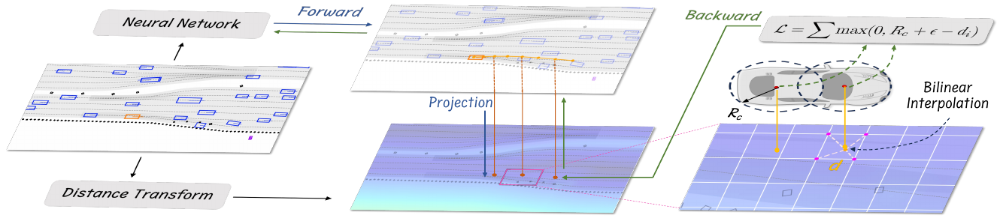

# 数式の解説

 - 静的物標 = 障害物 or obstacle
 - 動的物標 = エージェント or agent

## PLUTOのアーキテクチャ


## 3.1 Problem Formulation（問題定式化）

### 数式 1-1: 自動運転計画の基本定式化

```math
(T_0, \pi_0), P_{1:NA} = f(A, O, M, C | \phi)
```

- **目的**: 自動運転車（AV）のための 計画軌道 ( $T_0$ , $\pi_0$ ) と  周囲の動的エージェントの予測 $P_{1:NA}$ を生成します。
  - 自動運転計画の基本定式化とは、自動運転車が安全かつ効率的に目的地まで移動するための最適な軌道を決定するための数学的な枠組みを指します。
  - この定式化は、車両の動きや環境の情報を考慮し、適切な運転行動を選択するための基礎を提供します。
- **変数**:
  - $N_A$: 動的エージェントの数
  - $N_S$: 静的障害物の数
  - $A$: エージェントの特徴。( = $A_{0:N_A}$ , $A_0$ = AV )
  - $O$: 静的障害物。( = $O_{1:N_S}$ )
  - $M$: 高精度マップ情報。
  - $C$: 交通信号の状態などのコンテキスト。
  - $\phi$: モデルのパラメータ。
  - $f$: PLUTOのニューラルネットワーク。

- **[補足](./Supplement_EQ_1_1.md)**:
  

---
### 数式 1-2: 最適軌道の選択

```math
(\tau^*, \pi^*) = \arg\max_{(\tau, \pi) \in (T_0, \pi_0)} S(\tau, \pi, P_{1:N_A}, O, M, C)
```

- **目的**: シーンの文脈を考慮して、最も適切な軌道と信頼度スコア ($\tau^*$, $\pi^*$) を選択します。
- **変数**:
  - $\tau$ : 複数の計画軌道（Trajectories）
    - モデルは複数の候補軌道を生成します。これらの候補軌道が $\tau$ で表されます。

  - $\pi$ : 各軌道に対する信頼度スコア（Scores）
    - 各候補軌道 $\tau$ に対して、どれだけその軌道が適切であるかを示す信頼度スコアが $\pi$ で表されます。

  - $\tau^*$ : 最適な計画軌道（Optimal Trajectory）
    - モデルが複数の候補軌道 $\tau$ の中から選択した最適な軌道が $\tau^*$ です。

  - $\pi^*$ : 最適な軌道に対する信頼度スコア（Optimal Score）
    - 最適な軌道 $\tau^*$ に対する信頼度スコアが $\pi^*$ です。
  - $S$: スコアリングモジュール
    - $S$は、各軌道 $\tau$ とその信頼度スコア $\pi$ を評価し、シーンの文脈（例えば、他のエージェントの動き、静的障害物、交通信号などの情報）を考慮して、最も適切な軌道を選び出す役割を果たします。
    - このスコアリングモジュールは、与えられた入力情報に基づいて、軌道の安全性、効率性、その他の運転目標に適合するかどうかを判断します。

- **[補足](./Supplement_EQ_1_2.md)**:

<br>

## 3.2 Input Representation and Scene Encoding（入力表現とシーンエンコーディング）

### 3.2.1 Agent History Encoding
これの目的は、エージェント（自動車や他の移動体）の過去の観測データを処理し、効率的な特徴ベクトルに変換することです。この変換により、モデルがエージェントの動きや挙動を正確に捉え、予測や計画に活用できるようになります。

#### 数式 (a) の解説
エージェントの観測状態 $s^t_i$ は以下のように表されます：

```math
s^t_i = \left( p^t_i, \theta^t_i, v^t_i, b^t_i, \mathcal{I}^t_i \right)
```

このベクトルには、位置、進行方向、速度、寸法、および観測フレームの情報が含まれています。過去の観測データをベクトル形式に変換するために、時間ステップ $t$ と $t-1$ の間の差分を以下のように計算します：

```math
\hat{s}^t_i = \left( p^t_i - p^{t-1}_i, \theta^t_i - \theta^{t-1}_i, v^t_i - v^{t-1}_i, b^t_i, \mathcal{I}^t_i \right)
```

この操作により、エージェントの特徴ベクトル $F_A$ が次のような次元を持ちます：

```math
F_A \in \mathbb{R}^{N_A \times (T_H - 1) \times 8}
```

#### 変数の説明
- **$p^t_i$**: エージェントの位置座標。これはエージェントの位置を示す2次元のベクトルです。
- **$\theta^t_i$**: エージェントの進行方向の角度。通常、地面座標系に対するエージェントの向きを表します。
- **$v^t_i$**: エージェントの速度ベクトル。エージェントがどの方向にどれだけ速く動いているかを示します。
- **$b^t_i$**: エージェントの検出境界ボックスの寸法。長さと幅で構成され、エージェントの物理的なサイズを示します。
- **$\mathcal{I}^t_i$**: 観測フレームのバイナリインジケーター。このフレームが観測されたかどうかを示すフラグです。

最終的に、Feature Pyramid Network (FPN) を使用してこれらの履歴特徴を抽出および圧縮し、次の次元を持つエージェント埋め込み $E_A$ を生成します：

```math
E_A \in \mathbb{R}^{N_A \times D}
```

ここで、$D$ は隠れ層の次元を表しています。

<br>

### 3.2.2 Static Obstacle Encoding
この目的は、自動運転車が走行中に回避すべき静的障害物（例えば、交通コーンやバリアなど）をエンコードすることです。これにより、安全なナビゲーションが確保されます。静的障害物は、運転計画において非常に重要であり、無視されるべきではありません。

#### 数式 (b) の解説
各静的障害物は、以下のように表されます：

```math
o_i = \left( p_i, \theta_i, b_i \right)
```

ここで、$o_i$ は静的障害物の位置や寸法に関連する情報を含むベクトルです。このベクトルは、以下の方法でエンコードされます：

```math
F_O \in \mathbb{R}^{N_S \times 5}
```

- 5は静的障害物の特徴ベクトルの次元（x, y, yaw, height, width）

その後、2層の多層パーセプトロン (MLP) を使用して、静的物体の特徴をエンコードし、埋め込み $E_O$ を生成します。この埋め込みの次元は次のようになります：

```math
E_O \in \mathbb{R}^{N_S \times D}
```

#### 変数の説明
- **$p_i$**: 静的障害物の位置。これは障害物の場所を示す2次元のベクトルです。
- **$\theta_i$**: 静的障害物の進行方向の角度。通常、障害物の向きや方向を示します。
- **$b_i$**: 静的障害物の寸法。これは障害物のサイズ（長さと幅）を示します。
- **$F_O$**: 静的物体の特徴ベクトル。これには、各静的障害物の位置、方向、寸法が含まれます。
- **$E_O$**: MLP によってエンコードされた静的障害物の埋め込み。この埋め込みは、後続の処理に使用されます。

<br>

### 3.2.3 AV's State Encoding
この目的は、自動運転車（AV）の現在の状態を効率的にエンコードすることです。過去の研究から得られた知見に基づき、模倣学習では履歴データからショートカットを学習しやすく、それが性能を悪化させる可能性があるため、このアプローチでは自動運転車の「現在の状態」のみを入力特徴として使用します。

#### 数式 (c) の解説
現在の自動運転車の状態は、次のような要素で構成されます：

- 位置
- 進行方向の角度
- 速度
- 加速度
- ステアリング角度

これらの情報を基に、Attention Mechanismに基づく状態ドロップアウトエンコーダ（[State Dropout Encoder, SDE](./State_Dropout_Encoder.md)）を使用して状態特徴をエンコードします。このエンコードにより、外挿された運動学的状態に基づく軌道生成を避けることができます。最終的に、エンコードされた自動運転車の埋め込みベクトル $E_{AV}$ が次の次元を持つ形で生成されます：

```math
E_{AV} \in \mathbb{R}^{1 \times D}
```

- **位置**: 自動運転車の現在位置を示す2次元ベクトル。
- **進行方向の角度**: 自動運転車の進行方向を示す角度。通常、地面座標系に対する向きを表します。
- **速度**: 自動運転車の移動速度を示すベクトル。これは、車両がどれくらいの速さで進んでいるかを表します。
- **加速度**: 自動運転車の加速度を示すベクトル。これは、車両の速度がどのように変化しているかを示します。
- **ステアリング角度**: 自動運転車のステアリングホイールの角度。これは、車両がどの方向に向かおうとしているかを示します。

これらの状態情報は、エンコードされることで、埋め込みベクトル $E_{AV}$ となり、次の処理ステップで使用されます。この埋め込みは、自動運転車の現在の状態を効率的に表現し、予測や計画において重要な役割を果たします。

<br>

### 3.2.4 Scene Encoding
この目的は、複数のモダリティから入力されるデータ間の複雑な相互作用を効果的に捉えることです。具体的には、エージェント、自動運転車（AV）、静的障害物、地図などから得られるさまざまな埋め込みベクトルを統合し、シーン全体を表現するためのテンソルを生成します。

#### 数式(2)&(3)の解説
まず、各種の埋め込みベクトルを統合するために以下のようにテンソル $E_0$ が定義されます（数式 (2)）：

```math
E_0 = \text{concat}(E_{AV}, E_A, E_O, E_P) + PE + E_{\text{attr}}. \tag{2}
```

ここで、それぞれの埋め込みは以下の通りです：
- **$E_{AV}$**: 自動運転車の埋め込みベクトル。
- **$E_A$**: エージェントの埋め込みベクトル。
- **$E_O$**: 静的障害物の埋め込みベクトル。
- **$E_P$**: 地図のポリラインの埋め込みベクトル。
- **$PE$**: Positional Embedding. グローバルな位置情報を表す。この埋め込みは、位置 ($p$, $\theta$) を使い、エージェントや静的障害物、ポリラインの初期点などの最近の位置に基づいて計算されます。
- **$E_{\text{attr}}$**: エージェントの種類、車線の制限速度、信号の状態などのセマンティック属性を表す学習可能な埋め込みベクトル。

次に、このテンソル $E_0$ を複数層のTransformerエンコーダに入力します。各エンコーダ層での処理は、以下の数式 (3) で表されます：

```math
\hat{E}_{i-1} = \text{LayerNorm}(E_{i-1}),
```

```math
E_i = E_{i-1} + \text{MHA}(\hat{E}_{i-1}, \hat{E}_{i-1}, \hat{E}_{i-1}),
```

```math
E_i = E_i + \text{FFN}(\text{LayerNorm}(E_i)), \tag{3}
```

この式 (3) は、Transformerエンコーダの各層における処理を説明しています。各ステップを以下に詳しく説明します：

1. **Layer Normalization**:
   - 各層の入力 $E_{i-1}$ に対して、Layer Normalizationを適用し、正規化されたベクトル $\hat{E}_{i-1}$ を得ます。

2. **マルチヘッドAttention Mechanism (MHA)**:
   - 正規化されたベクトル $\hat{E}_{i-1}$ に対して、マルチヘッドAttention Mechanismを適用し、新しいベクトル $E_i$ を得ます。このAttention Mechanismでは、クエリ、キー、バリューが同じ入力（$\hat{E}_{i-1}$）から計算されます。

3. **フィードフォワードネットワーク (FFN)**:
   - 最後に、フィードフォワードネットワーク（FFN）を通じてベクトル $E_i$ をさらに更新します。このステップでは、Layer Normalizationを再度適用してからFFNを実行し、最終的な出力を得ます。

これにより、最終的に得られるシーンの埋め込みベクトル $E_{\text{enc}}$ が生成され、後続のタスク（予測や制御など）に使用されます。

#### 変数の説明
- **$E_{AV}$**: 自動運転車の現在の状態をエンコードした埋め込みベクトル。
- **$E_A$**: エージェントの履歴状態をエンコードした埋め込みベクトル。
- **$E_O$**: 静的障害物のエンコードされた埋め込みベクトル。
- **$E_P$**: 地図上のポリラインをエンコードした埋め込みベクトル。
- **$PE$**: グローバルな位置情報を表すFourier埋め込み。
- **$E_{\text{attr}}$**: エージェントの種類、車線の制限速度、信号の状態などのセマンティック属性を表す埋め込みベクトル。
- **$E_0$**: 上記の全ての埋め込みを統合したシーンの埋め込みベクトル。
- **$\hat{E}_{i-1}$**: 各層におけるLayer Normalizationを適用した後のベクトル。
- **$E_i$**: マルチヘッドAttention Mechanismとフィードフォワードネットワークを適用した後のベクトル。
- **$E_{\text{enc}}$**: 最終的なシーンの埋め込みベクトル。


<br>

## 3.3 Multi-modal Planning Trajectory Decoding

### 3.3.1 Reference Lines as Lateral Queries
この目的は、参照ライン（Reference Lines）を横方向クエリ（Lateral Queries）として使用し、自動運転車の横方向の運転行動を誘導することです。参照ラインは、自動運転車が走行する経路上にある周囲の車線から取得され、従来の車両運動計画において重要な役割を果たします。これにより、車両の横方向の挙動を適切に制御し、計画に反映させることができます。

#### 数式の解説


まず、自動運転車の現在の位置から一定の半径 $R_{\text{ref}}$ 内にある車線セグメントを特定します。それぞれのセグメントを起点として、深さ優先探索を行い、すべての可能なトポロジカルな接続を探索し、それらの車線の中心線をリンクします。

このようにして接続された中心線は、統一された長さに切り詰められ、一定の点数を保つために再サンプリングされます。この参照ラインの特徴を表現しエンコードする方法は、セクションIII-Bで説明されたベクトル化された地図のエンコーディングと同様です。最終的に、埋め込まれた参照ラインは、横方向のクエリ $Q_{\text{lat}}$ として利用されます。数式で表すと、次のようになります：

```math
Q_{\text{lat}} \in \mathbb{R}^{N_R \times D},
```

ここで、$N_R$ は参照ラインの数を表します。

#### 変数の説明
- **参照ライン（Reference Lines）**: 自動運転車の経路上にある車線から抽出されるライン。車両の横方向の動きを誘導するために使用されます。
- **$R_{\text{ref}}$**: 自動運転車の現在位置からの半径。この範囲内にある車線セグメントを特定します。
- **横方向クエリ $Q_{\text{lat}}$**: 埋め込まれた参照ラインで構成され、車両の横方向の計画に使用されるベクトル。
- **$N_R$**: 参照ラインの数。
- **$D$**: 各参照ラインの埋め込みベクトルの次元。


<br>

### 3.3.2 Factorized Lateral-longitudinal Self-Attention
この目的は、横方向（Lateral）と縦方向（Longitudinal）の両方に対して自己Attention Mechanism（Self-Attention）を適用し、車両の全体的な運転挙動を効果的にエンコードすることです。特に、横方向クエリ $Q_{\text{lat}}$ と縦方向クエリ $Q_{\text{lon}}$ を組み合わせて、横方向と縦方向の相互作用を捉えるためのクエリセット $Q_0$ を生成します。

#### 数式(4)の解説
まず、横方向クエリ $Q_{\text{lat}}$ に加えて、縦方向クエリ $Q_{\text{lon}}$ が使用されます。これらのクエリは、車両の縦方向の挙動（例えば、加速や減速）をエンコードするために利用されます。横方向クエリ $Q_{\text{lat}}$ と縦方向クエリ $Q_{\text{lon}}$ を結合し、次のようにクエリセット $Q_0$ が定義されます（数式 (4)）：

```math
Q_0 = \text{Projection}(\text{concat}(Q_{\text{lat}}, Q_{\text{lon}})), \tag{4}
```

ここで、**Projection** は単純な線形層または多層パーセプトロン（MLP）を指します。この $Q_0$ は、各参照ラインの局所的な領域に関する情報のみを捉えています。

次に、このクエリセット $Q_0$ に対して自己Attention Mechanismを適用し、異なる参照ラインにまたがるグローバルな横方向・縦方向の情報を統合します。しかし、$Q_0$ に直接自己Attention Mechanismを適用すると、計算複雑性が $O(N_R^2 N_L^2)$ となり、$N_R$ および $N_L$ が大きくなると計算が非常に重くなります。そこで、文献 [45] に基づき、計算複雑性を $O(N_R^2 N_L + N_R N_L^2)$ に削減するために、[因子化されたAttention Mechanism](./Factorized_Attention_Mechanism.md)を採用します。

#### 変数の説明
- **$Q_{\text{lat}}$**: 横方向のクエリベクトル。車両の横方向の挙動に関する情報をエンコードします。
- **$Q_{\text{lon}}$**: 縦方向のクエリベクトル。車両の縦方向の挙動（加速、減速など）に関する情報をエンコードします。
- **$Q_0$**: 横方向および縦方向のクエリを結合し、プロジェクションを適用した後のクエリセット。
- **Projection**: 単純な線形層または多層パーセプトロン（MLP）を指します。
- **$N_R$**: 参照ラインの数。
- **$N_L$**: 縦方向クエリの数。
- **計算複雑性**: 計算処理に必要な時間やリソースの量を示す尺度。因子化により、計算複雑性が軽減されます。

<br>

### 3.3.3 Trajectory Decoding
この目的は、自動運転車（AV）の将来の軌道（trajectory）をデコードするためのプロセスを説明することです。具体的には、デコーダ層（$L_{\text{dec}}$）で行われる3種類の注意メカニズムを用いて、横方向、縦方向、およびクエリ間のクロスアテンションを組み合わせて軌道を生成します。

#### 数式(5), (6), (7)の解説
軌道デコーダは、複数のデコーディング層（$L_{\text{dec}}$）で構成され、それぞれが次の3種類の注意メカニズムを含んでいます（数式 (5)）：

- 横方向の自己Attention Mechanism（Lateral Self-Attention）
```math
\hat{Q}^{i-1} = \text{SelfAttn}(Q_{i-1}, \text{dim} = 0),
```

- 縦方向の自己Attention Mechanism（Longitudinal Self-Attention）
```math
\tilde{Q}_i = \text{SelfAttn}(\hat{Q}^{i-1}, \text{dim} = 1),
```

- クエリ間のクロスアテンション機構（Query-to-Scene Cross-Attention）
```math
Q_i = \text{CrossAttn}(\tilde{Q}_i, E_{\text{enc}}, E_{\text{enc}}), \tag{5}
```

ここで、
- **SelfAttn**（自己注意）: 入力クエリ $Q_{i-1}$ に対して、$i$ 番目の次元に沿った自己注意を適用します。最初は横方向（dim = 0）での注意が適用され、次に縦方向（dim = 1）での注意が適用されます。
- **CrossAttn**（クロスアテンション）: 自己注意によって得られたクエリ $\tilde{Q}_i$ に対して、エンコードされた入力 $E_{\text{enc}}$ とのクロスアテンションを適用し、最終的なクエリ $Q_i$ を得ます。


デコーダの最終出力 $Q_{\text{dec}}$ は、2つのMLP（多層パーセプトロン）を使用して自動運転車の将来の軌道点およびそれらの確率スコアを決定するために利用されます。これを数式 (6) で表すと次のようになります：

```math
T_0 = \text{MLP}(Q_{\text{dec}}), \quad \pi_0 = \text{MLP}(Q_{\text{dec}}). \tag{6}
```

ここで、
- **$T_0$**: 将来の軌道点を表すベクトル。
- **$\pi_0$**: 軌道点の確率スコアを表すベクトル。

また、参照ラインが存在しないシナリオに対応するために、追加のMLPヘッドが導入され、自動運転車のエンコードされた特徴 $E'_{AV}$ から直接軌道をデコードします。これを数式 (7) で表すと次のようになります：

```math
\tau^{\text{free}} = \text{MLP}(E'_{AV}). \tag{7}
```

#### 変数の説明
- **$L_{\text{dec}}$**: デコーダ層の数。各層で異なる注意メカニズムが適用されます。
- **SelfAttn**: 自己Attention Mechanism。横方向および縦方向に適用され、クエリ間の相互作用を捉えます。
- **CrossAttn**: クロスアテンション機構。エンコードされた入力とクエリ間の相互作用を捉えます。
- **$Q_{\text{dec}}$**: デコーダの最終出力クエリ。将来の軌道とその確率を計算するために使用されます。
- **$T_0$**: 自動運転車の将来の軌道点を表すベクトル。
- **$\pi_0$**: 軌道点の確率スコアを表すベクトル。
- **$E'_{AV}$**: 自動運転車のエンコードされた特徴。これに基づいて軌道がデコードされます。
- **$\tau^{\text{free}}$**: 参照ラインが存在しない場合に直接デコードされた軌道。

<br>

### 3.3.4 Imitation Loss（学習時の損失計算, [補足](./PLUT_Loss_Funcs.md)）
ここでは、模倣学習中にモデルが特定の動作パターンに収束してしまうこと（モード崩壊）を防ぐための手法について説明します。具体的には、[教師強制（Teacher Forcing）](./Teacher_Forcing.md)技術を用いて、軌道回帰とスコア分類のための損失関数を設計します。

#### 数式(8), (9)の解説
まず、Ground Truthの軌道（$\tau^{\text{gt}}$）の最終点を参照ラインに対して投影し、横方向の距離が最も近い参照ラインをターゲット参照ラインとして選択します。このターゲット参照ラインは、$N_L - 1$ の等間隔のセグメントに分割されます。各セグメントは、それぞれの縦方向クエリが担当する領域に対応し、最後のクエリはターゲット参照ラインを超える領域をカバーします。投影された最終点を含むクエリがターゲットクエリとして指定されます。

ターゲット参照ラインとターゲット縦方向クエリを統合することで、ターゲット監督軌道 $\hat{\tau}$ が得られます。軌道回帰にはスムースL1損失（Smooth L1 Loss）を使用し、スコア分類にはクロスエントロピー損失を使用します。これを数式で表すと次のようになります（数式 (8)）：

```math
\mathcal{L}_{\text{reg}} = \text{L1}_{\text{smooth}}(\hat{\tau}, \tau^{\text{gt}}) + \text{L1}_{\text{smooth}}(\tau^{\text{free}}, \tau^{\text{gt}}),
```
```math
\mathcal{L}_{\text{cls}} = \text{CrossEntropy}(\pi_0, \pi_0^*), \tag{8}
```

ここで、
- **$\text{L1}_{\text{smooth}}$**: スムースL1損失。モデルの予測軌道 $\hat{\tau}$ や自由軌道 $\tau^{\text{free}}$ とGround Truthの軌道 $\tau^{\text{gt}}$ との間の誤差を計算します。
- **$\text{CrossEntropy}$**: クロスエントロピー損失。予測されたスコア $\pi_0$ とターゲットクエリに対応する真のスコア $\pi_0^*$ の間の誤差を計算します。

最終的な模倣損失 $\mathcal{L}_i$ は、これら2つの損失成分の和として次のように定義されます（数式 (9)）：

```math
\mathcal{L}_i = \mathcal{L}_{\text{reg}} + \mathcal{L}_{\text{cls}}. \tag{9}
```

#### 変数の説明
- **$\tau^{\text{gt}}$**: Ground Truthの軌道。モデルが学習するべき正解の軌道です。
- **$\hat{\tau}$**: ターゲット監督軌道。ターゲット参照ラインとターゲット縦方向クエリを統合して得られる軌道。
- **$\tau^{\text{free}}$**: 参照ラインが存在しない場合にデコードされた自由軌道。
- **$\text{L1}_{\text{smooth}}$**: スムースL1損失。軌道回帰の誤

<br>

### 3.3.5 Prediction Loss（学習時の損失計算, [補足](./PLUT_Loss_Funcs.md)）
この目的は、動的エージェント（動いている車両や歩行者など）に対する軌道予測のための損失関数を定義することです。具体的には、エージェントの埋め込みベクトルから得られる予測軌道とGround Truthの軌道との誤差を計算し、その誤差を最小化することでモデルの精度を向上させます。

#### 数式(10),(11)の解説
予測軌道は、動的エージェントの埋め込みベクトル $E'_A$ を入力として、単純な2層のMLP（多層パーセプトロン）を用いて生成されます。このプロセスは、次の数式 (10) によって表されます：

```math
P_{1:\text{NA}} = \text{MLP}(E'_A), \tag{10}
```

ここで、
- **$P_{1:\text{NA}}$**: 各動的エージェントに対する予測軌道を表すベクトル。
- **$E'_A$**: 動的エージェントの埋め込みベクトル。

この予測軌道は、学習プロセスでの密な監督（dense supervision）を提供し、モデルの学習を助けます。また、生成された予測は、ポストプロセッシング段階で不適切なプランニング提案を排除するために重要な役割を果たします。

次に、エージェントのGround Truthの軌道を $P^{\text{gt}}_{1:\text{NA}}$ として表します。予測損失は、このGround Truthの軌道と予測軌道との間のスムースL1損失として定義され、次の数式 (11) で表されます：

```math
\mathcal{L}_p = \text{L1}_{\text{smooth}}(P_{1:\text{NA}}, P^{\text{gt}}_{1:\text{NA}}). \tag{11}
```

ここで、
- **$\mathcal{L}_p$**: 予測損失。予測軌道とGround Truthの軌道との間のスムースL1損失を計算します。
- **$\text{L1}_{\text{smooth}}$**: スムースL1損失。モデルの予測とGround Truthとの間の誤差を計算するために使用されます。

#### 変数の説明
- **$P_{1:\text{NA}}$**: 動的エージェントに対する予測軌道ベクトル。MLPを通じてエンコードされたエージェントの特徴から生成されます。
- **$E'_A$**: 動的エージェントの埋め込みベクトル。予測軌道を生成するための入力です。
- **$P^{\text{gt}}_{1:\text{NA}}$**: Ground Truthの軌道。予測と比較するための正解データです。
- **$\mathcal{L}_p$**: 予測損失。予測軌道とGround Truthの軌道の間のスムースL1損失として定義されます。

#### まとめ
このセクションでは、動的エージェントに対する予測損失を定義しています。エージェントの埋め込みベクトルからMLPを用いて予測軌道を生成し、その軌道がGround Truthの軌道とどれだけ一致しているかをスムースL1損失を使って計算します。このプロセスにより、モデルが正確な軌道を予測できるようになります。


<br>

## 3.4 Efficient Differentiable Auxiliary Loss


---
---
---


### 数式 a: Agent History Encoding(エージェント履歴の差分表現)

```math
\hat{s}^t_i = (p^t_i - p^{t-1}_i, \theta^t_i - \theta^{t-1}_i, v^t_i - v^{t-1}_i, b^t_i, I^t_i)
```

- **目的**: エージェントの履歴情報を差分として表現し、時系列情報を抽出します。
- **変数**:
  - $p^t_i$, $\theta^t_i$, $v^t_i$: エージェントの位置、方向、速度。
  - $b^t_i$: バウンディングボックスの寸法。
  - $I^t_i$: 状態のバイナリ指標。
    - 「状態のバイナリ指標」とは、エージェントの観測状態が有効かどうかを示すために使用される2値（バイナリ）変数のことです。このバイナリ指標は、エージェントが観測可能かどうか、またはそのデータが信頼できるかどうかを判定するために利用されます。
    - 具体的な役割　(論文の補足メモ):
      1. 観測の有効性のチェック:
          - バイナリ指標は、各エージェントの状態（位置、速度、方向など）が観測可能かどうかを表します。例えば、エージェントがセンサーの範囲外に出てしまった場合や、データが欠損している場合、バイナリ指標は「無効」（通常は0）としてマークされます。
      2. データの信頼性の判断:
          - バイナリ指標を使用して、モデルはどのデータが信頼できるかを判断します。信頼できるデータのみを使用して、エージェントの将来の動きや状態を予測することができます。これにより、ノイズの多いデータや誤った観測に基づいた判断を避けることができます。
      3. 学習時の影響を軽減:
          - このバイナリ指標は、学習アルゴリズムが無効なデータを誤って学習するのを防ぎます。これにより、モデルが健全で正確な予測を行うために必要なデータのみを学習することができます。


- **説明**:
  - エージェント履歴の差分 $\hat{s}_i$ は、自動運転モデルにおいて、エージェント（車両や歩行者など）の過去の動きや状態の変化を捉えるために使われます。この差分は、エージェントがどのように動いてきたか、例えば速度や方向の変化など、時系列的な情報を把握する目的で使用されます。

- **具体的な目的**:

  1. **動きのパターンの学習**:
     - 差分情報を使うことで、モデルはエージェントの動きのパターン（例えば、加速している、減速している、方向を変えているなど）を学習します。これにより、現在のエージェントの動きを理解し、将来の動きを予測する能力が向上します。

  2. **タイムステップごとの変化の捉え方**:
     - エージェントの位置や速度、方向の変化をタイムステップごとに分析することで、モデルはエージェントが将来的にどのような動きをするかを予測する際に重要な情報を得ます。

  3. **リアクションの予測**:
     - 他のエージェントや障害物に対するエージェントのリアクションを予測する際にも、過去の動きの履歴が役立ちます。例えば、急な減速や方向転換がある場合、そのエージェントが直面している状況を理解し、適切な対策を講じるための材料となります。

- **重要性**:
  - この差分情報は、単なる静的な状態（現在の位置や速度など）に基づく判断ではなく、時間的な変化を考慮したより精緻な予測を可能にします。これにより、より安全で効率的な運転計画が可能となります。

---
### 数式 4: エージェント特徴ベクトル

```math
F_A \in \mathbb{R}^{N_A \times (T_H-1) \times 8}
```

- **目的**: エージェントの特徴(ベクトル形式）。
  - $F_A$ とは、各エージェント（他の車両や歩行者など）に関する重要な情報をまとめたベクトル表現です。
  - この特徴ベクトルは、エージェントの過去の動きや状態、位置、速度、方向などの情報をエンコードし、モデルがそれらのエージェントの将来の動きを予測するために利用されます。
- **変数**:
  - $N_A$: エージェントの数。
  - $T_H$: 履歴時間ステップの数。

- **具体的な内容**:
  1. **エージェントの履歴情報の集約**:
     - $F_A$ は、エージェントの過去の位置、速度、方向などの履歴データから計算されます。これにより、エージェントがどのように動いてきたかを把握することができます。

  2. **時系列データのエンコード**:
     - この特徴ベクトルには、エージェントの時系列的な変化（例えば、時間ごとの位置の変化や速度の変化）が含まれており、エージェントがどのような動きのパターンを持っているかを捉えます。

  3. **モデルへの入力として使用**:
     - $F_A$ は、モデルの入力として使用され、他のエージェントや障害物との相互作用を考慮しながら、エージェントの将来の行動を予測するための基礎データとなります。

  4. **次元構造**:
     - $F_A$ は通常、$N_A \times (T_H - 1) \times 8$ の形状を持ち、$N_A$ はエージェントの数、$T_H$ は履歴の時間ステップ数、$8$ は各時点での特徴の数（位置、速度、方向など）を表します。

- **重要性**:
  - エージェント特徴ベクトル $F_A$ は、自動運転車が周囲のエージェントの動きを正確に予測し、安全に運転計画を立てるために不可欠な要素です。これにより、エージェントの複雑な動きや相互作用を考慮した高度な予測が可能となります。

---
### 数式 5: シーンエンコーディングの統合テンソル

```math
E_0 = \text{concat}(E_{AV}, E_A, E_O, E_P) + PE + E_{attr}
```

- **目的**: AV、エージェント、静的障害物、マップ情報を統合し、シーンの全体像をエンコードします。
  - この数式は、シーン全体を一つのテンソルにまとめることで、複雑な相互作用をキャプチャする方法を示しています。
  - シーンエンコーディングの統合テンソルは、自動運転モデルにおいて、車両（自動運転車）、周囲のエージェント（他の車両や歩行者など）、静的障害物、地図情報など、複数の入力情報を統合するためのテンソル（多次元配列）です。

- **変数**:
  - $E_{AV}$, $E_A$, $E_O$, $E_P$: それぞれAV、エージェント、障害物、マップのエンコーディング。
  - $PE$: Positional Encodingを使った位置情報。
  - $E_{attr}$: 意味属性のエンコーディング。

- **具体的な内容**:
  1. **異なる情報の統合**:
     - 統合テンソルは、以下のような異なる種類の情報をまとめます：
       - **自動運転車の状態**（位置、速度、方向など）
       - **周囲のエージェントの状態**（他の車両や歩行者の動き）
       - **静的障害物**（建物や交通標識など）
       - **高精度マップ情報**（レーン、道路境界など）

  2. **テンソルの構造**:
     - この統合テンソルは、各情報源からのエンコーディングベクトル（特徴ベクトル）を連結して構成されます。具体的には、次のような形で構成されます：
     - ここで、$E_{AV}$ は自動運転車のエンコーディング、$E_A$ は周囲のエージェントのエンコーディング、$E_O$ は静的障害物のエンコーディング、$E_P$ はマップ情報のエンコーディングを表し、これらを結合して統合テンソル $E_0$ を形成します。
     - さらに、位置エンコーディング（$PE$）や意味属性エンコーディング（$E_{attr}$）が加えられます。

  3. **トランスフォーマーエンコーダへの入力**:
     - この統合テンソル $E_0$ は、トランスフォーマーエンコーダに入力され、シーン全体の複雑な相互作用をモデルが学習できるようになります。
     - エンコーダは、このテンソルを用いて、シーン全体を理解し、将来の予測や計画を立てるための基礎を構築します。

- **重要性**:
  - シーンエンコーディングの統合テンソルは、複数の情報源を統合し、それらの相互作用を効果的にモデル化するために不可欠です。これにより、モデルはシーン全体を一つの視点で捉え、より正確で安全な運転計画を立てることが可能になります。

---
## 3.3 Multi-modal Planning Trajectory Decoding（マルチモーダル計画軌道デコーディング）

### 数式 6: 初期クエリの投影

```math
Q_0 = \text{Projection}(\text{concat}(Q_{lat}, Q_{lon}))
```

- **目的**: 横方向と縦方向のクエリを結合し、初期クエリセットを生成します。
  - この数式は、横方向と縦方向の運転行動を統合する方法を示しています。
  - 初期クエリの投影の式は、自動運転モデルにおいて、横方向と縦方向の運転行動に基づいたクエリを生成し、それらを結合して初期のクエリセットを作成するプロセスを表しています。
  - このプロセスは、運転計画のデコーディングの基盤となる重要なステップです。
- **変数**:
  - $Q_{lat}$, $Q_{lon}$: 横方向と縦方向のクエリ。
- **具体的な内容**:

  0. **クエリとは**:
     - クエリは、具体的には「どの情報に注意を向けるべきかをモデルに尋ねるためのデータのセット」です。
     - トランスフォーマーアーキテクチャでは、セルフアテンションメカニズムにおいて、クエリ（Query）、キー（Key）、バリュー（Value）の3つの要素が用いられます。クエリは、モデルがどの情報に注意を向けるべきかを決定するためのデータです。
     - クエリは、他の要素との関連性（スコア）を計算するためにキーと比較され、その結果をバリューに適用することで、モデルが必要とする情報を抽出します。

  1. **クエリの種類**:
     - **横方向クエリ（Lateral Queries, $Q_{lat}$）**: 
       - これは、道路上での車両の横方向（左右の位置やレーン変更）の動きを捉えるために使用されます。例えば、車両がレーンを変更するか、直進するかといった横方向の決定をサポートします。
     - **縦方向クエリ（Longitudinal Queries, $Q_{lon}$）**: 
       - これは、車両の縦方向（前後の動き、加速・減速）の動きを捉えるために使用されます。例えば、車両が加速するか減速するかといった縦方向の決定をサポートします。

  2. **クエリの投影**:
     - 横方向と縦方向のクエリはそれぞれ独立に生成されますが、これらを結合して初期クエリセット $Q_0$ を生成する必要があります。この結合されたクエリセットは、運転行動を全体的に捉えるための基盤となります。
     - 関数「Projection()」は通常、単純な線形層や多層パーセプトロン（MLP）を指し、結合されたクエリを適切な次元に投影します。
     - 「concat」は、横方向クエリ $Q_{lat}$ と縦方向クエリ $Q_{lon}$ を結合する操作を示します。

  3. **初期クエリセット $Q_0$**:
     - この初期クエリセット $Q_0$ は、後続のトランスフォーマーデコーダで使用され、シーン全体のエンコーディング情報とクロスアテンションを行うための基礎として機能します。
     - $Q_0$ は、運転計画の軌道をデコードし、車両の次の動きを予測するために非常に重要な役割を果たします。

- **重要性**:
  - 初期クエリの投影は、運転計画のデコーディングプロセスにおいて、横方向と縦方向の動きを統合し、シーン全体の文脈に基づいた最適な運転行動を決定するための基盤を形成します。このプロセスが正確であるほど、車両はより安全で効率的な運転を実現することができます。

---
### 数式 7: 軌道デコーディングのセルフアテンション

```math
Q'_{i-1} = \text{SelfAttn}(Q_{i-1}, \text{dim} = 0)
```

```math
\hat{Q}_{i-1} = \text{SelfAttn}(Q'_{i-1}, \text{dim} = 1)
```

```math
Q_i = \text{CrossAttn}(\hat{Q}_{i-1}, E_{enc}, E_{enc})
```

- **目的**: 横方向セルフアテンション、縦方向セルフアテンション、シーン情報とのクロスアテンションを通じて軌道をデコードします。
  - 軌道デコーディングのセルフアテンションの式は、自動運転モデルにおいて、運転計画のデコーディングプロセスで重要な役割を果たします。
  - セルフアテンションメカニズム（Self-Attention）は、入力クエリ内での各要素間の関連性を学習し、それを基に重要な特徴を強調するために使用されます。
  - 軌道デコーディングにおいて、横方向と縦方向のセルフアテンションが適用され、複数の運転軌道候補が適切にデコードされます。
- **変数**:
  - $\text{SelfAttn}(X, \text{dim} = i)$: $X$ の $i$ 次元でのセルフアテンション。
  - $\text{CrossAttn}(Q, K, V)$: クロスアテンション操作。

- **具体的な内容**:
  1. **横方向セルフアテンション（Lateral Self-Attention）**:
     - 横方向の運転行動（例えば、レーン変更や左右への動き）に関する情報を処理するために、横方向クエリに対してセルフアテンションが適用されます。これにより、横方向の動きにおける重要な情報が強調されます。

     - 数式で表すと次のようになります：
     - ここで、$Q_{i-1}$ は前のステップのクエリで、$Q'_{i-1}$ はセルフアテンションを適用した後のクエリです。`dim=0` は横方向（Lateral）次元でセルフアテンションが適用されることを示します。
   ```math
   Q'_{i-1} = \text{SelfAttn}(Q_{i-1}, \text{dim} = 0)
   ```

  2. **縦方向セルフアテンション（Longitudinal Self-Attention）**:
     - 縦方向の運転行動（例えば、加速や減速）に関する情報を処理するために、縦方向クエリに対してセルフアテンションが適用されます。これにより、縦方向の動きにおける重要な情報が強調されます。

     - 数式で表すと次のようになります：
     - ここで、$Q'_{i-1}$ は横方向セルフアテンションを適用した後のクエリで、$\hat{Q}_{i-1}$ は縦方向セルフアテンションを適用した後のクエリです。
     - `dim=1` は縦方向（Longitudinal）次元でセルフアテンションが適用されることを示します。
   ```math
   \hat{Q}_{i-1} = \text{SelfAttn}(Q'_{i-1}, \text{dim} = 1)
   ```
     

  3. **シーンエンコーディングとのクロスアテンション（Cross-Attention with Scene Encoding）**:
     - 最後に、セルフアテンションを適用したクエリセットは、シーン全体のエンコーディング情報とクロスアテンションを行います。これにより、運転軌道の最終的なデコードが行われ、運転行動がシーンの文脈に適合するようになります。

     - 数式で表すと次のようになります：
     - ここで、$\hat{Q}_{i-1}$ は縦方向セルフアテンションを適用した後のクエリで、$E_{enc}$ はシーンエンコーディングです。
     - この操作により、シーン全体の文脈を考慮した運転軌道が生成されます。
   ```math
   Q_i = \text{CrossAttn}(\hat{Q}_{i-1}, E_{enc}, E_{enc})
   ```
     

- **重要性**:
  - 軌道デコーディングのセルフアテンションは、複数の運転軌道候補を生成し、それらがシーン全体の文脈にどのように適合するかを評価するための基盤を提供します。横方向と縦方向のセルフアテンションを適用することで、運転軌道がより詳細に評価され、より安全で効率的な運転計画が可能となります。

---
### 数式 8: 軌道とスコアの生成

```math
T_0 = \text{MLP}(Q_{dec}), \quad \pi_0 = \text{MLP}(Q_{dec})
```

- **目的**: デコーダの出力からAVの将来の軌道とそのスコアを決定します。
  - 軌道とスコアの生成の式は、自動運転モデルが最終的に候補軌道（trajectory）とそれに対応する信頼度スコアを生成するプロセスを表します。
  - このプロセスでは、セルフアテンションやクロスアテンションを経て得られたクエリから、具体的な運転軌道とその評価スコアを導き出します。
- **変数**:
  - $Q_{dec}$: 軌道デコーダの出力。
- **具体的な内容**:
  1. **軌道の生成**:
     - クエリセット $Q_i$ は、トランスフォーマーデコーダによって処理された後、軌道生成用の多層パーセプトロン（MLP）に入力されます。このMLPは、クエリを最終的な軌道に変換するための関数です。

     - 数式で表すと次のようになります：
     - ここで、$T_0$ は生成された軌道（trajectory）であり、$\text{MLP}_{traj}$ は軌道生成用の多層パーセプトロンを示します。この関数は、クエリセットから2次元の位置座標（x, y）を予測します。
   ```math
   T_0 = \text{MLP}_{traj}(Q_i)
   ```
   
  2. **スコアの生成**:
     - 同様に、クエリセット $Q_i$ は、スコア生成用の多層パーセプトロン（MLP）に入力され、各軌道に対する信頼度スコアが生成されます。このスコアは、モデルがその軌道をどれだけ確信を持って選んでいるかを示します。

     - 数式で表すと次のようになります：
     - ここで、$\pi_0$ は生成されたスコアであり、$\text{MLP}_{score}$ はスコア生成用の多層パーセプトロンを示します。この関数は、クエリセットからスカラー値を予測し、その軌道がどれだけ適切であるかを評価します。
   ```math
   \pi_0 = \text{MLP}_{score}(Q_i)
   ```
   
  3. **軌道とスコアの組み合わせ**:
     - 最終的に、生成された軌道 $T_0$ とスコア $\pi_0$ は組み合わされ、複数の候補軌道の中から最適な軌道とそれに対応する信頼度スコアが選択されます。このプロセスは、運転計画において非常に重要であり、モデルが安全かつ効率的に運転できる軌道を選択するための基盤となります。

- **重要性**:
  - 軌道とスコアの生成は、自動運転モデルが複数の運転候補の中から最適な運転計画を選択するための決定的なステップです。このプロセスにより、モデルは実際の運転状況に基づいて最も適切な行動を選び、車両を安全に目的地に導くことができます。
