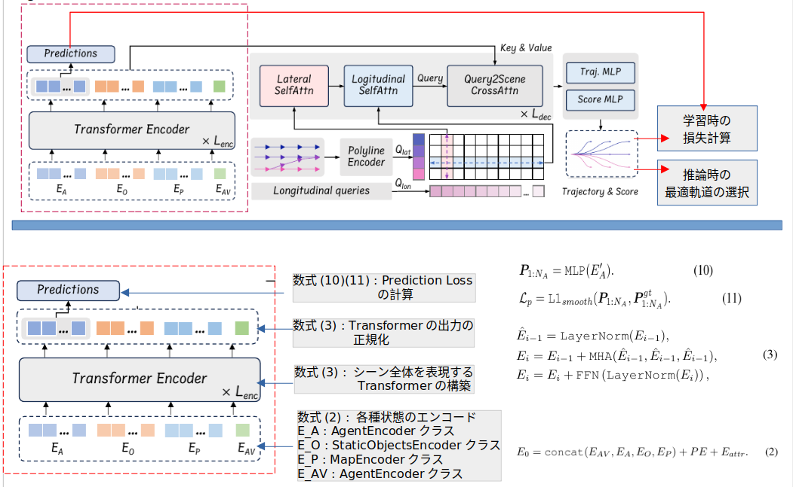
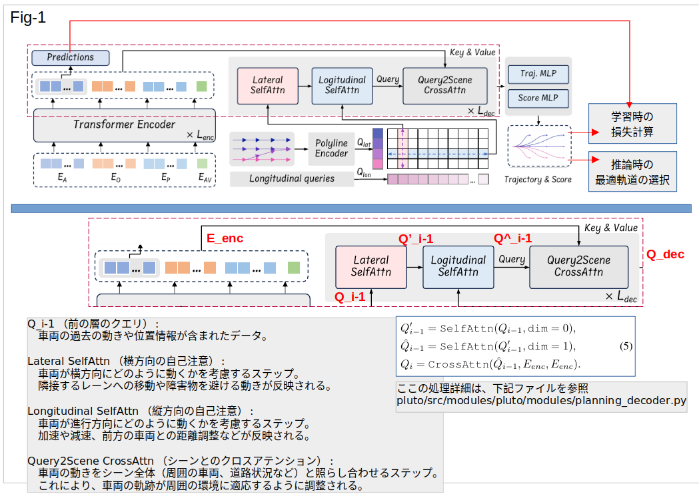
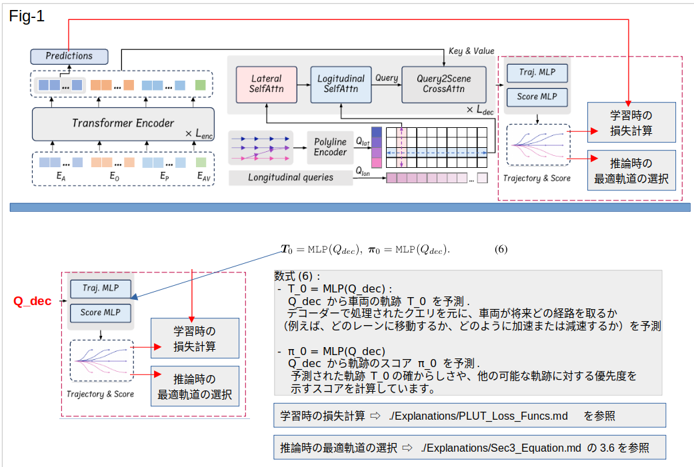

# PLUTO: 
Contrastive Imitation Learning for Longitudinal-Lateral Coupling Decision-making in Urban Autonomous Driving

# 概要

## 1. 序論

### 1.1 背景と動機
この節では、都市部の自動運転車（AV）が直面する課題について説明しています。具体的には、複雑な交通状況や多様なエージェントの存在が、自動運転システムの計画と意思決定における大きな障壁となっていることが指摘されています。従来の手法では、特定の場面に適したルールベースのアプローチや、学習に基づくアプローチが存在するが、これらはそれぞれ限界を持っています。この論文では、模倣学習とコントラスト学習を組み合わせた新しい手法を提案し、これらの課題に対処します。

## 2. 関連研究

この章では、自動運転の分野における関連する研究をレビューしています。ルールベース、学習ベース、およびハイブリッド手法の利点と欠点が分析されています。また、模倣学習や強化学習の技術がどのように進化してきたかについても説明されています。

## 3. 手法

### 3.1 問題定式化
PLUTOのモデルは、AVが動的な都市環境で意思決定を行うための枠組みを提供します。具体的には、AVの周囲に存在する動的なエージェント、静的な障害物、高精度マップ、および交通信号の状態を考慮に入れています。これらの情報を元に、AVが将来の複数の軌道を生成し、シーンの文脈を統合して最適な軌道を選択します。

### 3.2 入力表現とシーンエンコーディング

エージェントの履歴情報や静的障害物の特徴をエンコードするために、  特徴ピラミッドネットワーク（FPN） を使用しています。これにより、エージェントの位置、方向、速度などの情報が効率的に抽出されます。

### 3.3 軌道デコーディング
PLUTOは、横方向と縦方向のセルフアテンションメカニズムを用いて、さまざまな軌道を生成します。最終的に、デコーダの出力を使用して、将来の軌道点とそれに関連するスコアを決定します。

## 4. コントラスト模倣学習フレームワーク

### 4.1 フレームワークの概要
このフレームワークは、データ拡張とコントラスト学習を組み合わせて、モデルがより良い行動を学習できるように設計されています。具体的には、正のサンプルと負のサンプルを生成し、それらの間でコントラスト損失を計算することで、モデルの学習を強化します。

### 4.2 データ拡張
状態の摂動や非相互作用エージェントの削除など、6つの拡張戦略が提案されています。これにより、モデルはさまざまなシナリオでの堅牢性を向上させます。

## 5. 結果と考察

### 5.1 最先端技術との比較
PLUTOは、他の最先端の手法と比較して、さまざまな評価指標で優れた性能を示しています。特に、閉ループシナリオでの性能が向上しています。

### 5.2 アブレーション研究
PLUTOの各コンポーネントの影響を分析するためのアブレーション研究が実施されています。これにより、状態ドロップアウトエンコーダーや補助損失が、モデルの性能向上に寄与していることが確認されています。

## 6. 結論

この章では、PLUTOが自動運転分野における新しいベンチマークを設定し、学習ベースの計画における重要な進展を示していると結論付けています。今後の研究課題として、複数モードの予測を計画に統合する方法の探求が挙げられています。

---

# 各章ごとに詳しくまとめる

# 1. 序論

## 1.1 背景と動機

学習ベースの計画（Learning-based planning）は、自動運転において拡張性のあるアプローチとして注目されており、多くの研究が行われています。特に、模倣学習に基づく計画は、シミュレーションや実世界の応用で成功を収めています。しかし、学習ベースの計画の効果はまだ不十分です。2023年のnuPlan計画チャレンジでは、従来のルールベースの計画が全ての学習ベースの代替手法を凌駕し、優勝しました。この論文では、学習ベースの計画における主要な課題を明らかにし、これらの課題に対処するための新しいソリューションを提案しています。

## 1.2 学習ベースの計画の課題

1. **マルチモーダル運転行動の取得**: 学習ベースのプランナーは、車線維持のような縦方向のタスクの学習に優れている一方で、車線変更や障害物の回避といった横方向のタスクには苦戦しています。この欠陥は、モデルの設計における明確な横方向行動モデリングの欠如に起因しています。

2. **純粋な模倣学習の限界**: 純粋な模倣学習には、学習のショートカットをとる傾向や、分布のシフト、因果混同などの問題が内在しています。特に、自動運転のような安全性が重要な領域では、トレーニング中に明示的な制約を課すことが不可欠です。本研究では、微分可能な補間に基づく新しい補助損失計算方法を導入し、これらの問題に対処します。

3. **新しいデータ拡張手法**: モデルがオープンループトレーニングとクローズドループテストを経る際に、時間とともにエラーが蓄積し、入力データがトレーニング分布から逸脱することがあります。 データ拡張はこれらの問題を軽減するために広く用いられており、効果が証明されています。さらに、本研究では運転行動を調整し、相互作用の学習を強化するための新しい拡張手法を提案します。

# 2. 関連研究

## 2.1 模倣学習に基づく計画

模倣学習に基づく計画は、経験豊富なドライバーの政策をクローン化することにより、自動運転の最も直接的かつスケーラブルな解決策とされています。今日のデータの豊富さと経済性を考慮すると、この方法は非常に有望です。特に人気があるのはエンドツーエンド（E2E）運転のアプローチで、これは生センサーデータから直接運転政策を学習します。この手法は、比較的短期間で大きな進歩を遂げました。最初は、カメラ入力を制御政策にマッピングする畳み込みニューラルネットワーク（CNN）ベースのモデルに焦点が当てられていましたが、その後、マルチセンサーフュージョンを活用したより高度な方法に進化しました。

最近の開発では、LAVやUniADといった団体が主導し、モジュールベースのE2Eアーキテクチャにシフトしています。このアプローチは、認識、予測、計画のプロセスを統合したモデルを形成します。しかし、これらの多くのE2E戦略は、トレーニングと評価の両方で高忠実度のシミュレーション環境に大きく依存しています。その結果、シミュレーションされたエージェントのリアリズムと多様性の欠如、不完全なルールベースの専門家への依存、および現実世界での適用性のためのシミュレーションと現実のギャップを埋める必要性などの問題が生じています。

参考情報 : [LAV & UniAD](./Explanations/LAV_UniAD.md)

この論文では、事前認識結果を入力機能として使用する「ミッド・トゥ・ミッド」アプローチに焦点を当てています。この方法の主な利点は、シミュレーションから現実への転送の懸念を排除し、実世界のデータでモデルを計画の学習に集中させることができる点にあります。ChauffeurNet、SafetyNet、UrbanDriverなどの先駆的なアプローチは、実世界環境で自動運転車を操作する能力を示し、その後の研究はこれらの基盤の上に構築されてきました。これらのアプローチは、動作予測コミュニティにおける進展、特に予測タスクで優れた性能を発揮するベクトルベースのモデルの採用から大きな利益を得ています。しかし、これらのモデルの多くは、計画タスクに固有の特性、例えば閉ループテストや積極的な意思決定能力の必要性を見落としています。対照的に、我々の提案するフレームワークは、計画のために最初から設計されています。ネットワークは、クエリベースのアーキテクチャを通じて縦方向と横方向の運転行動を共同でモデル化し、柔軟で多様な運転スタイルを可能にしています。

## 2.2 対照学習

対照学習は、類似したペアと異なるペアを比較することで表現を学習するフレームワークであり、コンピュータビジョンや自然言語処理で大きな成功を収めています。自動運転の文脈では、運動予測のためのいくつかの試みがなされています。Social NCEは、歩行者の動きの予測において目標生成を導くために社会的対照損失を導入しました。Marahらは、学習された軌道埋め込みを洗練するためにアクションベースの対照学習損失を利用しました。FENDはこのアプローチを使用してロングテール軌道を認識しました。これらの研究は、正と負の例の慎重な選択を通じてモデルにドメイン固有の知識を組み込む上での対照学習の力を強調しています。

# 3. Methodology（手法）
### モデル図と数式の概要を示す。詳細は、[ここ](./Explanations/Sec3_Equation.md)を参照。

- 1. シーン全体を理解する部分（上段が fig-01. 下段が解説部分の拡大図）

 

- 2. センシング値から縦横のクエリを作成（上段が fig-01. 下段が解説部分の拡大図）

 

- 3. シーン全体のクエリと縦横のクエリをデコード（上段が fig-01. 下段が解説部分の拡大図）

 

- 4. 損失とスコア計算。最適軌道の選択。（上段が fig-01. 下段が解説部分の拡大図）

- 式(7)以降は損失計算がメイン。下記を参照。
  - [全数式の詳細](./Explanations/Sec3_Equation.md)
  - [損失の説明](./Explanations/PLUT_Loss_Funcs.md)

# 4. Experiment

第4章は「実験と評価」に関する内容で、PLUTOフレームワークの性能を評価するための実験設定、結果、考察、アブレーションスタディに焦点を当てています。以下に、テーブルも含めて詳しく解説します。

---

## **4.1 実験設定**

**使用データセット: nuPlan**
- **nuPlanデータセット**を使用して、PLUTOモデルのトレーニングと評価が行われました。このデータセットには、1,300時間の実運転データが含まれており、75種類のシナリオラベルが付けられています。nuPlanは、大規模な自律運転のベンチマークであり、シミュレーションと実データの組み合わせを特徴としています。

## **ベンチマークと評価基準**
- 評価は**Val14**ベンチマークを使用し、14種類のシナリオタイプから選ばれた100のシナリオに基づいて行われました。
- 使用された評価指標には、**オープンループスコア**、**非リアクティブな閉ループスコア**、および**リアクティブな閉ループスコア**が含まれます。特に、閉ループスコアに重点が置かれており、モデルが予測に基づいて環境とどのように相互作用するかが評価されます。

---

## **4.2 結果と考察**

**PLUTOの性能**
- PLUTOモデルは、**PDM-Closed**などのルールベースのプランナーを初めて上回る結果を示し、これまでの学習ベースの手法を超える性能を達成しました。
- 特に、PLUTOは**PlanTF**モデルに対して大幅な改善を示し、安全性指標での向上が特に顕著でした。

**テーブル 1: 各モデルの比較**
- **Table 1**では、PLUTOと他の最先端モデルとの比較結果が示されています。具体的な数値としては、PLUTOがPlanTFを含む他のモデルよりも優れたパフォーマンスを示していることが分かります。
- 参考 [Table-1](./Explanations/Table_1.md)
- 参考 [Table-2](./Explanations/Table_2.md)

**定性的な結果**
- **PLUTOの動作例**が示されており、ラウンドアバウトでの運転や車線変更など、複雑なシナリオでの優れた運転計画能力が強調されています。
- これらのシナリオでは、PLUTOは人間のような多様で動的な運転行動を示しており、他のエージェントと円滑に相互作用しています。

---

## **4.3 アブレーションスタディ**

- **縦方向クエリの数**の影響に関しては、12個のクエリが最適であることが示され、それ以上の増加は逆に性能を低下させることが分かりました。

**学習ベースのスコアの影響**
- **Table 3**では、学習ベースのスコアとルールベースのスコアの組み合わせが示されています。特に、学習ベースのスコアがルールベースのスコアと適切に組み合わせられると、最適な性能が得られることが示されています。
- 参考 [Table-3](./Explanations/Table_3.md)

**予測モデルの影響**
- **予測モデル**についても言及されており、PLUTOに組み込まれた学習された予測モデルが、従来の定速予測モデルよりも優れたパフォーマンスを提供することが示されています。

# 5. RESULTS AND D ISSCUSION

第5章では、PLUTOのパフォーマンスを従来の最先端手法と比較し、PLUTOの優位性を定量的および定性的に評価しています。この章では、主に閉ループシミュレーションの結果を中心に、モデルのパフォーマンスを詳細に分析しています。

## **5.1 パフォーマンスの定量評価**

このセクションでは、PLUTOが従来のプランナーと比較して、どのようにパフォーマンスが向上したかを詳細に説明しています。以下のような評価指標が使用され、それぞれについてPLUTOがどのように優れているかを示しています。

1. **衝突率（Collisions Rate）**:
   - PLUTOは、他の従来のプランニング手法に比べて、衝突率が大幅に低いことが示されています。これは、PLUTOがより安全な運転計画を生成し、シナリオの複雑さに対処できる能力が高いことを示唆しています。
   - 特に、混雑した都市環境や複数のエージェントが関与するシナリオにおいて、PLUTOは安全性の面で優位に立っています。

2. **走行可能領域の維持率（Drivable Area Compliance）**:
   - PLUTOは、走行可能な領域内にエゴビークルを維持する能力においても他の手法を上回っています。これは、モデルが道路の境界を理解し、それを遵守する能力が優れていることを示しています。
   - 他のモデルと比較して、PLUTOは走行可能領域から逸脱するケースが少なく、法規遵守の度合いが高いと評価されています。

3. **乗り心地（Comfort）**:
   - PLUTOは、急加速や急減速を避けることで、乗り心地の向上にも成功しています。これにより、実際の運転シナリオでのユーザーエクスペリエンスが向上します。
   - 他のモデルに比べて、PLUTOはよりスムーズな運転軌道を生成し、快適性の面でも優れた性能を発揮しています。

4. **時間的効率（Temporal Efficiency）**:
   - PLUTOは目的地に迅速に到達する能力においても優れた結果を示しています。これは、効率的な経路計画と迅速な意思決定が可能であることを意味します。
   - 他の手法と比較して、PLUTOは遅延や迂回を最小限に抑えることで、目的地への到達時間を短縮しています。

## **5.2 パフォーマンスの定性的評価**

このセクションでは、定性的な視点からPLUTOのパフォーマンスを評価しています。実際のシナリオでの運転行動や、エージェント間の相互作用についての観察が含まれます。

1. **複雑なシナリオでの対応力**:
   - PLUTOは、複数のエージェントが関与する複雑なシナリオでも優れたパフォーマンスを発揮します。これは、PLUTOが他のエージェントの動きを予測し、それに基づいて適切な運転計画を立てる能力が高いことを示しています。
   - 特に、都市部の交差点やラウンドアバウトなどの複雑な環境で、PLUTOの計画能力が際立っています。

2. **人間らしい運転行動**:
   - PLUTOは、他の手法と比較して、より人間らしい運転行動を生成します。これは、モデルが多様な運転スタイルや状況に柔軟に対応できることを示しています。
   - PLUTOの運転計画は、実際の人間ドライバーの行動に近いものであり、急なハンドル操作やブレーキ操作が少ないことが特徴です。

3. **エージェントとの相互作用**:
   - 他のエージェントとの相互作用においても、PLUTOは非常に優れた結果を示しています。これは、モデルが他の車両や歩行者の動きを予測し、それに応じた適切な行動をとることができることを意味します。
   - 特に、ラウンドアバウトや交差点での他のエージェントとの協調的な動きが評価されています。

## **5.3 アブレーションスタディ**

このセクションでは、PLUTOの各コンポーネントがモデルの性能にどのように寄与しているかを分析しています。各コンポーネントを取り除いた場合のパフォーマンスの変化が評価されています。

1. **クエリの数と配置の影響**:
   - PLUTOでは、クエリの数と配置が運転計画の精度に大きな影響を与えることが確認されています。最適な数のクエリを使用することで、計画精度が向上し、衝突回避能力も向上します。
   - 過剰なクエリは計算コストを増加させ、逆にパフォーマンスを低下させるため、バランスが重要です。

2. **クロスアテンションの重要性**:
   - クロスアテンションメカニズムは、PLUTOの運転計画において非常に重要な役割を果たしています。このメカニズムを取り除くと、モデルの環境理解が不十分になり、衝突率が増加することが示されています。
   - クロスアテンションは、シーンの重要な要素を正確に捉え、それに基づいて適切な運転行動を生成するために不可欠です。

## **結論**
- 第5章では、PLUTOの優れたパフォーマンスが、従来のプランニング手法と比較して、どのように際立っているかが詳細に示されています。定量的な評価と定性的な評価の両面から、PLUTOの運転計画能力が強調されており、特に複雑なシナリオでの安全性と効率性が高く評価されています。

 
# 6. CONCLUSION

第6章では、PLUTOの研究成果を総括し、今後の研究方向性について言及しています。以下に、この章の内容を詳しく解説します。

## **6.1 PLUTOの貢献**

本研究で提案されたPLUTOフレームワークは、模倣学習を拡張し、自律運転の計画策定における課題を効果的に解決する新たなアプローチを提供します。主な貢献点は以下の通りです：

1. **クエリベースのモデルアーキテクチャ**:
   - PLUTOは、縦方向および横方向の運転行動を柔軟に計画できるクエリベースのモデルアーキテクチャを導入しました。このアーキテクチャにより、計画者は多様な運転シナリオに適応可能な行動を学習できます。

2. **新しい補助損失計算手法**:
   - 差別可能な補間に基づく新しい補助損失計算手法が導入されました。この手法により、モデルに対する制約の統合が可能となり、エンドツーエンドでのトレーニングが実現しました。

3. **コントラスト模倣学習フレームワーク**:
   - コントラスト模倣学習（CIL）フレームワークが導入され、データ拡張技術と組み合わせることで、望ましい行動の獲得と内在する相互作用の理解が向上しました。

## **6.2 実験結果の要約**

PLUTOの実験結果は、現実の運転データセットを使用して評価されました。その結果、PLUTOが既存の最先端手法を上回り、閉ループ性能の新たなベンチマークを設定したことが確認されました。

1. **閉ループパフォーマンスの向上**:
   - PLUTOは、ルールベースのプランナーを上回るパフォーマンスを示し、自律運転研究における大きな進展を実現しました。

## **6.3 限界と今後の課題**

PLUTOにはいくつかの限界があり、今後の研究で解決すべき課題として以下が挙げられます：

1. **単一軌道予測の限界**:
   - 本研究では、各動的エージェントに対して単一の軌道を予測しています。このアプローチは実用的な結果をもたらしていますが、複数のモダリティを含む予測を生成し、それらを効率的に計画に組み込む方法は、今後の研究での重要な課題となります。

2. **ポストプロセッシングモジュールの限界**:
   - ポストプロセッシングモジュールの追加により、全体的なパフォーマンスが向上しましたが、生成されたすべての軌道が利用できない場合には対応できません。このモジュールを軌道生成に直接影響を与える中間的な役割に移行することが、より効果的な戦略となる可能性があります。

---

この解説は、PLUTOの論文の第6章の内容を詳しく理解するためのガイドラインとなります。

