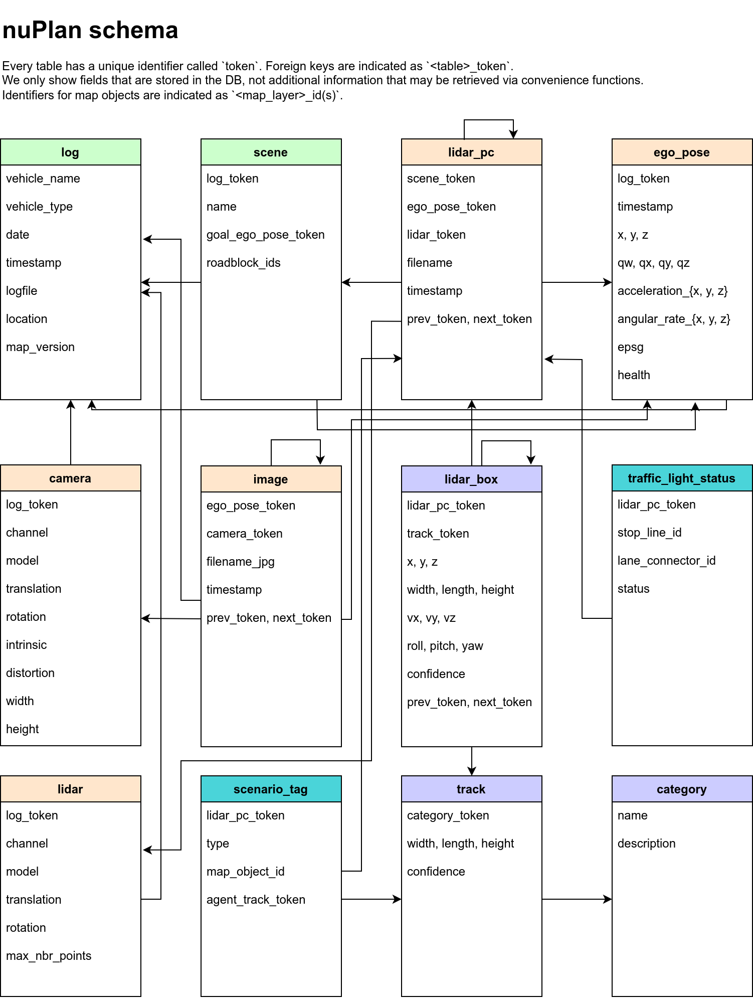

# nuPlan スキーマ (Schema)

このドキュメントでは、nuPlanで使用されるデータベーススキーマについて説明します。すべての注釈とメタデータ（キャリブレーション、マップ、車両座標など）はリレーショナルデータベースに保存されます。以下にデータベーステーブルを一覧として示します。各行はユニークな主キー`token`で識別されます。他のテーブルとの関連付けには外部キー（例: `log_token`）が使用されます。



---

## log
データが抽出されたログに関する情報。
```python
log {
   "token":                        <str> -- ユニークなレコード識別子。
   "vehicle_name":                 <str> -- 車両名。
   "date":                         <str> -- 日付 (YYYY-MM-DD)。
   "timestamp":                    <int> -- ログの開始時点のUnixタイムスタンプ。
   "logfile":                      <str> -- 元のログファイル名。
   "location":                     <str> -- ログが記録されたエリア（例: シンガポール）。
   "map_version":                  <str> -- このログで使用されたマップバージョンの名前。
}
```

---

## ego_pose
特定のタイムスタンプにおける自車の位置情報。
```python
ego_pose {
   "token":                        <str> -- ユニークなレコード識別子。
   "log_token":                    <str> -- 外部キー。このego_poseが属するログを識別。
   "timestamp":                    <str> -- Unixタイムスタンプ。
   "x":                            <float> -- 自車のグローバル座標系における中心のx座標（メートル）。
   "y":                            <float> -- 自車のグローバル座標系における中心のy座標（メートル）。
   "z":                            <float> -- 自車のグローバル座標系における中心のz座標（メートル）。
   "qw":                           <float> -- 自車のグローバル座標系におけるクォータニオン形式の方位。
   "qx":                           <float> -- 同上。
   "qy":                           <float> -- 同上。
   "qz":                           <float> -- 同上。
   "vx":                           <float> -- ローカル座標系における自車のx方向速度（m/s）。
   "vy":                           <float> -- ローカル座標系における自車のy方向速度（m/s）。
   "vz":                           <float> -- ローカル座標系における自車のz方向速度（m/s）。
   "acceleration_x":               <float> -- ローカル座標系における自車のx方向加速度（m/s²）。
   "acceleration_y":               <float> -- ローカル座標系における自車のy方向加速度（m/s²）。
   "acceleration_z":               <float> -- ローカル座標系における自車のz方向加速度（m/s²）。
   "angular_rate_x":               <float> -- ローカル座標系における自車のx方向の角速度。
   "angular_rate_y":               <float> -- ローカル座標系における自車のy方向の角速度。
   "angular_rate_z":               <float> -- ローカル座標系における自車のz方向の角速度。
   "epsg":                         <int> -- EPSG（地球の中心を基準とした緯度/経度座標系）。
}
```

---

## camera
特定のログにおけるカメラのキャリブレーションや設定情報。
```python
camera {
   "token":                        <str> -- ユニークなレコード識別子。
   "log_token":                    <str> -- 外部キー。この設定を使用するログを識別。
   "channel":                      <str> -- カメラの位置（例: 'CAM_F0', 'CAM_R0'など）。
   "model":                        <str> -- カメラモデル。
   "translation":                  <float> [3] -- 自車の座標系に対するカメラの外部位置（メートル単位）。
   "rotation":                     <float> [4] -- 自車の座標系に対するカメラの外部回転（クォータニオン形式）。
   "intrinsic":                    <float> [3, 3] -- カメラの内部キャリブレーション行列。
   "distortion":                   <float> [*] -- カリフォルニア工科大学モデルに基づくカメラの歪みパラメータ。
   "width":                        <int> -- カメラ画像の幅（ピクセル単位）。
   "height":                       <int> -- カメラ画像の高さ（ピクセル単位）。
}
```

---

## image
カメラで撮影された単一の画像を取得するためのメタデータを格納します（画像そのものは含まれません）。
```python
image {
   "token":                        <str> -- ユニークなレコード識別子。
   "next_token":                   <str> -- 外部キー。次の時間のレコードを指す。ログの最後の場合は空。
   "prev_token":                   <str> -- 外部キー。前の時間のレコードを指す。ログの最初の場合は空。
   "ego_pose_token":               <str> -- 外部キー。この画像が撮影された時点の自車位置。
   "camera_token":                 <str> -- 外部キー。この画像に使用されたカメラ設定。
   "filename_jpg":                 <str> -- 画像ファイルへの相対パス。
   "timestamp":                    <int> -- Unixタイムスタンプ。
}
```

---

## lidar
特定のログにおけるLiDARのキャリブレーションや設定情報。
```python
lidar {
   "token":                        <str> -- ユニークなレコード識別子。
   "log_token":                    <str> -- 外部キー。この設定を使用するログを識別。
   "channel":                      <str> -- ログチャンネル名。
   "model":                        <str> -- LiDARモデル。
   "translation":                  <float> [3] -- 自車の座標系に対するLiDARの外部位置（メートル単位）。
   "rotation":                     <float> [4] -- 自車の座標系に対するLiDARの外部回転（クォータニオン形式）。
}
```

---

## その他のテーブル

このセクションの続きには、`lidar_pc`, `lidar_box`, `track`, `category`, `scene`, `scenario_tag`, `traffic_light_status`など、nuPlanデータベースのすべてのテーブルが含まれます。詳細は元の記述を参照してください。
