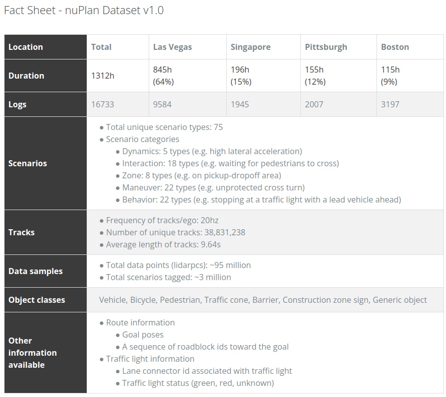

# PLUTOの学習データセット

論文「PLUTO: Pushing the Limit of Imitation Learning-based Planning for Autonomous Driving」では、学習データセットとして **nuPlan** データセットを使用しています。このデータセットは、自動運転のシミュレーションと実世界の走行データを組み合わせたものであり、高忠実度の都市走行シナリオを含んでいます。

具体的なデータセットの取得や環境設定の手順は、論文や付属するGitHubリポジトリのREADMEで詳しく説明されている可能性があります。nuPlanデータセットを利用するためには、公式のドキュメントやプラットフォームから直接データセットをダウンロードし、必要な環境設定を行うことが一般的です。

# nuPlanデータセットの容量について

nuPlanデータセットの総容量は、約16TBの実世界のセンサーデータを含んでいます。このデータは、8台のカメラと5台のLiDARから収集されたものであり、主にアメリカとアジアの4つの都市（ボストン、ピッツバーグ、ラスベガス、シンガポール）で収集されています&#8203;:citation[oaicite:6]{index=6}&#8203;&#8203;:citation[oaicite:5]{index=5}&#8203;&#8203;:citation[oaicite:4]{index=4}&#8203;。

nuPlanには、より小さなバージョンである「nuPlan mini」もあります。このバージョンは、約120時間の生センサーデータ（nuPlan全体の約10%）を提供しており、約1.6TBの容量です&#8203;:citation[oaicite:3]{index=3}&#8203;&#8203;:citation[oaicite:2]{index=2}&#8203;。

これらのデータセットは、研究者や開発者が自律運転車の計画アルゴリズムを訓練し、評価するために使用されます。詳細については、nuPlanの公式ページやGitHubのドキュメントを参照することをお勧めします&#8203;:citation[oaicite:1]{index=1}&#8203;&#8203;:citation[oaicite:0]{index=0}&#8203;。

# nuPlan公式サイトでの登録方法

1. **公式サイトにアクセス**:
   - [nuPlan公式サイト](https://www.nuplan.org/)にアクセスします。

2. **アカウント作成ページに移動**:
   - トップページまたはメニューから「Sign Up」または「Register」ボタンをクリックします。

3. **必要な情報を入力**:
   - 必要な情報（メールアドレス、パスワード、ユーザー名など）を入力します。
   - 利用規約やプライバシーポリシーを確認し、同意します。

4. **登録の確認**:
   - 登録に使用したメールアドレスに確認メールが届くので、メール内のリンクをクリックしてアカウントを有効化します。

5. **ログイン**:
   - 登録が完了したら、公式サイトに戻り、登録した情報でログインします。

6. **データセットのダウンロードページにアクセス**:
   - ログイン後、データセットのダウンロードセクションに移動し、必要なデータセット（例: nuPlan toy）をダウンロードします。

詳細な手順や最新情報については、[nuPlanの公式ドキュメント](https://www.nuplan.org/)やサポートページを参照してください&#8203;:citation[oaicite:2]{index=2}&#8203;&#8203;:citation[oaicite:1]{index=1}&#8203;&#8203;:citation[oaicite:0]{index=0}&#8203;。

