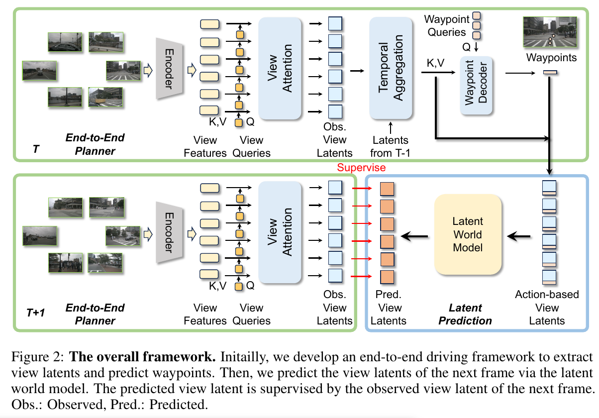

## 4章 詳細解説（図と数式の関係）

### 4.1 エンドツーエンドプランナーとラテント抽出

#### 図の上半分 (時刻 $T$) の説明
図の上半分は、エンドツーエンドプランナーがどのようにしてマルチビュー画像からラテント特徴を抽出し、ウェイポイントを予測するかを示しています。

1. **Encoder（エンコーダ）**:
    - 入力として複数のカメラからのマルチビュー画像を取り込みます。
    - これらの画像をエンコーダを通じて、特徴表現（View Features）に変換します。
    - 数式では、特徴表現セット $F = \{f_1, f_2, \dots, f_N\}$ として表されます。

2. **View Attention**:
    - 各ビューには学習可能なビュークエリ $Q_{\text{view}} = \{q_1, q_2, \dots, q_N\}$ が対応しており、これらのクエリがエンコーダからの特徴表現 $F$ に対してクロスアテンションを行います。
    - 数式では次のように表されます：
    
      $$
      v_i = \text{CrossAttention}(q_i, f_i, f_i)
      $$

      ここで、$v_i$ は各ビューに対応する観察ビューラテント (Observed View Latents) です。

      [ここで CrossAttention を使う理由](./TheReasonToUseCrossAttention.md)

      [CrossAttentionの式の説明](./Exp_of_CrossAttention.md)

3. **Temporal Aggregation**:
    - 前のフレーム $T-1$ からの歴史的ビューラテント $H$ を用いて、観察ビューラテント $V$ を強化し、強化されたビューラテント $E$ を生成します。
    - このプロセスは以下の数式で表されます：

      $$
      E = V + H
      $$

      ここで、$E$ は強化されたビューラテント (Enhanced View Latents) です。

4. **Waypoint Decoder**:
    - 強化されたビューラテント $E$ を基に、ウェイポイントデコーダがウェイポイントをデコードします。
    - 具体的には、ウェイポイントクエリ $Q_{\text{wp}}$ が $E$ に対してクロスアテンションを行い、次のように予測ウェイポイント $w_j$ が生成されます：

      $$
      w_j = \text{MLP}(\text{CrossAttention}(q_j^{\text{wp}}, E, E))
      $$

    - 最終的に、L1損失を用いて予測されたウェイポイントと真のウェイポイントの差を次の式で評価します：

      $$
      L_{\text{waypoint}} = \sum_{j=1}^{M} \|w_j - w_j^{\text{GT}}\|_1
      $$

      ここで、$w_j^{\text{GT}}$ はグラウンドトゥルースのウェイポイントです。

---

### 4.2 ラテント予測のためのワールドモデル

#### 図の下半分 (時刻 $T+1$) の説明
図の下半分は、ラテントワールドモデルが次のフレームのラテント特徴をどのように予測するかを示しています。

1. **Action-based View Latents**:
    - 強化されたビューラテント $E_t = \{e_1^t, e_2^t, \dots, e_N^t\}$ と予測されたウェイポイント $W_t = \{w_1^t, w_2^t, \dots, w_M^t\}$ を基に、アクションベースのビューラテント $A_t$ を生成します。
    - このプロセスは次の式で表されます：

      $$
      a_i^t = \text{MLP}([e_i^t, w_t])
      $$

      ここで、$w_t$ は予測されたウェイポイントの1次元ベクトルです。

2. **Latent World Model**:
    - アクションベースのビューラテント $A_t$ を入力として、ラテントワールドモデルが次のフレーム $t+1$ の予測ビューラテント $P_{t+1}$ を生成します。
    - このプロセスは次の式で表されます：

      $$
      P_{t+1} = \text{LatentWorldModel}(A_t)
      $$

      ここで、$P_{t+1}$ は予測されたビューラテント (Predicted View Latents) です。

3. **Supervision**:
    - 予測されたビューラテント $P_{t+1} = \{p_1^{t+1}, p_2^{t+1}, \dots, p_N^{t+1}\}$ は、次のフレームで実際に観察されたビューラテント $V_{t+1}$ によって監督され、L2損失で評価されます：

      $$
      L_{\text{latent}} = \sum_{i=1}^{N} \|p_i^{t+1} - v_i^{t+1}\|_2
      $$

4. **Temporal Aggregation for Future Prediction**:
    - アクションベースのビューラテント $A_t$ を使用して、自己アテンションを行い、次のフレーム $T+1$ の歴史的ビューラテント $H_{t+1}$ を生成します：

      $$
      H_{t+1} = \text{SelfAttention}(A_t)
      $$

      この $H_{t+1}$ は次のフレームの観察ビューラテント $V_{t+1}$ を強化するために使用されます。

---

### 4.3 ラテント代替によるビュー選択

図に直接示されていませんが、ラテントワールドモデルによって予測されたラテント特徴を利用して、計算効率を向上させるためのビュー選択戦略が提案されています。この戦略では、選択された重要なビューのみを処理し、他のビューに対応するラテントは予測されたものを使用して効率を高めます。

---

### 4.4 モジュール全体のまとめ

図2は、エンドツーエンドプランナー、ラテントワールドモデル、ビュー選択戦略の各モジュールがどのように連携して効率的かつ精度の高いエンドツーエンド自動運転モデルを構築するかを示しています。数式と図の各ブロックは、モデルの全体的なフローと、その中で行われる各処理を視覚的に理解するのに役立ちます。
