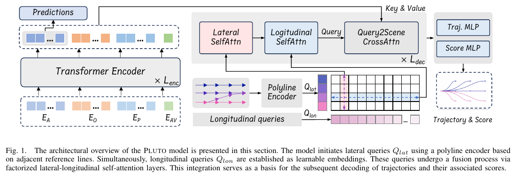

# Markdownでよく忘れるコード集

1. 文字に色をつける
``` 
<span style="color:red"> xxx </span>
```
例 : <span style="color:red"> xxx </span>

2. リンクを貼る
```
[文字列](リンク先)
```
例 : [LAV & UniAD](../004_PLUTO//Explanations/LAV_UniAD.md)

3. 画像を挿入
```

```
例：